## 1. 开篇废话
### 1.1 干了这碗鸡汤
**基础知识就像是一座大楼的地基，它决定了我们的技术高度。**

**人生路上，我们会遇到很多的坎。跨过去，你就可以成长，跨不过去就是困难和停滞。而在后面很长的一段时间里，你都需要为这个困难买单。**

### 1.2 为什么学习数据结构与算法
* 掌握基础知识，便于运用
* 方便阅读框架源码，理解背后的设计思想
* 基础架构研发
* 建立时间复杂度、空间复杂度意识，写出高质量代码

### 1.3 如何学习？
####  1.3.1 基本概念
* 数据结构：一组数据的存储结构
* 算法：操作数据的一组方法
####  1.3.2 相辅相成
数据结构是为算法服务的，算法要作用在特定的数据结构之上。

数据结构是静态的，只是组织数据的一种方式，如果不在其基础上操作，构建算法，孤立存在的数据结构是没用的。

数据结构和算法解决的是如何更省、更快地存储和处理数据的问题。

一个考量效率和资源消耗的方法，这就是复杂度分析方法，需要考虑：
时间复杂度、空间复杂度。
####  1.3.3 基本内容


####  1.3.4 重点内容
* 10 个数据结构：数组、链表、栈、队列、散列表、二叉树、堆、跳表、图、Trie 树；
* 10 个算法：递归、排序、二分查找、搜索、哈希算法、贪心算法、分治算法、回溯算法、动态规划、字符串匹配算法。
####  1.3.5 学习思路
学习它的“来历”“自身的特点”“适合解决的问题”以及“实际的应用场景"

掌握理论，动手编写，适度刷题，勤思考、多交流，反复迭代沉积。


## 2. 复杂度分析
### 2.1 概述
数据结构与算法本质上解决“快”和“省”的问题，即如何更快的运行代码、如何更节省存储空间。可用时间、空间复杂度来分析衡量。

时间、空间复杂度分析是从宏观角度去大体粗略估计程序的时间、空间消耗，和实际跑代码测试观察具体资源消耗是两种不同的思路。实际测试在不同的平台、环境下可能会有着不同的结果。

时间、空间复杂度分析也并不是说就完全准确的评估程序资源消耗，好比如开车从广州到北京，估算下大概需要的时间，那么就会根据正常开车来说大概速度，然后根据距离除以速度，再考虑下中间休息时间，那么就能得出一个大致的时间，但是你说实际路上跑的时候我就慢吞吞的开，那这种算是特殊情况，任何的估算都是一种近似推测。

当然时间、空间复杂度分析肯定不能直接替代实际的测试，我们在评估出相应的复杂度是为了优化代码，但是最终的效果如何，肯定还需要实际的测试，以达到两者结合来反馈实际效率的目的。

### 2.2 大O复杂度表示法

#### 2.2.1  时间复杂度

##### **2.2.1.1 时间复杂度概述**

时间复杂度就是来衡量估算代码片段的执行时间，代码块由一行行的代码组成，总体的执行时间必然等于每行代码的执行时间之和，每行代码的执行时间尽管是不一样的，不过我们从整体估算的角度，代码整体执行次数越多那么执行时间也就越长，即 `总体执行时间 = 每行执行时间之和 = 代码行执行次数 * 每次执行平均时间`。

如果每次执行平均时间认为是近似的，其实总体执行时间必然和代码执行执行次数成正比例关系，注意这里不是说和代码行数成比例关系，而是代码行总的执行次数，例如有些代码行数看起来多，有100行，但是没有任何循环，每行执行一次；而有的代码就3行，但是是个循环，执行1万次，那么显然很大概率循环这个代码段执行时间长。
所以我们估算时间复杂度只需要看代码块执行次数即可。

如果用公式表示：`T(n)= O(f(n))`
其中 T(n) 表示代码执行时间；n 代表数据规模大小，不同大小的数据规模所消耗的执行时间肯定是不同的，n越大，则T(n)必然越大；f(n)代表代码执行次数总和，其实也就是每行代码执行次数总和；而大O正是表示总体时间与执行总次数的关系函数，即正比关系：f(n)越大，T(n)越大。

大O表示代码执行时间随数据规模增长的变化趋势，表示的是一种外在函数关系，但是具体说是啥函数关系，是 T(n)= 2 * f(n) 还是说 T(n) = f(n) + 10 呢，这个取决于不同的具体代码段，但是可以肯定的是一定是正比关系。

在分析时间复杂度过程中，可以忽略常数、低阶、系数，记录最大阶的量级即可。例如函数 
```math
T(n)=2n^2 + 3n + 100
```


这个里面随着n的增大，那么整体的函数变化趋势主要就取决于n平方这个量级了，所以我们可以近似表示为： 

```math
T(n)=n^2
```
这个其实就是时间复杂度的一个量级表示。

##### **2.2.1.2 复杂度分析方法**

a. 关注循环次数最多的部分

在一个代码段中，其他部分几乎都是运算几次的程序，但是存在一个乃至多个循环，那么自然代码段的整体运行时间大概率取决于循环片段代码的执行次数，例如：

```java
 int cal(int n) {
   int sum = 0;
   int i = 1;
   for (; i <= n; ++i) {
     sum = sum + i;
   }
   return sum;
 }
```

循环之前代码行执行两次，循环部分执行 2n次（忽略每行实际多次，即一行执行一次的话就是1），那么整体其实取决于循环部分，则整体时间复杂度为  T(n) = O(n) 

b. 加法法则：总的复杂度取决于量级最大的代码复杂度

如果存在多个循环呢？例如：

```java
int cal(int n) {
   int sum_1 = 0;
   int p = 1;
   for (; p < 100; ++p) {
     sum_1 = sum_1 + p;
   }
 
   int sum_3 = 0;
   int i = 1;
   int j = 1;
   for (; i <= n; ++i) {
     j = 1; 
     for (; j <= n; ++j) {
       sum_3 = sum_3 +  i * j;
     }
   }
 
   return sum_1 + sum_3;
 }
```

除去常量级运算，包含两个循环一个循环n次，一个循环n方次，那么总体时间复杂度其实可表示为：
```math
T(n)=O(n + n^2)
```
这里面明显n方的量级要大于n，当n很大的时候，消耗时间主要取决于n方，可以忽略n，所以该段代码时间复杂度就是：
```math
T(n)=O(n^2)
```
另外如果两个代码段，一个n次，一个m次，无法确定到底哪个大，那么其实整个的时间复杂度就是：
```math
T(n)=O(n + m)
```

c. 乘法法则：嵌套代码的复杂度等于嵌套内外代码复杂度的乘积

如果一个循环代码片段执行n次，但是循环内部又调用其他函数，其他函数每次执行m次，那么总体的时间复杂度其实就是两者的乘积，例如：

```java
int cal(int n) {
   for (; i < n; ++i) {
     ret = ret + f(i);
   } 
 } 
 
 int f(int m) {
  for (; i < m; ++i) {
    sum = sum + i;
  } 
  return sum;
 }
```

那么整体时间复杂度即：
```math
T(n) = O(f(n)) * O(f(m)) = O(n) * O(m) = O(n * m)
```

##### 2.2.1.3 几种常见复杂度量级

* 常量阶 O(1)
* 对数阶 O(logn)
* 线性阶 O(n)
* 线性对数阶 O(nlogn)
* 平方阶 O(n^2) 、立方阶O(n^3) …… k次方阶O(n^k)
* 指数阶 O(2^n)
* 阶乘阶 O(n!)

其中像指数阶 O(2^n) 和阶乘阶 O(n!) 属于非多项式阶，其它的属于多项式阶，按照函数的特性我们看下几种复杂度的函数变化趋势：

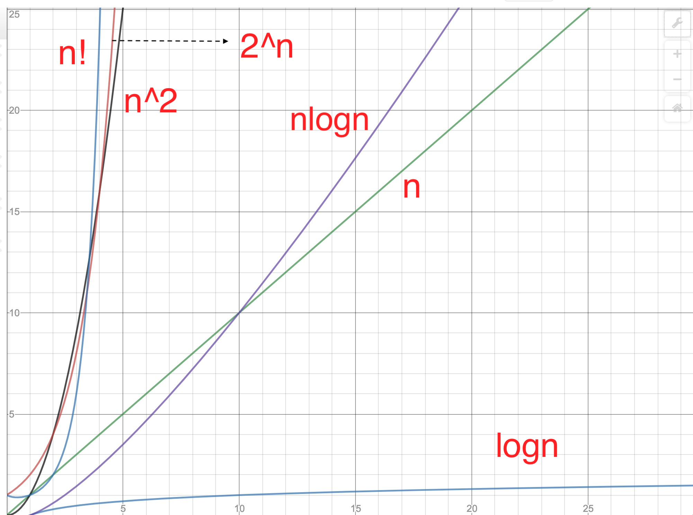

可以看出n的k次阶、指数阶、阶乘阶这些都是随着n的增大急速增长，这个在实际代码中意味着需要消耗着更多的时间，即程序效率低。

* 常量阶 O(1)

常量阶不是说就代表我们的程序就运行一次，而是运行的次数是有限次数的，不管n如何变化，它的次数是一定的，一般程序中没有循环、递归这些情况，不管有多少行。例如：

```java
int count(int n) {
    int sum = 0;
    sum += n;
}
```

* 对数阶 O(logn)

这个难分析，直接看实例，例如：
```java
 i=1;
 while (i <= n)  {
   i = i * 2;
 }
```

我们分析时间复杂度主要看代码执行次数，那么这里有循环，那肯定主要看循环的执行次数了，一眼看上去不知道有几次，可以传入实际的数值看看，例如 n = 10，那么判断的过程就是：

i = 1 ，i <= 10 ,  i = 1 * 2 = 2       第1次；
i = 2 ，i <= 10 ,  i = 2 * 2 = 4       第2次；
i = 4 ，i <= 10 ,  i = 4 * 2 = 8       第3次；
i = 8 ，i <= 10 ,  i = 8 * 2 = 16     第4次；
i = 16，i <= 10   			       不成立，结束

如果我们加大n的值，同样可以依次来计算下，其实发现，最终这个循环能执行次数即：
`2^0 , 2^1 , 2^2 , 2^3 , 2^4 , 2^5 …… 2^k —> n`
即2的执行次数方趋向于n的值，最终就是 2^k = n，k即为执行次数，而这里 k = log2N = logN

这里是以2为底的对数阶，其实不管代码是3的对数阶还是更大的对数阶，都可以当成2的对数阶，因为例如
log3N = log3 ^ 2 * log2N，而时间复杂度分析中系数是可以忽略的。

#### 2.2.2  空间复杂度

前面分析的时间复杂度就是分析代码消耗的时间，那么空间复杂度诚然分析的就是代码占用的空间资源大小。我们在代码运行过程中申请的内存空间就是所占用的空间资源，例如我们声明一个变量 i = 0，那么必然在JVM中需要分配一个空间去保存这个变量，也即是占用了一个单位内存空间，所以我们要分析空间复杂度，主要就要看程序申请分配了多少变量空间。例如：

```java
void print(int n) {
  int i = 0;
  int[] a = new int[n];
  for (i; i <n; ++i) {
    a[i] = i * i;
  }

  for (i = n-1; i >= 0; --i) {
    print out a[i]
  }
}
```

这里申请了一个变量 i 和 一个大小 n 的数组，那么类似时间复杂度表示法我们可以认为当前程序空间复杂度就是 n + 1,同样常量阶不考虑，那么其实就是 n，即
```math
S(n) = O(n)
```

S(n) 代表空间复杂度，n代表数据规模，大O表示数据规模与空间复杂度的正比关系。

常见空间复杂度有 O(1)、O(n)、O(n^2) 。

### 2.3 最好、最坏、均摊时间复杂度
#### 2.3.1 概述
某些场景下，算法的时间复杂度是不确定的，可能不同条件走不同的分支，那么仅用前面说的时间复杂度是无法全面的反应其时间复杂度的，所以就有了最好、最坏、平均、均摊时间复杂度这些不同角度的衡量指标。

#### 2.3.2 最好时间复杂度
最好时间复杂度即算法在最优化方案之下或最理想情况、花费时间最少的时间复杂度。

例如：要在数组a中找出指定值得元素所在位置
```java
int find(int[] array, int val){
    // TODO 判空

    for(int i = 0; i < array.length; i++){
        if(val == array[i]){
            return i;
        }
    }
    
    return -1;
}
```

无法确定元素在数组中具体哪个位置，采用从前到后依次遍历（当然也可用用其它类似二分查找这些算法）方式的时候，如果第一个元素值就是目标值，那么只需要比较1次直接返回，如果最后位置则循环n次，如果不在数组中也需要n次。对于第一个位置情况显然时间复杂度就是O(1), 这也是最理想的情况，即最好时间复杂度。

#### 2.3.3 最坏时间复杂度
还是上面的例子，目标元素值在最后或者不在数组当中那么就需要循环n次，这种就是最不理想的情况，需要花费最多的时间，时间复杂度为O(n), 这也就是最坏时间复杂度的一个例子。

一般分析的时候比如对于循环这些最坏的情况都是要整个都循环完成，最好的情况就是在某个场景下能及早的退出循环。

#### 2.3.4 平均时间复杂度
上面最好、最坏时间复杂度反应的是极端情况下的，可能很多时候不会出现这些情况，那么就需要评估一个平均时间复杂度。可以通过加权平均来计算。

以上个例子，目标元素可能在数组中任意位置，在任意位置的概率为1/n；而每个位置要么不是目标值要么是，则符合概率为1/2；出现在第一个位置循环1次，第二个位置循环2次，依次类推，我们将所有元素位置和不在数组中概率加起来则就是：

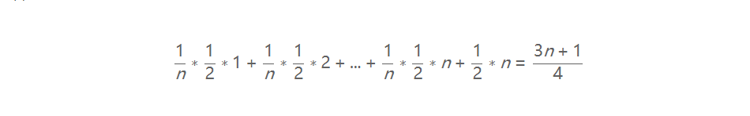

计算出的结果为 (3n+1)/4，按照时间复杂度量级就是O(n)

平均时间复杂度又称加权平均时间复杂度或者期望时间复杂度。

#### 2.3.5 均摊时间复杂度
摊还分析得出的时间复杂度叫做均摊时间复杂度。

使用场景：大部分情况下时间复杂度都很低，但是个别场景下时间复杂较高，而且存在先后时序关系，我们可以采用摊还分析，即将耗时的操作时间分摊到每个耗时时间少的的操作上，这样整体的时间复杂度就会趋于平摊，也相当于一种平均时间复杂度了。如果很多时候都是最好时间复杂度，但是个别情况很耗时，但是由于总体时间少，所以可以忽略最耗时的了或者说最耗时的被平均了，最后均摊时间复杂度就是最好时间复杂度了。

例如：输入数组和不大于数组长度的非负整数val值，如果小于数组长度则输出val值，如果等于则遍历输出每个元素值
```java
void find(int[] array, int val){
    if(val < array.length){
        输出 val值；
    }
    
    if(val == array.length){
      for(int i = 0; i < array.length; i++){
        输出 array[i];
      }
    }
}
```

这里输入的val值可能情况就是 0、1、2 ... n ，其实在小于n的时候时间复杂度都是O(1)，但是在为n的时候就是O(n)了，那么整体时间复杂度就是：

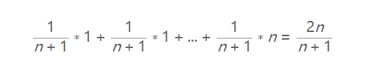

可见最终时间复杂度就是O(1), 其实不通过概率计算直接用摊还分析即可，最差的时候O(n)，那么我把这n次分到其他n个的O(1)上，相当于每个就是O(2)了，那最终还是O(1)量级时间复杂度。

## 3. 基础数据结构与算法
### 3.1 数组
定义：数组（Array）是一种线性表结构，用一组连续的内存空间，来存储一组具有相同类型的数据。

图示：例如我们申请了一个大小空间为7的字符数组（Java中），假设内存分配给数组的初始地址为100，每个字符占两字节

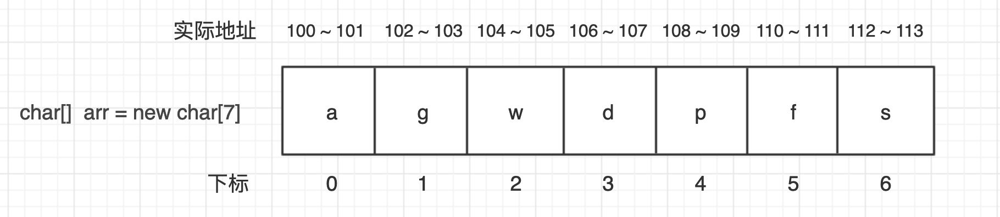

寻址公式：`第i+1位地址 = 首地址 + i * 每个元素大小`
例如上例第4个元素地址就是 100 + 3*2 = 106

从0开始编号：方便寻址，减少寻址运算；历史原因。

查找时间复杂度：
a. 按照下标随机访问：O(1)
b. 查找指定元素元素：最好O(1)、最差O(n)、平均O(n)、二分查找O(logn)

插入操作
a. 将某个元素插入到数组中的第K个位置：
最好 -- 直接插入末尾 O(1)
最差 -- 数组开头位置，因为涉及后续元素往后移动 O(n)
平均 -- O(n)

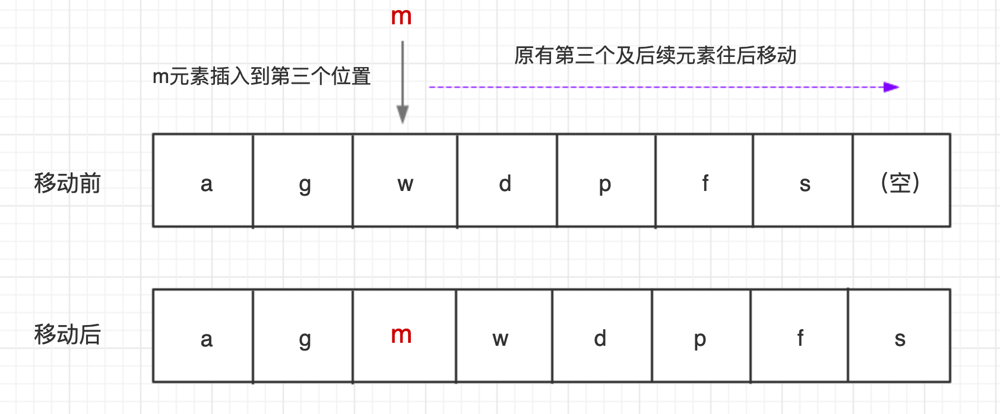

优化插入操作：将原位置元素放入末尾，原位置插入目标元素，时间复杂度O(1)

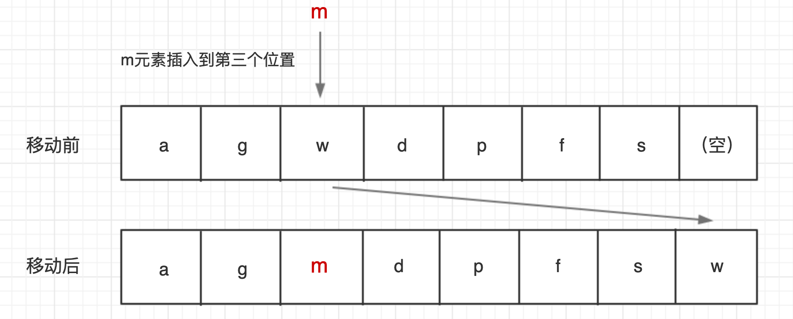

删除操作：删除第K位的元素，为保证内存连续性也要搬移数据
最好 -- 直接删除末尾 O(1)
最差 -- 数组开头位置，因为涉及后续元素往后移动 O(n)
平均 -- O(n)
优化 -- 每次删除时候并不真正删除元素，而是标记为已删除，当存储空间不够时候再执行真正的删除并搬移数据，减少每次都搬移数据的时间消耗

数组访问越界：
C语言即使越界了但是只要内存空间可以访问就能正常运行，可能导致隐含bug；例如C语言中：元素向下压栈分配内存空间，i、a[2]、a[1]、a[0]，越界后a[3]就是i位置，结果i又变为0，导致死循环（和编译器有关，开启堆栈保护功能设置可避免）
```java
int main(int argc, char* argv[]){
    int i = 0;
    int arr[3] = {0};
    for(; i<=3; i++){
        arr[i] = 0;
        printf("hello world\n");
    }
    return 0;
}
```

Java语言具有显式越界检查，避免越界问题。

容器：例如ArrayList底层就是数组，对数组的操作进行了封装;
为避免集合频繁扩容影响性能最好提前预估设置好容量大小；
集合无法存储基本类型，基本类型还需要使用数组；
表示多维数组使用数组更简单；

### 3.2 链表
#### 3.2.1 基本定义

定义：通过指针将零散的（不一定非连续）内存块串联在一起的数据结构。

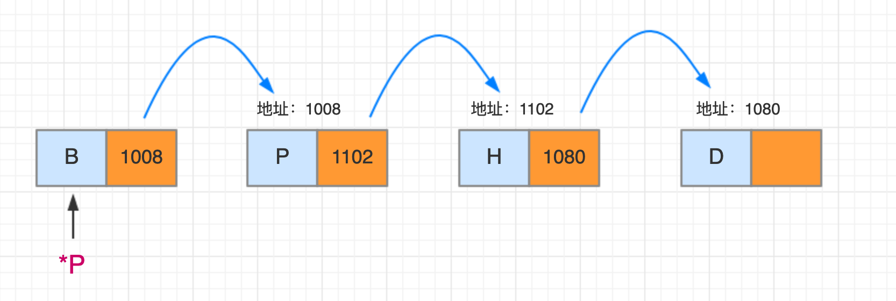

含义解读：

* 指针：可以理解为储存地址的变量，例如变量P，那么 *P 就是指针声明方式，含义为它代表它所指向地址的变对象；可以理解为Java中的引用：变量Person per = new Person() 变量per本身是引用变量，可能是局部变量，而它实际保存的是所指向对象的地址，即 per 是指向 new Person()出来的这个对象实例的。例如上图*p 指向链表头节点，那么就可以用*p来指代当前链表。

* 非连续：不同于数组要求连续的内存空间，零散的空间即可，有利于空间利用；

* 节点：链表节点同数组一样也是一个个内存块；只不过链表的节点不像数组的节点只有数据，还需要单独一个内存块来存储下一个节点的值；

* 把记录下个节点地址的指针叫做后继指针；

* 链表第一个节点叫做头结点；最后一个节点叫做尾节点；尾节点的后继指针指向空地址NULL，其实就是没存任何地址；

* 我们定义的数组也好，链表也罢，它们在实际内存中的形式都是一样的，都是一个个内存块，不过任务抽象把它们封装成不同的数据结构，例如链表这个前后连接的线肯定不存在，但是从逻辑上存在的，好像一根根线连接起来一样；

* 链表相比数组需要占据更多的内存空间，天然支持动态扩容，但是具体场景选用那种数据结构需要根据实际情况分析；

#### 3.2.2 单链表操作

* 插入节点

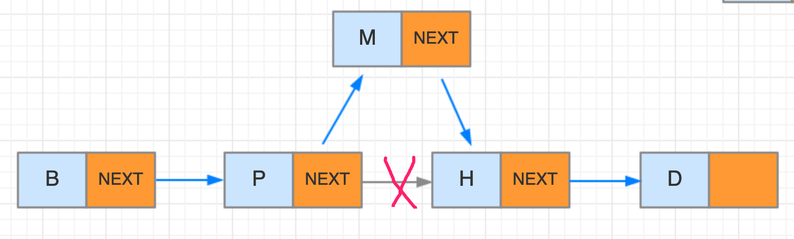

单纯的插入操作本身：时间复杂度 O(1)

在指定节点之后插入节点： 时间复杂度 O(1)

在指定节点之前插入节点： 时间复杂度 O(n)

在指定值节点之前、后插入节点： 时间复杂度 O(n)

* 删除节点


单纯的删除操作本身：时间复杂度 O(1)

删除给定指针指向的节点：时间复杂度 O(n)，因为删除需要知道指定节点的前驱节点，单链表需要依次遍历直到 p->next = q 找到前驱节点才能删除，查找 O(n) ，删除 O(1)，加起来 O(n)

删除节点中值为某个值的节点：时间复杂度 O(n)，查找节点O(n)，删除操作O(1)，加起来就是 O(n)

* 访问节点

随机访问第K个节点：时间复杂度O(n)，因为链表空间非连续，无法类似数组寻址公式寻找节点，需要从头节点依次遍历

#### 3.2.3 循环链表

循环链表即在单链表的基础上，尾节点指向头节点：

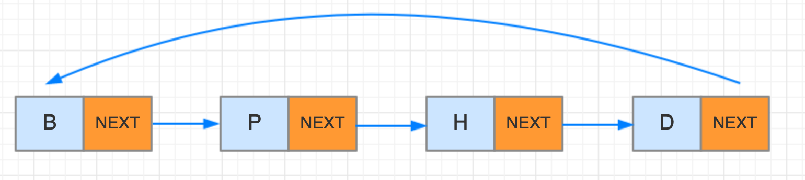

#### 3.2.4 双向链表

后继指针next指向下一个节点，前驱指针prev指向前面的节点

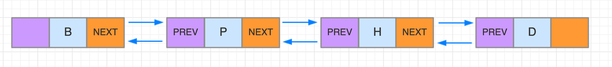

相比单链表需要更多的存储空间；但是支持前后双向遍历，支持O(1)时间复杂度找到前驱节点

* 插入节点

单纯的插入操作本身：时间复杂度 O(1)

在指定节点之后插入节点： 时间复杂度 O(1)

在指定节点之前插入节点： 时间复杂度 O(1)

在指定值节点之前、后插入节点： 时间复杂度 O(n)

* 删除节点

单纯的删除操作本身：时间复杂度 O(1)

删除给定指针指向的节点：时间复杂度 O(1)

删除节点中值为某个值的节点：时间复杂度 O(n)，查找节点O(n)，删除操作O(1)，加起来就是 O(n)

* 访问节点

随机访问第K个节点：同单链表一样 时间复杂度O(n)

#### 3.2.5 双向循环链表

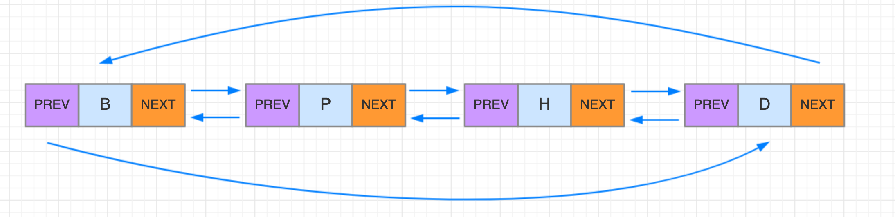

#### 3.2.6 如何写好链表代码

* 指针、引用的含义

有些语言有指针，有些语言是引用；本质上是一样的，都是存储所指对象的地址；

例如链表中某个节点，以单链表来说，需要两个内存块，一个保存当前节点数据，一个为next指针，即保存了下一个节点的内存地址；


* 警惕指针丢失和内存泄露

在进行例如插入链表节点时，需要注意指针指向的顺序，例如：


如果这样操作：

```
P -> next = M
M -> next = P -> next
```

因为第一步已经把P指针对应节点后继指针指向了M，这样当用 P -> next 想将 H 节点声明为 M 节点的后继节点时候，P->next其实已经不是H了，而是M，这样就导致M指向了自己，导致链表断裂，其实原因在于一开始 P->next 将指向改变的时候就切断了与后面节点的联系，导致新的节点也无法找到后面的节点位置。

正确应该是(相当于先不切断W和H的联系)：

```
M -> next = P -> next
P -> next = M
```

C语言类似的需要手动释放删除的节点内存；而Java这种自动内存管理的不需要；

* 利用哨兵简化难度

引入哨兵节点，head指针一直指向这个哨兵节点；

有哨兵节点的链表叫做带头链表；没有哨兵节点的就叫不带头链表；

带头链表：


* 留意边界条件处理

需要考虑链表为空、只有一个节点、只有两个节点、在处理头尾节点的时候能否正常工作？

* 画图辅助思考

无图无真相

* 多写多练

Talk is cheap, show me your code !

#### 3.2.7 链表代码实战

见代码目录：

[https://github.com/SkyYongFly/DSA/tree/master/src/main/java/com/skylaker/linkedlist](https://github.com/SkyYongFly/DSA/tree/master/src/main/java/com/skylaker/linkedlist)

### 3.3 栈
#### 3.3.1 基本定义

先进后出，后进先出；是一种操作受限的线性表；只允许一端进行操作；

栈这种结构本质上是对数组、链表的逻辑化封装，底层实现还是要基于数组或者链表本身：

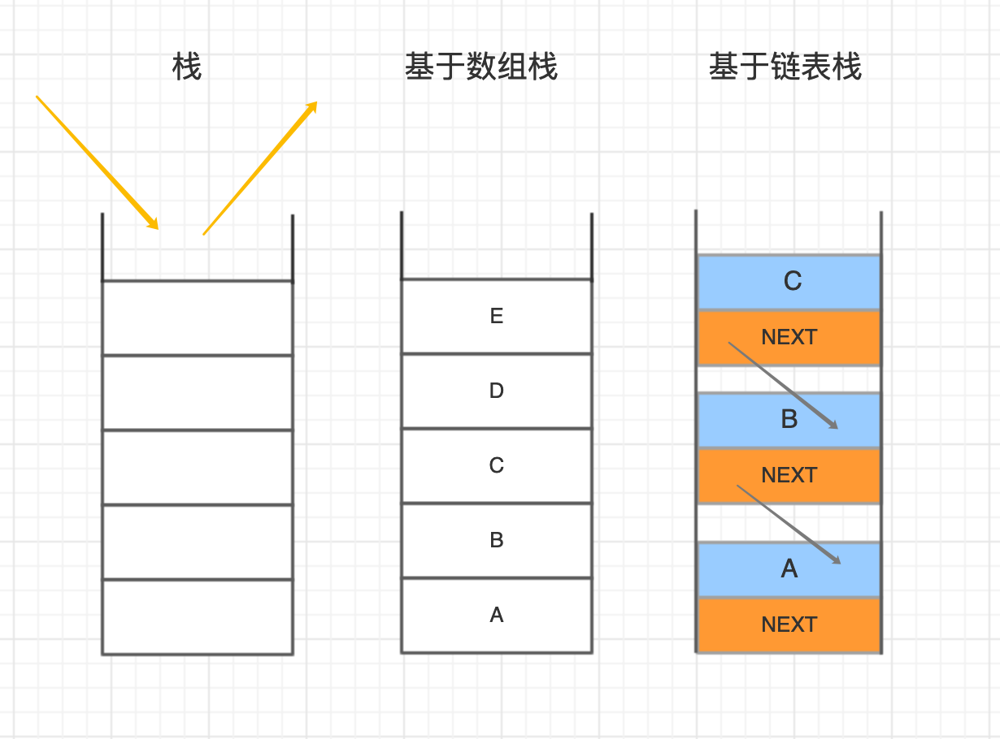

#### 3.3.2 代码实现

* 基于数组实现的栈

```java
package com.skylaker.stack;

/**
 * 基于数组的栈
 * @author skylaker2019@163.com
 * @version V1.0 2019/8/21 11:14 PM
 */
public class StackBasedOnArray {
    // 内部维护一个数组结构
    private String[] arr;
    // 栈最大大小，即数组的设置大小
    private int max;
    // 栈中已有元素个数
    private int num;

    /**
     * 初始化栈，即初始化内部的数组
     * @param max
     */
    public StackBasedOnArray(int max){
        this.arr = new String[max];
        this.max = max;
        this.num = 0;
    }

    /**
     * 入栈操作
     * @return 成功：true ；失败：false
     */
    public boolean push(String item){
        if(num == max){
            // 已有元素个数达到最大数量限制，则说明栈已经满
            return false;
        }

        arr[num] = item;
        num++;

        return true;
    }

    /**
     * 出栈操作
     */
    public String pop(){
        if(0 == num){
            // 已有元素个数为0则说明栈是空的
            return null;
        }

        // 从最上面取值
        String item = arr[num-1];
        num--;

        return item;
    }
}
```

测试数据：


输出：


如果想遍历的话直接数组倒序遍历即可，避免直接出栈将元素废弃，破坏栈结构。

时间复杂度：O(1)
空间复杂度：O(1)

* 基于链表实现的栈

```java
package com.skylaker.stack;

/**
 * 基于链表实现的栈
 * @author skylaker2019@163.com
 * @version V1.0 2019/8/22 12:03 AM
 */
public class StackBasedOnLinkedList {
    // 栈顶结点，该结点也就可直接代表栈
    Node<String> top = null;

    /**
     * 入栈操作
     * @param val
     */
    public void push(String val){
        Node newNode = new Node(val, null);

        if(null == top){
            top = newNode;
        } else {
            // 新的结点成为栈顶元素
            newNode.next = top;
            top = newNode;
        }
    }

    /**
     * 出栈操作
     */
    public String pop(){
        if(null == top){
            return null;
        }

        String val = top.data;
        // 新的栈顶元素后移一个结点
        top = top.next;
        return val;
    }

    /**
     * 获取所有结点值
     */
    public void printAll(){
        if(null == top){
            System.out.println("[空结构]");
        }

        Node p = top;
        while (p != null){
            System.out.print(p.getData() + " ");
            p = p.next;
        }
        System.out.println();
    }

    public static class Node <E> {
        // 结点保存对象
        E data;
        // 后继节点
        Node<E> next;

        Node(E data, Node<E> next){
            this.data = data;
            this.next = next;
        }

        E getData(){
            return this.data;
        }
    }
}
```

测试代码：

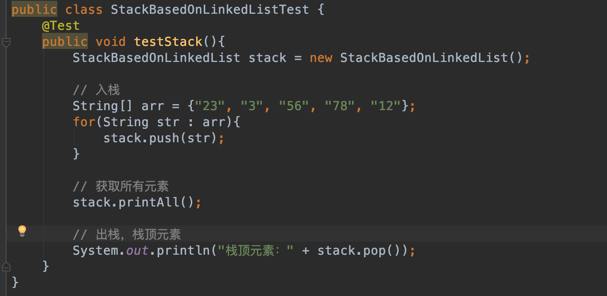

执行结果：

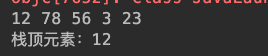

时间复杂度：O(1)
空间复杂度：O(1)

* 支持动态扩容的栈

如果底层是数组，相当于数组空间不够时候自动扩容，可以再申请一个两倍大小的数组，然后将原有数组复制过去；

如果底层是链表，则本身就支持动态扩容；

### 3.4 队列
#### 3.4.1 基本定义
一种操作受限的线性表数据结构；和栈一样，也是一种逻辑上抽象的数据结构，本质上可以用数组和链表两种基本数据结构实现；

最基本的两个操作：入队 enqueue()  队尾放一个数据 、出队 dequeue() 队列头部取一个元素；

基本特性：先进先出；后进后出；

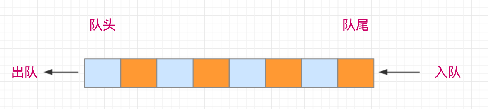

#### 3.4.2 顺序队列
顺序队列：用数组实现的队列

```java
package com.skylaker.queue;

/**
 * 顺序队列
 * @author skylaker2019@163.com
 * @version V1.0 2019/9/9 10:04 PM
 */
public class ArrayQueue {
    // 内部数组
    private String[] items;
    // 数组大小：n，即队列大小
    private int n = 0;
    // 队头下标：指向第一个实际元素
    private int head = 0;
    // 队尾下标：指向最后一个元素的后一节点，即入队元素要保存进的位置
    private int tail = 0;

    /**
     * 申请一个大小为 m 的数组
     * @param m
     */
    public ArrayQueue(int m){
        items = new String[m];
        n = m;
    }

    /**
     * 入队操作（不做判空操作，即允许存储空数据）
     * @param item 入队元素
     * @return 成功 true；失败 false
     */
    public boolean enqueue(String item){
        // 判断队列是否已经满
        if(tail == n){
            return false;
        }

        items[tail] = item;
        tail++;
        return true;
    }

    /**
     * 出队操作
     * @return
     */
    public String dequeue(){
        // 判断队列是否为空
        if(head == tail){
            return null;
        }

        String item = items[head];
        head++;
        return item;
    }
}
```

a、b、c、d、e 元素依次入队后，head指向0位置，tail指向5位置：
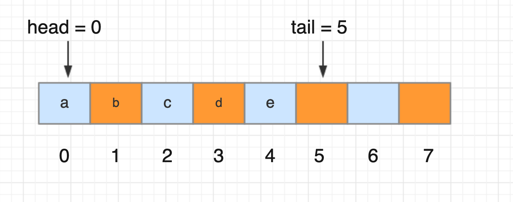

注意队列元素的内容应该在于队头到队尾之间的元素内容，而不是整个数组，例如出队操作后，只是队头指针向后移动，但是本身出队的元素在数组中是依然存在的；顺序队列是存在于数组上的逻辑数组结构；

两次出队后，队头指向2位置：


产生问题：例如上面的队列，如果继续入队元素，当tail=8时候：
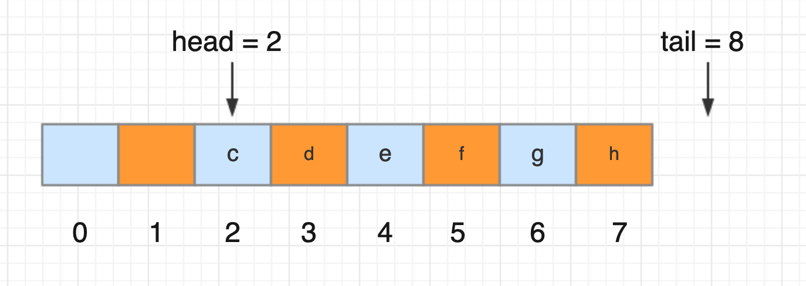
这个时候继续入队，但是队尾已经没有空间了，无法再入队新插入元素，可是队列头明明是有空间的；

解决这个问题，可以在入队的时候进行元素搬移操作，例如上面队列可以后续元素都往前搬移两个位置；但是并不是每次入队都需要，只需要在队尾已经无法插入元素时再迁移元素，降低时间复杂度；

```java
/**
     * （带元素空间调整的）入队操作
     * @param item 入队元素
     */
    public boolean enqueueWithMoveItem(String item){
        // 判断队列是否已满
        if(tail == n){
            if(head == 0){
                // 队头在第一个位置，队尾在末尾位置，说明整个队列已经真正满了，无法再入队
                return false;
            }

            // 说明即使队尾已无法入队，但是队头前还有剩余空间，进行元素搬移操作
            for(int i = head; i < tail; i++){
                items[i - head] = items[i];
            }

            // 调整队头和队尾（注意先要调整队尾）
            tail = tail - head;
            head = 0;
        }

        // 再进行入队操作
        items[tail] = item;
        tail++;
        return true;
    }
```

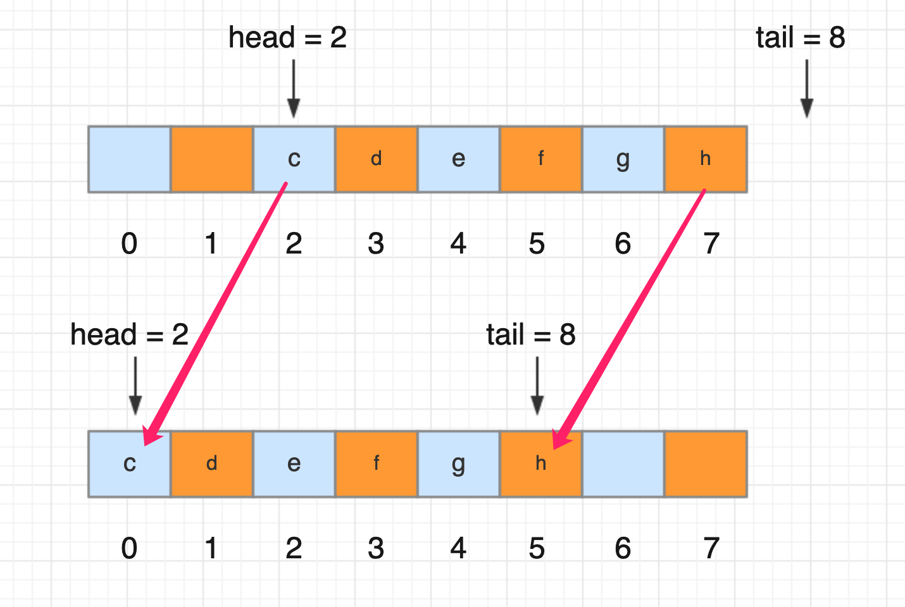

#### 3.4.3 链式队列
链式队列：用链表实现的队列

head指针：指向链表的第一个结点；
tail指针：指向链表最后一个结点；

```java
package com.skylaker.queue;

/**
 * 链式队列
 * @author skylaker2019@163.com
 * @version V1.0 2019/9/9 11:17 PM
 */
public class LinkedQueue {
    // 队头
    private Node head = null;
    // 队尾
    private Node tail = null;

    /**
     * 入队
     * @param item
     * @return
     */
    public void enqueue(String item){
        Node node = new Node(item, null);
        if(tail == null){
            head = node;
            tail = node;
        } else {
            tail.next = node;
            tail = node;
        }
    }

    /**
     * 出队
     * @return
     */
    public String dequeue(){
        if(null == head){
            return null;
        }
        String item = head.data;
        head = head.next;

        // 考虑边界情况，如果当期head指向最后一个元素，即和tail位置一样，那么再出队，则head指向下一个结点即空，tail也就自然指向空了
        if(null == head){
            tail = null;
        }
        return item;
    }

    /**
     * 输出元素
     */
    public void print(){
        Node p = head;
        while(null != p){
            System.out.print(p.data + " ");
            p = p.next;
        }
    }


    /**
     * 链式队列结点定义
     */
    public class Node {
        private String data;

        private Node next;

        Node(String data, Node next){
            this.data = data;
            this.next = next;
        }
    }
}
```

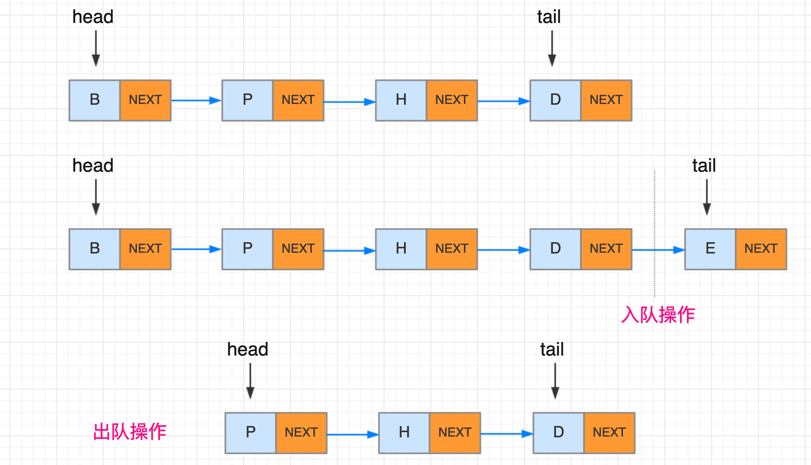

#### 3.4.4 循环队列
把原有顺序队列，收尾相连，形成一个循环队列；

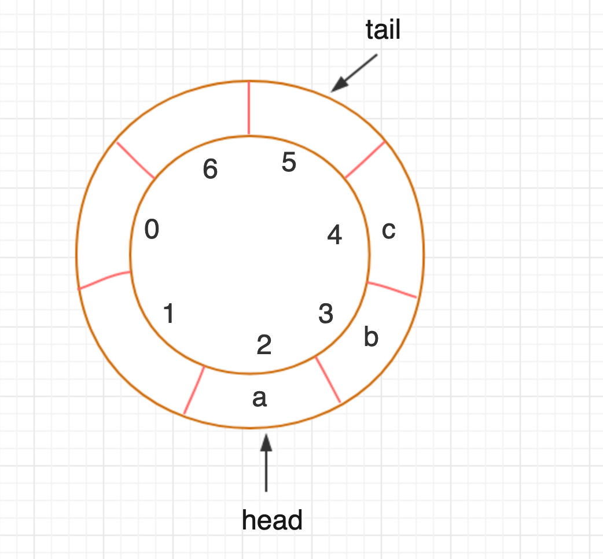

当前队列tail=2，tail=5，如果继续入队，那么tail依次为5、6、0，这样比顺序队列一个明显优势就是在tail=n时候不需要再移动数组元素，大大降低了入队时间复杂度；

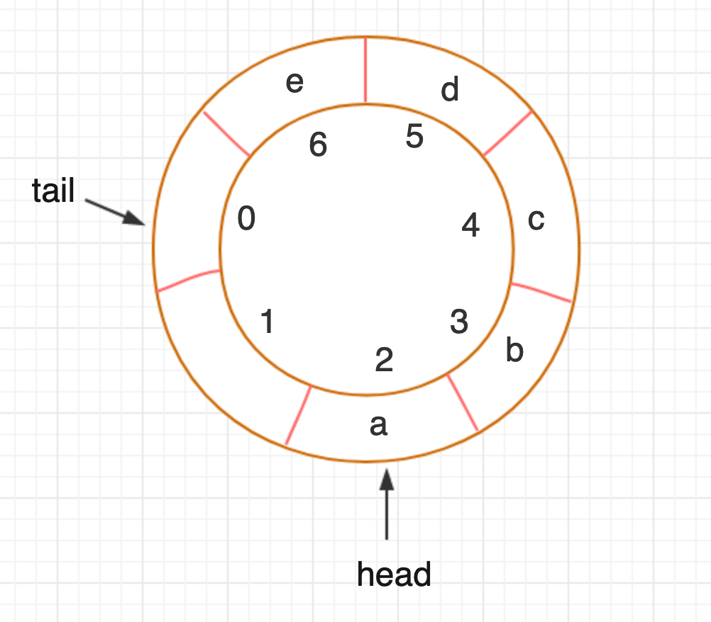

循环队列tail指向的位置不存储元素，所以会浪费一个存储单元空间；

循环队列代码关键：确定好队空和队满的条件；

循环队列满时规律：`（tail + 1）% n = head`

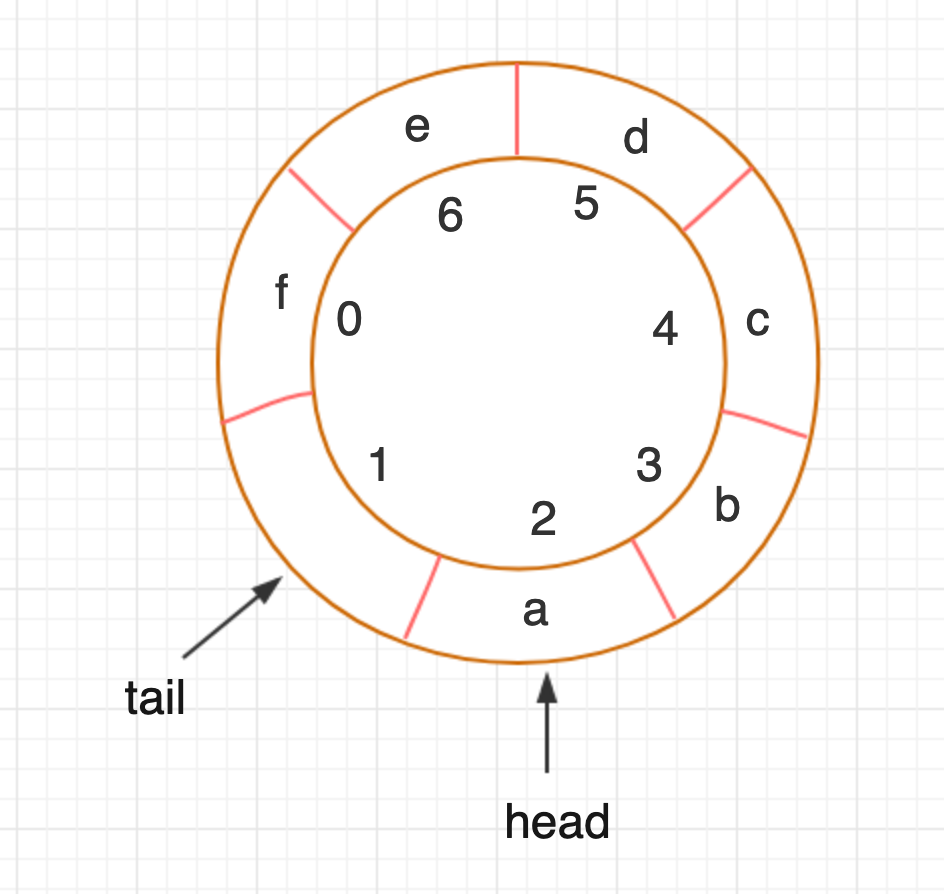

```java
package com.skylaker.queue;

/**
 * 循环队列
 * @author skylaker2019@163.com
 * @version V1.0 2019/9/10 12:30 AM
 */
public class CircularQueue {
    // 数组
    private String[] items;
    // 数组长度
    private int n;
    // 队头下标
    private int head = 0;
    // 队尾下标
    private int tail = 0;

    public CircularQueue(int m){
        items = new String[m];
        n = m;
    }

    /**
     * 入队
     * @param item
     * @return
     */
    public boolean enqueue(String item){
        // 判断队列是否已经满了
        if((tail + 1 ) % n == head){
            return false;
        }

        items[tail] = item;
        tail = (tail + 1) % n;
        return true;
    }

    /**
     * 出队
     * @return
     */
    public String dequeue(){
        if(head == tail){
            return null;
        }

        String item = items[head];
        head = (head + 1) % n;
        return item;
    }

    /**
     * 打印元素
     */
    public void print(){
        if(head == tail){
            System.out.println("队列为空");;
        }

        int p = head;
        while(p != tail){
            System.out.print(items[p] + " ");

            p += 1;
            if(p >= n){
                p -= n;
            }
        }
    }
}
```

### 3.5 递归
#### 3.5.1 何为递归

方法或函数调用自身的方式称为递归调用，调用称为递，返回称为归；

#### 3.5.2 递归示例
例如计算1到100的之间的整数和，可以使用递归算法：

```java
package com.skylaker.recursion;

/*
 * 递归计算：1到100的之间的整数和
 */
public class IntegerSum {
     public static void main(String[] args) {
        System.out.println(sum(100));
     }

     private static int sum(int n) {
         if(1 == n) {
              return 1;
         }
         return sum(n-1) + n;
     }

}
```

#### 3.5.3 递归需要满足三个条件
**1. 一个问题可以分解为几个子问题的解**

例如前面的例子计算1到100之间整数和可以分解为1到99的和加上100；其实就是可以大问题分解为小问题；

**2. 这个问题与分解后的子问题，除了数据规模不同，求解思路完全一样**

1到100整数和分解为1到99的和加上100，而这又可以继续往下分，即1到99之间整数和等于1到98整数和加上99，，，而这些计算的思路完全一样的；其实就是存在一定的规律，如果毫无规律可言，那么程序处理只能一个个写死处理了；

**3. 存在递归终止条件**

例如上面的 if(1 == n)  sum = 1; 一层层递归下来，化整为零，大的模块分解为小模块，最终小模块的值必然确定，否则会导致递归无法终止造成为无限递归；

#### 3.5.4 如何写出递归代码
写出递归公式，找到终止条件；然后转换成递归代码即可。

递归公式，即处理问题方案之间的**规律性**，例如上述例子，1到n之间的整数和可以表示成如下递归公式：
`sum(n) = sum(n -1) + n`

终止条件，即上述存在递归终止条件项阐述内容；

遇到递归，抽象成递归公式，不需要人脑想一层层调用关系，很容易绕进去；

#### 3.5.5 递归缺点
A. 如果递归嵌套太深，容易导致栈溢出异常

因为递归是循环调用方法本身，而Java每次调用方法就会生成对应的栈帧，将当前方法涉及的局部变量等信息压入当前线程栈，而线程栈的大小是不会很大的，层次越深，入栈栈帧越多，线程栈很快就会满，导致 StackOverflowError 报错；

所以要控制递归层次，例如设置计数器计算递归层次，达到一定层次直接返回；

但是因为实际栈的大小以及当前方法栈帧大小不固定，要想设置准确的递归层次不容易，所以一般递归层次确定在一定范围内，例如50、100这样的就可以用递归，实际要根据实际场景来看；

B、递归可能存在重复计算的可能性；

可以将每次f(n)计算的结果用散列表存储，每次获取时候判断是否存在，如果已经存在直接获取，减少重复计算；

C、空间复杂度高

因为每次递归调用都是相当于新调用一次方法，那么局部变量需要重新创建，导致空间复杂度高；

D、时间复杂度高

深层次递归调用必然导致严重耗时；

#### 3.5.6 递归优点

表达力强，代码简洁；

#### 3.5.7 递归代码改为非递归代码
所有的递归代码都可以改写为迭代循环的方式；例如上述代码可以改写成：

```java
	private static int sum2(int n) {
		int sum = 0;
		for(int i = 1; i <= n; i++) {
			sum = sum + i;
		}
		return sum;
	}
```

### 3.6 排序

#### 3.6.1 排序分类

按照时间复杂度分类：

|     排序算法     | 时间复杂度 | 是否基于比较 |
| :--------------: | :--------: | :----------: |
| 冒泡、插入、选择 |   O(n^2)   |      是      |
|    快排、归并    |  O(nlogn)  |      是      |
|  桶、计数、基数  |    O(n)    |      否      |

#### 3.6.2 分析衡量排序算法

**1. 算法的执行效率**

A. 最好、最坏、平均情况时间复杂度

分析排序算法，需要给出最好、最坏、平均时间复杂度三种情况，因为一不同算法之间会对比区分，二要排序的数据有序无序程度不一样，排序算法在不同数据情况下的性能表现需要全面衡量；

B. 时间复杂度的系数、常数、低阶

时间复杂度反应的是数据规模n很大时候一个增长趋势，会忽略系数、常数、低阶这些内容，但是对于排序算法，数据量可能很少，那么就不能简单的忽略这些内容；对于同阶排序算法比较也不能忽略系数这些内容；

C. 比较次数和交换（或移动）次数

基于比较的排序算法，涉及两种操作：比较大小、移动元素，分析时候需要考虑这两种情况；

**2. 排序算法的内存消耗**

算法内存消耗可以通过空间复杂度来分析衡量；

**原地排序**：特指空间复杂度为O(1)的排序算法。（冒泡、插入、选择都是原地排序算法）

**3. 排序算法的稳定性**

**稳定性**：待排序的序列中存在值相等的元素，排序后，值相等的元素相对顺序不变。

例如：

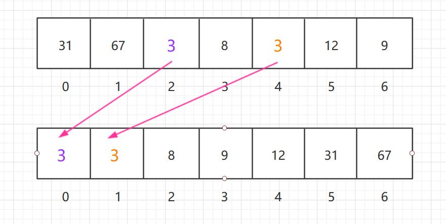

排序后两个3相对位置没有改变，所以就叫稳定排序；

但是如果这样：


就不是稳定排序算法了。

可能疑惑，这个3谁在前在后有啥关系？我们这里只是数值排序，没啥影响，但是涉及相关状态的处理就有意义了。比如一群人给你转账，张三转100块，李四转200块，，，张三和王五都是转100块，但是他们转的先后时间不同，这个时候你想看谁转账钱多少顺序以及先后顺序，那么对于相同100块钱来说他们的先后顺序就不能颠倒。针对这种场景，可以先按照金额排序后再针对金额相同的按照时间再一个个分段排序，不过相对麻烦；可以直接先按照时间排序一次，从前到后，然后再利用稳定排序算法排序金额，最终排序结果就是金额按照顺序，且相同金额符合时序。

#### 3.6.3 冒泡排序（Bubble Sort）

##### **3.6.3.1 基本思想**

从前到后，依次在剩余未排序项前后两两比较，如果前一个比后一个大则交换位置，一次冒泡后未排序项中最大值就被放到末尾，这样经过多次冒泡后从前到后依次从小到大有序（当然也可以从后向前、或者从大到小排序都可以，但是基本思想是一致的）。

例如，有序列  15、2、23、12、9、56、31

首先所有的项都是未排序项，则先 15 和 2 两两比较，15 比 2 大，则交换位置：2、15、23、12、9、56、31

再继续往后，15 和 23 比较，前一个小则不动，这样依次比较交换，第一次冒泡后最大值56被排到末尾：

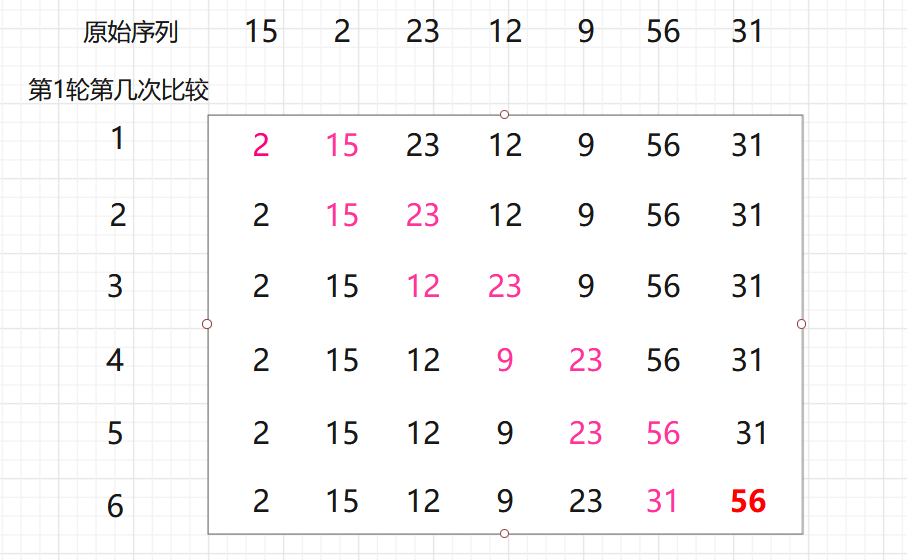

这样经过一轮后剩下的6个元素还未排序好，需要再次冒泡，那么第二次冒泡最大值23就排到最后了，，，依次冒泡后即可排序好；


##### **3.6.3.2 算法代码**

```java
/**
 * 冒泡排序算法1：直接有多少元素冒泡几次
 * @param a
 */
public static void sort1(int[] a) {
    if(null == a || a.length < 1) {
        return;
    }

    // i 表示第几次（i + 1）冒泡（有多少个元素就冒泡几次）
    for(int i = 0; i < a.length; i++) {
        // j 表示需要几次（j + 1）比较，第 i 次 冒泡 ，则还剩余 length - i 个元素，则两两比较次数为 length - i -1 次
        for(int j = 0; j < a.length - i - 1; j++) {
            if(a[j] > a[j + 1]) {
                int temp = a[j];
                a[j] = a[j+1];
                a[j+1] = temp;
            }
        }
    }
}
```

但是根据上面冒泡图我们可以看到其实在第3次冒泡后序列已经有序，后面的冒泡其实没有必要，所以我们可以优化下代码，在冒泡过程中发现**没有发生交换**说明**已经有序**则后续无需再冒泡，直接结束：

```java
/**
	 * 冒泡排序算法2：记录是否发生交换，没交换直接结束
	 * @param a
	 */
	public static void sort2(int[] a) {
		if(null == a || a.length < 1) {
			return;
		}
		
		// i 表示第几次（i + 1）冒泡（有多少个元素就冒泡几次）
		for(int i = 0; i < a.length; i++) {
			//记录是否发生数据交换
			boolean swap = false;
			// j 表示需要几次（j + 1）比较，第 i 次 冒泡 ，则还剩余 length - i 个元素，则两两比较次数为 length - i -1 次
			for(int j = 0; j < a.length - i - 1; j++) {
				if(a[j] > a[j + 1]) {
					int temp = a[j];
					a[j] = a[j+1];
					a[j+1] = temp;
					// 设置发生了数据交换
					swap = true;
				}
			}
			
			if(!swap) {
				// 没有数据交换说明有序直接退出
				break;
			}
		}
	}
```

##### **3.6.3.3 冒泡排序分析**

* 是否原地排序？

  算法中只有在相邻元素交换的时候才会申请一个临时变量空间，对于整体来说是常量级，即空间复杂度为O(1)，所以冒泡排序为原地排序。

* 是稳定排序算法么？

  这个取决于比较交换操作，当前后两个元素相等时候，我们不交换元素，则可以保证冒泡排序稳定性。

* 时间复杂度

  最好情况：即已经完全有序，但仍然需要一次冒泡比较来确定，而比较次数为 n-1 ，则时间复杂度为**O(n)**；

  最坏情况：即完全逆序，需要n次冒泡，每次冒泡 length-i-1比较交换，整体而言时间复杂度**O(n^2)**；

* 平均时间复杂度

  按照概率论等分析会比较复杂，可以根据**有序度**、**逆序度**来分析；

  **有序度**：是数组中具有有序关系的元素对的个数，即 a[i] <= a[j]，如果 i < j;

  例如 15、2、23、12、9、56、31，有序对一共14对：

  ```
  （15，23）、（15，56）、（15，31）、
  
  （2，23）、（2，12）、（2，9）、（2，56）、（2，31）、
  
  （23，56）、（23，31）、
  
  （12，56）、（12，31）、
  
  （9，56）、（9，31）
  ```

  **满有序度**：完全有序的序列，例如 1、2、 8、 15、 17、 21，满有序度即两两组合对 **n*(n-1)/2**；

  **逆序度**：大小相反的元素对，即 a[i] > a[j]，如果 i < j；
  $$
  逆序度 = n*(n-1)/2 - 有序度     （n为元素个数）
  $$
  例如 15、2、23、12、9、56、31，有序对一共7对：

  ```
  （15、2）、（15、12）、（15、9）、
  （23、12）、（23、9）、
  （12、9）、
  （56、31）
  ```

  按照公式计算 **逆序度 7 = 满有序度 21 - 有虚度 14**；

  平均情况：取最好情况 即完全有序时候 有序度 n(n-1)/2，交换次数为0；最坏时候有序度即完全逆序，有序度 0 ，交换次数  n(n-1)/2；取中间次数 n(n-1)/4，则最终平均时间复杂度为 **O(n^2)**

#### 3.6.4 插入排序（Insertion Sort）

##### 3.6.4.1 基本思路

将目标数组（这里以数组作为目标数据结构）分为已排序区间和未排序区间，将未排序区间中的元素依次放到已排序区间中的合适位置，那么最终得到的数组就是有序的。例如对于数组来说，我们一开始可以将第一个元素作为已排序区间，后面元素依次在已排序区间找到合适位置插入。

例如对于数组序列：15、2、23、12、9、56、31

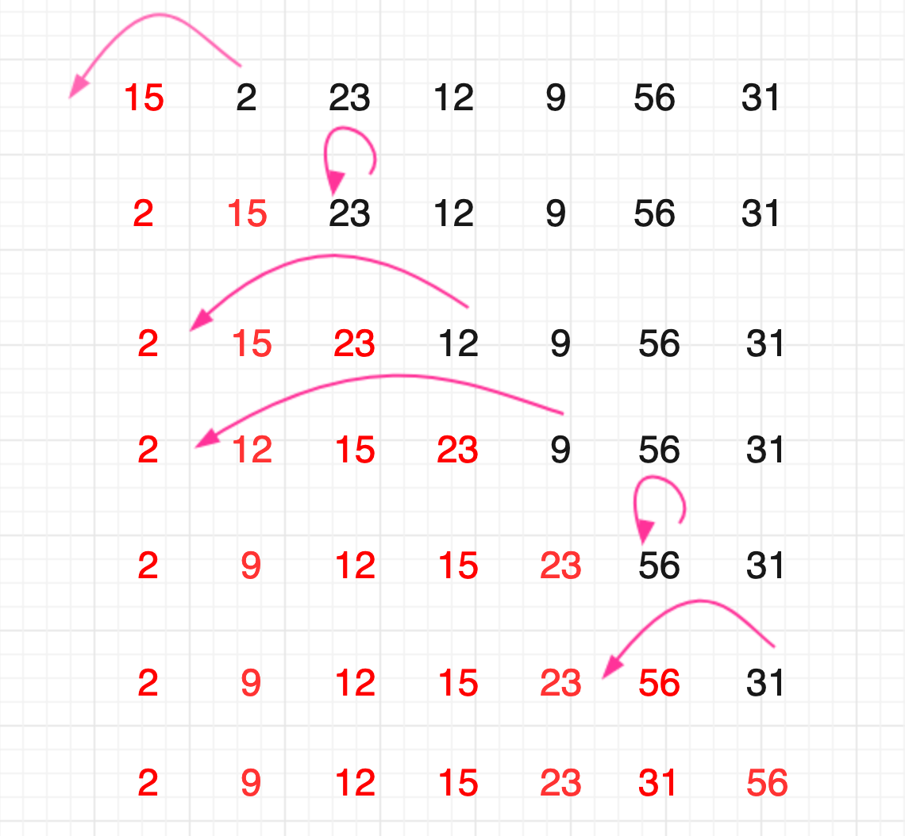

每次拿未排序的第一个元素插入到已排序序列，比较的次数是从已排序序列的最后一个元素往前，因为如果已排序序列最后元素小于未排序第一个元素，说明已经符合有序性，那么就不需要再往前比较交换了，直接继续下一个未排序元素，例如第二行，以排序元素2、15，未排序元素23来比较时候发现大于15，则直接继续下一个元素12的比较插入操作。

插入操作涉及两种操作：1、元素比较   2、元素移动（移动次数等于逆序度）

##### 3.6.4.2 代码实现

```java
public static void sort(int[] a){
  if(null == a || a.length < 1){
    return;
  }

  // 从第二个元素开始，第一个元素一开始被当成以排序有序序列
  for(int i = 1; i < a.length; i++){
    // 需要缓存当前未排序第一个元素值，因为后期再用a[i]取值可能该位置值已被更新
    int temp = a[i];
    int j ;
    for(j = i - 1; j >= 0; j--){
      if(a[j] > temp){
        // 如果被比较元素比当前待比较元素大，则位置后移一位
        a[j+1] = a[j];
      }else{
        // 如果小于等于则说明已排序序列和当前未排序第一个序列已经是有序了
        break;
      }
    }
    // 将未排序第一个元素值放到已排序序列元素后移留出的空位置
    a[j + 1] = temp;
  }
}
```

在未排序第一个元素向前比较过程中，如果发现前面的元素比当前元素大，我们并不采用像冒泡排序类似的交换位置做法，而只是把前面的元素位置后移，这样就空出一个位置，一直向前比较，直到找到合适位置，再把目标元素放到合适的空位置，这样减少了操作次数，降低时间复杂度。

例如上述列表在 2、15、23、12、9、56、31 中 12 往前面已排序列表插入操作：

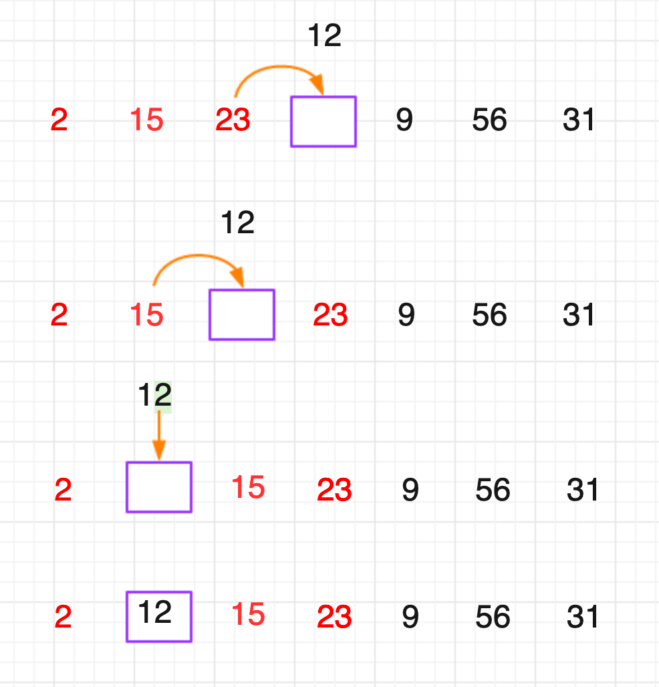

##### 3.6.4.3 插入排序分析

* 是否原地排序？是，因为几乎不占用额外内存空间；

* 是否稳定排序？是，我们在涉及相等值比较后，不做位置交换，保证稳定；

* 时间复杂度

  **最好时间复杂度**：本身就是有序列表，但是需要从前到后遍历一下比较下元素和之前已排序列表末尾元素，所以最好时间复杂度为 **O(n)**；

  **最坏时间复杂度**：即完全逆序的列表，则需要从前到后遍历，然后每个元素在已排序区间比较再涉及现有元素后移，相当于内外层循环嵌套，则最坏时间复杂为  **O(n^2)** ；

  **平均时间复杂度**：因为每次元素插入操作相当于往数组插入一个元素，而这个操作平均时间复杂度为O(n)，而我们这里需要排序n个元素，所以平均时间复杂度就是**O(n^2)**

#### 3.6.5 选择排序（Selection Sort）

##### 3.6.5.1 基本思路

每次从未排序列表中查找出最小的数放到已排序列表末尾（当然也可以取最大放到末尾等）。

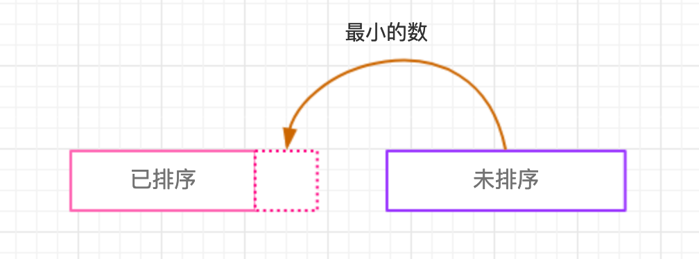

其实对于数组来说，选取第k大数后需要交换位置放到第K个下标索引位置中。

##### 3.6.5.2 代码实现

```java
public static void sort(int[] a){
        if(null == a || a.length < 1){
            return;
        }

        for(int i = 0; i < a.length; i++){
            // 从剩下区间中选择最小的数
            int min = a[i];
            int index = i;
            for(int j = i; j < a.length; j++){
                if(min > a[j]){
                    min = a[j];
                    index = j;
                }
            }
            // 如果index不是当前i说明最小数不是当前i下标数，需要交换
            if(i != index){
                int temp = a[i];
                a[i] = a[index];
                a[index] = temp;
            }
        }
    }
```

##### 3.6.5.3 选择排序分析

* 空间复杂度为 **O(1)** ，是原地排序；
* 最好、最坏、平均时间复杂度都是 **O(n^2)**，因为无论如何它都要内外循环查找一遍；
* **不是稳定排序算法** ，因为比如 5、5、2，第一遍寻找到最小数为2，则直接和第一个5交换，最终2、5、5，但是两个5前后顺序已经改变了，所以不是稳定排序算法；

#### 3.6.6 归并排序（Merge Sort）

##### 3.6.6.1 基本思路

如何将两个各自有序的数组合并成一个整的有序数组？我们可以依次从头比较两个数组的元素，依次将较小的值放入新的大数组，最后将剩下的数组元素放入大数组末尾即可。

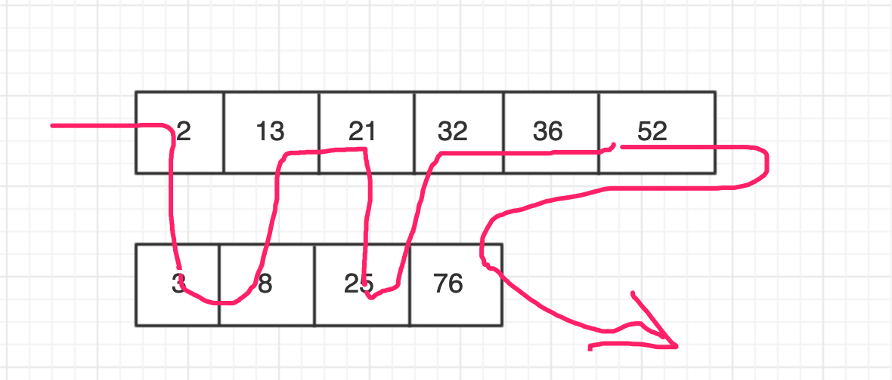

归并排序最核心的算法就是利用数组合并的方法，即我们要对一个大的数组排序，那么我们可以直接将大数组一分为二，拆分成两个数组，那么将这两个数组分别排好序之后利用上述的合并方法整合起来不就是有序的数组了嘛。而对于拆分成的两个数组怎么排序呢？可以同样用拆分合并的方式递归下去，即最终细分到最底层的合并就是两个数组元素的合并。


3.6.6.2 代码实现

```java
package com.skylaker.sort;

/**
 * 归并排序：核心思想，先将目标数组分解，再依次将分解的子数组从小串联合并起来
 * @author skylaker2019@163.com
 * @version V1.0 2019/11/1 11:59 PM
 */
public class MergeSort {
    public static void main(String[] args) {
        int[] a = {99, 80, 198, 66, 32, 1, 23, 45, 2, 18, 56, 72, 11};
        sort(a);
        print(a);
    }

    private static void sort(int[] a){
        if(null == a || a.length < 1){
            return;
        }

        sort_merge(a, 0, a.length - 1);
    }

    /**
     * 排序数组a 索引p到r之间的元素
     * @param a 目标数组
     * @param p 开始索引位置
     * @param r 结束索引位置
     */
    private static void sort_merge(int[] a, int p, int r){
        if(p >= r){
            return;
        }

        // 取待排序数组中间索引位置
        int q = (p + r) / 2;

        // 排序前半段
        sort_merge(a, p, q);
        // 排序后半段
        sort_merge(a, q+1, r);

        // 合并前后两段
        merge(a, p, q, r);
    }

    /**
     * 合并数组前后半段（前后半段已经分别排好序）
     * @param a 目标数组
     * @param p 开始索引位置
     * @param q 中间索引位置
     * @param r 结束索引位置
     */
    private static void merge(int[] a, int p, int q, int r){
        // 申请临时数组空间（注意这里申请临时数组大小）
//        int[] b = new int[a.length];
        int[] b = new int[r - p + 1];

        // i 前半段数组游标 j 后半段数组游标
        int i = p, j = q + 1;
        // k 临时数组索引
        int k = 0;

        // 依次从前后半段数组取最小的值，串起来
        while(i <= q && j <= r){
            if(a[i] <= a[j]){
                b[k++] = a[i++];
            } else {
                b[k++] = a[j++];
            }
        }

        // 将前后半段中剩下的元素放到临时数组的后面（它们就是最大的元素）
        int start = i, end = q;
        if(j <= r){
            start = j;
            end = r;
        }
        while(start <= end){
            b[k++] = a[start++];
        }

        // 将临时数组复制回原数组(注意回写的索引位置)
//        for(int t = 0; t < b.length; t++){
        int m = p;
        for(int t = 0; t < b.length; t++){
            a[m++] = b[t];
        }
    }

    private static void print(int[] a) {
        if(null == a || a.length < 1) {
            System.out.println("数组无内容！");
            return;
        }

        for(int i = 0; i < a.length; i++) {
            System.out.print(a[i] + " ");
        }
    }
}

```


#### 3.6.10 排序算法总结

|          | 是原地排序？ | 是否稳定？ |  最好  |  最坏  |  平均  |
| :------: | :----------: | :--------: | :----: | :----: | :----: |
| 冒泡排序 |      是      |     是     |  O(n)  | O(n^2) | O(n^2) |
| 插入排序 |      是      |     是     |  O(n)  | O(n^2) | O(n^2) |
| 选择排序 |      是      |     否     | O(n^2) | O(n^2) | O(n^2) |

