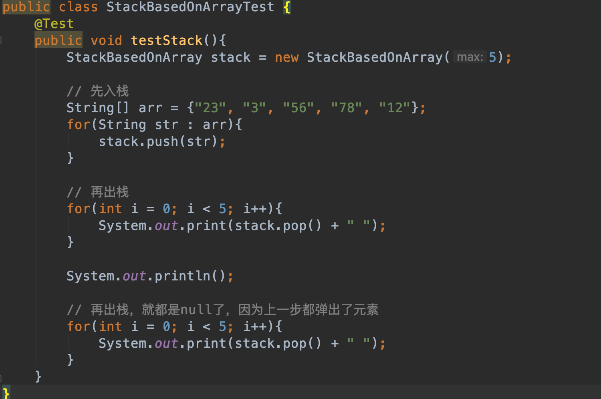
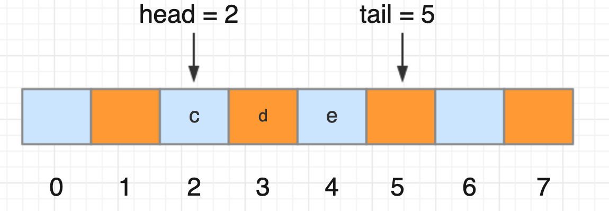
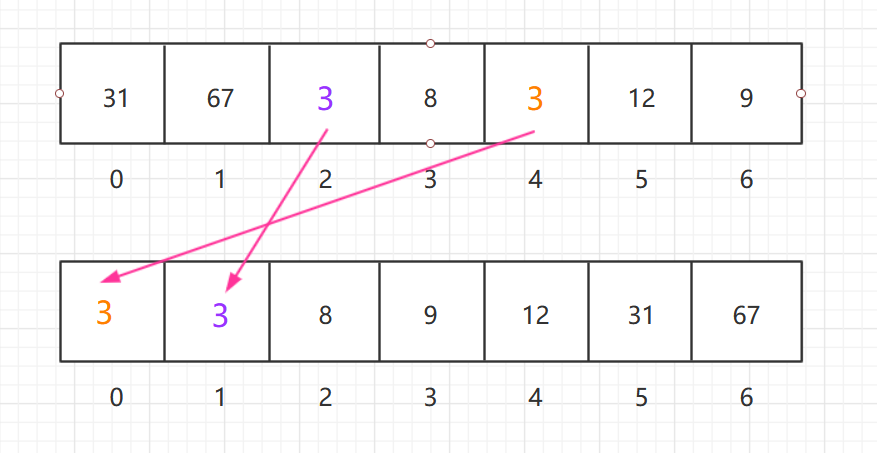
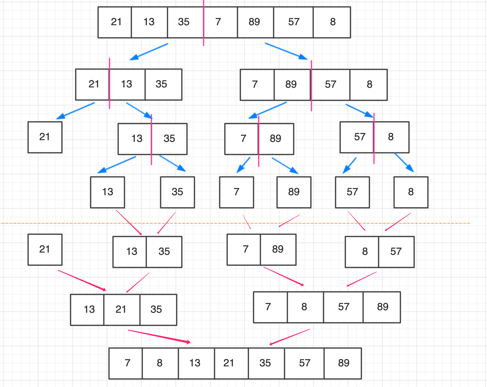
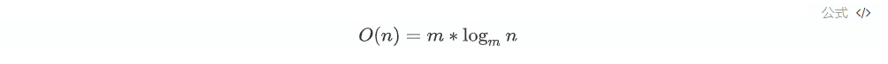
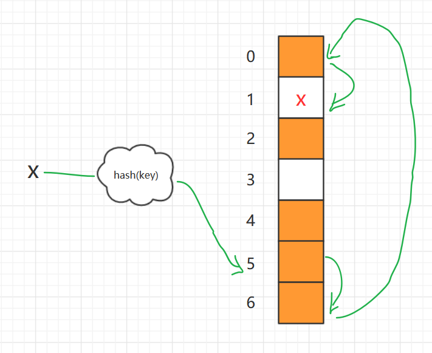
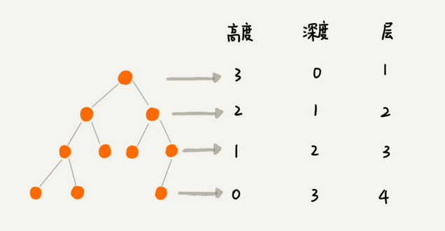
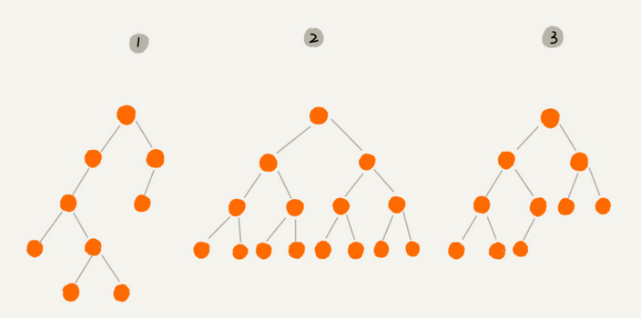
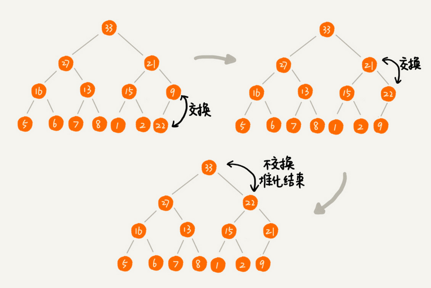

## 1. 开篇废话
### 1.1 干了这碗鸡汤
**基础知识就像是一座大楼的地基，它决定了我们的技术高度。**

**人生路上，我们会遇到很多的坎。跨过去，你就可以成长，跨不过去就是困难和停滞。而在后面很长的一段时间里，你都需要为这个困难买单。**

### 1.2 为什么学习数据结构与算法
* 掌握基础知识，便于运用
* 方便阅读框架源码，理解背后的设计思想
* 基础架构研发
* 建立时间复杂度、空间复杂度意识，写出高质量代码

### 1.3 如何学习？
####  1.3.1 基本概念
* 数据结构：一组数据的存储结构
* 算法：操作数据的一组方法
####  1.3.2 相辅相成
数据结构是为算法服务的，算法要作用在特定的数据结构之上。

数据结构是静态的，只是组织数据的一种方式，如果不在其基础上操作，构建算法，孤立存在的数据结构是没用的。

数据结构和算法解决的是如何更省、更快地存储和处理数据的问题。

一个考量效率和资源消耗的方法，这就是复杂度分析方法，需要考虑：
时间复杂度、空间复杂度。
####  1.3.3 基本内容


####  1.3.4 重点内容
* 10 个数据结构：数组、链表、栈、队列、散列表、二叉树、堆、跳表、图、Trie 树；
* 10 个算法：递归、排序、二分查找、搜索、哈希算法、贪心算法、分治算法、回溯算法、动态规划、字符串匹配算法。
####  1.3.5 学习思路
学习它的“来历”“自身的特点”“适合解决的问题”以及“实际的应用场景"

掌握理论，动手编写，适度刷题，勤思考、多交流，反复迭代沉积。


## 2. 复杂度分析
### 2.1 概述
数据结构与算法本质上解决“快”和“省”的问题，即如何更快的运行代码、如何更节省存储空间。可用时间、空间复杂度来分析衡量。

时间、空间复杂度分析是从宏观角度去大体粗略估计程序的时间、空间消耗，和实际跑代码测试观察具体资源消耗是两种不同的思路。实际测试在不同的平台、环境下可能会有着不同的结果。

时间、空间复杂度分析也并不是说就完全准确的评估程序资源消耗，好比如开车从广州到北京，估算下大概需要的时间，那么就会根据正常开车来说大概速度，然后根据距离除以速度，再考虑下中间休息时间，那么就能得出一个大致的时间，但是你说实际路上跑的时候我就慢吞吞的开，那这种算是特殊情况，任何的估算都是一种近似推测。

当然时间、空间复杂度分析肯定不能直接替代实际的测试，我们在评估出相应的复杂度是为了优化代码，但是最终的效果如何，肯定还需要实际的测试，以达到两者结合来反馈实际效率的目的。

### 2.2 大O复杂度表示法

#### 2.2.1  时间复杂度

##### **2.2.1.1 时间复杂度概述**

时间复杂度就是来衡量估算代码片段的执行时间，代码块由一行行的代码组成，总体的执行时间必然等于每行代码的执行时间之和，每行代码的执行时间尽管是不一样的，不过我们从整体估算的角度，代码整体执行次数越多那么执行时间也就越长，即 `总体执行时间 = 每行执行时间之和 = 代码行执行次数 * 每次执行平均时间`。

如果每次执行平均时间认为是近似的，其实总体执行时间必然和代码执行执行次数成正比例关系，注意这里不是说和代码行数成比例关系，而是代码行总的执行次数，例如有些代码行数看起来多，有100行，但是没有任何循环，每行执行一次；而有的代码就3行，但是是个循环，执行1万次，那么显然很大概率循环这个代码段执行时间长。
所以我们估算时间复杂度只需要看代码块执行次数即可。

如果用公式表示：`T(n)= O(f(n))`
其中 T(n) 表示代码执行时间；n 代表数据规模大小，不同大小的数据规模所消耗的执行时间肯定是不同的，n越大，则T(n)必然越大；f(n)代表代码执行次数总和，其实也就是每行代码执行次数总和；而大O正是表示总体时间与执行总次数的关系函数，即正比关系：f(n)越大，T(n)越大。

大O表示代码执行时间随数据规模增长的变化趋势，表示的是一种外在函数关系，但是具体说是啥函数关系，是 T(n)= 2 * f(n) 还是说 T(n) = f(n) + 10 呢，这个取决于不同的具体代码段，但是可以肯定的是一定是正比关系。

在分析时间复杂度过程中，可以忽略常数、低阶、系数，记录最大阶的量级即可。例如函数 
```math
T(n)=2n^2 + 3n + 100
```


这个里面随着n的增大，那么整体的函数变化趋势主要就取决于n平方这个量级了，所以我们可以近似表示为： 

```math
T(n)=n^2
```
这个其实就是时间复杂度的一个量级表示。

##### **2.2.1.2 复杂度分析方法**

a. 关注循环次数最多的部分

在一个代码段中，其他部分几乎都是运算几次的程序，但是存在一个乃至多个循环，那么自然代码段的整体运行时间大概率取决于循环片段代码的执行次数，例如：

```java
 int cal(int n) {
   int sum = 0;
   int i = 1;
   for (; i <= n; ++i) {
     sum = sum + i;
   }
   return sum;
 }
```

循环之前代码行执行两次，循环部分执行 2n次（忽略每行实际多次，即一行执行一次的话就是1），那么整体其实取决于循环部分，则整体时间复杂度为  T(n) = O(n) 

b. 加法法则：总的复杂度取决于量级最大的代码复杂度

如果存在多个循环呢？例如：

```java
int cal(int n) {
   int sum_1 = 0;
   int p = 1;
   for (; p < 100; ++p) {
     sum_1 = sum_1 + p;
   }
 
   int sum_3 = 0;
   int i = 1;
   int j = 1;
   for (; i <= n; ++i) {
     j = 1; 
     for (; j <= n; ++j) {
       sum_3 = sum_3 +  i * j;
     }
   }
 
   return sum_1 + sum_3;
 }
```

除去常量级运算，包含两个循环一个循环n次，一个循环n方次，那么总体时间复杂度其实可表示为：
```math
T(n)=O(n + n^2)
```
这里面明显n方的量级要大于n，当n很大的时候，消耗时间主要取决于n方，可以忽略n，所以该段代码时间复杂度就是：
```math
T(n)=O(n^2)
```
另外如果两个代码段，一个n次，一个m次，无法确定到底哪个大，那么其实整个的时间复杂度就是：
```math
T(n)=O(n + m)
```

c. 乘法法则：嵌套代码的复杂度等于嵌套内外代码复杂度的乘积

如果一个循环代码片段执行n次，但是循环内部又调用其他函数，其他函数每次执行m次，那么总体的时间复杂度其实就是两者的乘积，例如：

```java
int cal(int n) {
   for (; i < n; ++i) {
     ret = ret + f(i);
   } 
 } 
 
 int f(int m) {
  for (; i < m; ++i) {
    sum = sum + i;
  } 
  return sum;
 }
```

那么整体时间复杂度即：
```math
T(n) = O(f(n)) * O(f(m)) = O(n) * O(m) = O(n * m)
```

##### 2.2.1.3 几种常见复杂度量级

* 常量阶 O(1)
* 对数阶 O(logn)
* 线性阶 O(n)
* 线性对数阶 O(nlogn)
* 平方阶 O(n^2) 、立方阶O(n^3) …… k次方阶O(n^k)
* 指数阶 O(2^n)
* 阶乘阶 O(n!)

其中像指数阶 O(2^n) 和阶乘阶 O(n!) 属于非多项式阶，其它的属于多项式阶，按照函数的特性我们看下几种复杂度的函数变化趋势：


可以看出n的k次阶、指数阶、阶乘阶这些都是随着n的增大急速增长，这个在实际代码中意味着需要消耗着更多的时间，即程序效率低。

* 常量阶 O(1)

常量阶不是说就代表我们的程序就运行一次，而是运行的次数是有限次数的，不管n如何变化，它的次数是一定的，一般程序中没有循环、递归这些情况，不管有多少行。例如：

```java
int count(int n) {
    int sum = 0;
    sum += n;
}
```

* 对数阶 O(logn)

这个难分析，直接看实例，例如：
```java
 i=1;
 while (i <= n)  {
   i = i * 2;
 }
```

我们分析时间复杂度主要看代码执行次数，那么这里有循环，那肯定主要看循环的执行次数了，一眼看上去不知道有几次，可以传入实际的数值看看，例如 n = 10，那么判断的过程就是：

i = 1 ，i <= 10 ,  i = 1 * 2 = 2       第1次；
i = 2 ，i <= 10 ,  i = 2 * 2 = 4       第2次；
i = 4 ，i <= 10 ,  i = 4 * 2 = 8       第3次；
i = 8 ，i <= 10 ,  i = 8 * 2 = 16     第4次；
i = 16，i <= 10   			       不成立，结束

如果我们加大n的值，同样可以依次来计算下，其实发现，最终这个循环能执行次数即：
`2^0 , 2^1 , 2^2 , 2^3 , 2^4 , 2^5 …… 2^k —> n`
即2的执行次数方趋向于n的值，最终就是 2^k = n，k即为执行次数，而这里 k = log2N = logN

这里是以2为底的对数阶，其实不管代码是3的对数阶还是更大的对数阶，都可以当成2的对数阶，因为例如
log3N = log3 ^ 2 * log2N，而时间复杂度分析中系数是可以忽略的。

#### 2.2.2  空间复杂度

前面分析的时间复杂度就是分析代码消耗的时间，那么空间复杂度诚然分析的就是代码占用的空间资源大小。我们在代码运行过程中申请的内存空间就是所占用的空间资源，例如我们声明一个变量 i = 0，那么必然在JVM中需要分配一个空间去保存这个变量，也即是占用了一个单位内存空间，所以我们要分析空间复杂度，主要就要看程序申请分配了多少变量空间。例如：

```java
void print(int n) {
  int i = 0;
  int[] a = new int[n];
  for (i; i <n; ++i) {
    a[i] = i * i;
  }

  for (i = n-1; i >= 0; --i) {
    print out a[i]
  }
}
```

这里申请了一个变量 i 和 一个大小 n 的数组，那么类似时间复杂度表示法我们可以认为当前程序空间复杂度就是 n + 1,同样常量阶不考虑，那么其实就是 n，即
```math
S(n) = O(n)
```

S(n) 代表空间复杂度，n代表数据规模，大O表示数据规模与空间复杂度的正比关系。

常见空间复杂度有 O(1)、O(n)、O(n^2) 。

### 2.3 最好、最坏、均摊时间复杂度
#### 2.3.1 概述
某些场景下，算法的时间复杂度是不确定的，可能不同条件走不同的分支，那么仅用前面说的时间复杂度是无法全面的反应其时间复杂度的，所以就有了最好、最坏、平均、均摊时间复杂度这些不同角度的衡量指标。

#### 2.3.2 最好时间复杂度
最好时间复杂度即算法在最优化方案之下或最理想情况、花费时间最少的时间复杂度。

例如：要在数组a中找出指定值得元素所在位置
```java
int find(int[] array, int val){
    // TODO 判空

    for(int i = 0; i < array.length; i++){
        if(val == array[i]){
            return i;
        }
    }
    
    return -1;
}
```

无法确定元素在数组中具体哪个位置，采用从前到后依次遍历（当然也可用用其它类似二分查找这些算法）方式的时候，如果第一个元素值就是目标值，那么只需要比较1次直接返回，如果最后位置则循环n次，如果不在数组中也需要n次。对于第一个位置情况显然时间复杂度就是O(1), 这也是最理想的情况，即最好时间复杂度。

#### 2.3.3 最坏时间复杂度
还是上面的例子，目标元素值在最后或者不在数组当中那么就需要循环n次，这种就是最不理想的情况，需要花费最多的时间，时间复杂度为O(n), 这也就是最坏时间复杂度的一个例子。

一般分析的时候比如对于循环这些最坏的情况都是要整个都循环完成，最好的情况就是在某个场景下能及早的退出循环。

#### 2.3.4 平均时间复杂度
上面最好、最坏时间复杂度反应的是极端情况下的，可能很多时候不会出现这些情况，那么就需要评估一个平均时间复杂度。可以通过加权平均来计算。

以上个例子，目标元素可能在数组中任意位置，在任意位置的概率为1/n；而每个位置要么不是目标值要么是，则符合概率为1/2；出现在第一个位置循环1次，第二个位置循环2次，依次类推，我们将所有元素位置和不在数组中概率加起来则就是：


计算出的结果为 (3n+1)/4，按照时间复杂度量级就是O(n)

平均时间复杂度又称加权平均时间复杂度或者期望时间复杂度。

#### 2.3.5 均摊时间复杂度
摊还分析得出的时间复杂度叫做均摊时间复杂度。

使用场景：大部分情况下时间复杂度都很低，但是个别场景下时间复杂较高，而且存在先后时序关系，我们可以采用摊还分析，即将耗时的操作时间分摊到每个耗时时间少的的操作上，这样整体的时间复杂度就会趋于平摊，也相当于一种平均时间复杂度了。如果很多时候都是最好时间复杂度，但是个别情况很耗时，但是由于总体时间少，所以可以忽略最耗时的了或者说最耗时的被平均了，最后均摊时间复杂度就是最好时间复杂度了。

例如：输入数组和不大于数组长度的非负整数val值，如果小于数组长度则输出val值，如果等于则遍历输出每个元素值
```java
void find(int[] array, int val){
    if(val < array.length){
        输出 val值；
    }
    
    if(val == array.length){
      for(int i = 0; i < array.length; i++){
        输出 array[i];
      }
    }
}
```

这里输入的val值可能情况就是 0、1、2 ... n ，其实在小于n的时候时间复杂度都是O(1)，但是在为n的时候就是O(n)了，那么整体时间复杂度就是：


可见最终时间复杂度就是O(1), 其实不通过概率计算直接用摊还分析即可，最差的时候O(n)，那么我把这n次分到其他n个的O(1)上，相当于每个就是O(2)了，那最终还是O(1)量级时间复杂度。

## 3. 基础数据结构与算法
### 3.1 数组
定义：数组（Array）是一种线性表结构，用一组连续的内存空间，来存储一组具有相同类型的数据。

图示：例如我们申请了一个大小空间为7的字符数组（Java中），假设内存分配给数组的初始地址为100，每个字符占两字节


寻址公式：`第i+1位地址 = 首地址 + i * 每个元素大小`
例如上例第4个元素地址就是 100 + 3*2 = 106

从0开始编号：方便寻址，减少寻址运算；历史原因。

查找时间复杂度：
a. 按照下标随机访问：O(1)
b. 查找指定元素元素：最好O(1)、最差O(n)、平均O(n)、二分查找O(logn)

插入操作
a. 将某个元素插入到数组中的第K个位置：
最好 -- 直接插入末尾 O(1)
最差 -- 数组开头位置，因为涉及后续元素往后移动 O(n)
平均 -- O(n)


优化插入操作：将原位置元素放入末尾，原位置插入目标元素，时间复杂度O(1)


删除操作：删除第K位的元素，为保证内存连续性也要搬移数据
最好 -- 直接删除末尾 O(1)
最差 -- 数组开头位置，因为涉及后续元素往后移动 O(n)
平均 -- O(n)
优化 -- 每次删除时候并不真正删除元素，而是标记为已删除，当存储空间不够时候再执行真正的删除并搬移数据，减少每次都搬移数据的时间消耗

数组访问越界：
C语言即使越界了但是只要内存空间可以访问就能正常运行，可能导致隐含bug；例如C语言中：元素向下压栈分配内存空间，i、a[2]、a[1]、a[0]，越界后a[3]就是i位置，结果i又变为0，导致死循环（和编译器有关，开启堆栈保护功能设置可避免）
```java
int main(int argc, char* argv[]){
    int i = 0;
    int arr[3] = {0};
    for(; i<=3; i++){
        arr[i] = 0;
        printf("hello world\n");
    }
    return 0;
}
```

Java语言具有显式越界检查，避免越界问题。

容器：例如ArrayList底层就是数组，对数组的操作进行了封装;
为避免集合频繁扩容影响性能最好提前预估设置好容量大小；
集合无法存储基本类型，基本类型还需要使用数组；
表示多维数组使用数组更简单；

### 3.2 链表
#### 3.2.1 基本定义

定义：通过指针将零散的（不一定非连续）内存块串联在一起的数据结构。


含义解读：

* 指针：可以理解为储存地址的变量，例如变量P，那么 *P 就是指针声明方式，含义为它代表它所指向地址的变对象；可以理解为Java中的引用：变量Person per = new Person() 变量per本身是引用变量，可能是局部变量，而它实际保存的是所指向对象的地址，即 per 是指向 new Person()出来的这个对象实例的。例如上图*p 指向链表头节点，那么就可以用*p来指代当前链表。

* 非连续：不同于数组要求连续的内存空间，零散的空间即可，有利于空间利用；

* 节点：链表节点同数组一样也是一个个内存块；只不过链表的节点不像数组的节点只有数据，还需要单独一个内存块来存储下一个节点的值；

* 把记录下个节点地址的指针叫做后继指针；

* 链表第一个节点叫做头结点；最后一个节点叫做尾节点；尾节点的后继指针指向空地址NULL，其实就是没存任何地址；

* 我们定义的数组也好，链表也罢，它们在实际内存中的形式都是一样的，都是一个个内存块，不过任务抽象把它们封装成不同的数据结构，例如链表这个前后连接的线肯定不存在，但是从逻辑上存在的，好像一根根线连接起来一样；

* 链表相比数组需要占据更多的内存空间，天然支持动态扩容，但是具体场景选用那种数据结构需要根据实际情况分析；

#### 3.2.2 单链表操作

* 插入节点


单纯的插入操作本身：时间复杂度 O(1)

在指定节点之后插入节点： 时间复杂度 O(1)

在指定节点之前插入节点： 时间复杂度 O(n)

在指定值节点之前、后插入节点： 时间复杂度 O(n)

* 删除节点


单纯的删除操作本身：时间复杂度 O(1)

删除给定指针指向的节点：时间复杂度 O(n)，因为删除需要知道指定节点的前驱节点，单链表需要依次遍历直到 p->next = q 找到前驱节点才能删除，查找 O(n) ，删除 O(1)，加起来 O(n)

删除节点中值为某个值的节点：时间复杂度 O(n)，查找节点O(n)，删除操作O(1)，加起来就是 O(n)

* 访问节点

随机访问第K个节点：时间复杂度O(n)，因为链表空间非连续，无法类似数组寻址公式寻找节点，需要从头节点依次遍历

#### 3.2.3 循环链表

循环链表即在单链表的基础上，尾节点指向头节点：


#### 3.2.4 双向链表

后继指针next指向下一个节点，前驱指针prev指向前面的节点


相比单链表需要更多的存储空间；但是支持前后双向遍历，支持O(1)时间复杂度找到前驱节点

* 插入节点

单纯的插入操作本身：时间复杂度 O(1)

在指定节点之后插入节点： 时间复杂度 O(1)

在指定节点之前插入节点： 时间复杂度 O(1)

在指定值节点之前、后插入节点： 时间复杂度 O(n)

* 删除节点

单纯的删除操作本身：时间复杂度 O(1)

删除给定指针指向的节点：时间复杂度 O(1)

删除节点中值为某个值的节点：时间复杂度 O(n)，查找节点O(n)，删除操作O(1)，加起来就是 O(n)

* 访问节点

随机访问第K个节点：同单链表一样 时间复杂度O(n)

#### 3.2.5 双向循环链表


#### 3.2.6 如何写好链表代码

* 指针、引用的含义

有些语言有指针，有些语言是引用；本质上是一样的，都是存储所指对象的地址；

例如链表中某个节点，以单链表来说，需要两个内存块，一个保存当前节点数据，一个为next指针，即保存了下一个节点的内存地址；


* 警惕指针丢失和内存泄露

在进行例如插入链表节点时，需要注意指针指向的顺序，例如：


如果这样操作：

```
P -> next = M
M -> next = P -> next
```

因为第一步已经把P指针对应节点后继指针指向了M，这样当用 P -> next 想将 H 节点声明为 M 节点的后继节点时候，P->next其实已经不是H了，而是M，这样就导致M指向了自己，导致链表断裂，其实原因在于一开始 P->next 将指向改变的时候就切断了与后面节点的联系，导致新的节点也无法找到后面的节点位置。

正确应该是(相当于先不切断W和H的联系)：

```
M -> next = P -> next
P -> next = M
```

C语言类似的需要手动释放删除的节点内存；而Java这种自动内存管理的不需要；

* 利用哨兵简化难度

引入哨兵节点，head指针一直指向这个哨兵节点；

有哨兵节点的链表叫做带头链表；没有哨兵节点的就叫不带头链表；

带头链表：


* 留意边界条件处理

需要考虑链表为空、只有一个节点、只有两个节点、在处理头尾节点的时候能否正常工作？

* 画图辅助思考

无图无真相

* 多写多练

Talk is cheap, show me your code !

#### 3.2.7 链表代码实战

见代码目录：

[https://github.com/SkyYongFly/DSA/tree/master/src/main/java/com/skylaker/linkedlist](https://github.com/SkyYongFly/DSA/tree/master/src/main/java/com/skylaker/linkedlist)

### 3.3 栈
#### 3.3.1 基本定义

先进后出，后进先出；是一种操作受限的线性表；只允许一端进行操作；

栈这种结构本质上是对数组、链表的逻辑化封装，底层实现还是要基于数组或者链表本身：


#### 3.3.2 代码实现

* 基于数组实现的栈

```java
package com.skylaker.stack;

/**
 * 基于数组的栈
 * @author skylaker2019@163.com
 * @version V1.0 2019/8/21 11:14 PM
 */
public class StackBasedOnArray {
    // 内部维护一个数组结构
    private String[] arr;
    // 栈最大大小，即数组的设置大小
    private int max;
    // 栈中已有元素个数
    private int num;

    /**
     * 初始化栈，即初始化内部的数组
     * @param max
     */
    public StackBasedOnArray(int max){
        this.arr = new String[max];
        this.max = max;
        this.num = 0;
    }

    /**
     * 入栈操作
     * @return 成功：true ；失败：false
     */
    public boolean push(String item){
        if(num == max){
            // 已有元素个数达到最大数量限制，则说明栈已经满
            return false;
        }

        arr[num] = item;
        num++;

        return true;
    }

    /**
     * 出栈操作
     */
    public String pop(){
        if(0 == num){
            // 已有元素个数为0则说明栈是空的
            return null;
        }

        // 从最上面取值
        String item = arr[num-1];
        num--;

        return item;
    }
}
```

测试数据：



输出：


如果想遍历的话直接数组倒序遍历即可，避免直接出栈将元素废弃，破坏栈结构。

时间复杂度：O(1)
空间复杂度：O(1)

* 基于链表实现的栈

```java
package com.skylaker.stack;

/**
 * 基于链表实现的栈
 * @author skylaker2019@163.com
 * @version V1.0 2019/8/22 12:03 AM
 */
public class StackBasedOnLinkedList {
    // 栈顶结点，该结点也就可直接代表栈
    Node<String> top = null;

    /**
     * 入栈操作
     * @param val
     */
    public void push(String val){
        Node newNode = new Node(val, null);

        if(null == top){
            top = newNode;
        } else {
            // 新的结点成为栈顶元素
            newNode.next = top;
            top = newNode;
        }
    }

    /**
     * 出栈操作
     */
    public String pop(){
        if(null == top){
            return null;
        }

        String val = top.data;
        // 新的栈顶元素后移一个结点
        top = top.next;
        return val;
    }

    /**
     * 获取所有结点值
     */
    public void printAll(){
        if(null == top){
            System.out.println("[空结构]");
        }

        Node p = top;
        while (p != null){
            System.out.print(p.getData() + " ");
            p = p.next;
        }
        System.out.println();
    }

    public static class Node <E> {
        // 结点保存对象
        E data;
        // 后继节点
        Node<E> next;

        Node(E data, Node<E> next){
            this.data = data;
            this.next = next;
        }

        E getData(){
            return this.data;
        }
    }
}
```

测试代码：


执行结果：


时间复杂度：O(1)
空间复杂度：O(1)

* 支持动态扩容的栈

如果底层是数组，相当于数组空间不够时候自动扩容，可以再申请一个两倍大小的数组，然后将原有数组复制过去；

如果底层是链表，则本身就支持动态扩容；

### 3.4 队列
#### 3.4.1 基本定义
一种操作受限的线性表数据结构；和栈一样，也是一种逻辑上抽象的数据结构，本质上可以用数组和链表两种基本数据结构实现；

最基本的两个操作：入队 enqueue()  队尾放一个数据 、出队 dequeue() 队列头部取一个元素；

基本特性：先进先出；后进后出；


#### 3.4.2 顺序队列
顺序队列：用数组实现的队列

```java
package com.skylaker.queue;

/**
 * 顺序队列
 * @author skylaker2019@163.com
 * @version V1.0 2019/9/9 10:04 PM
 */
public class ArrayQueue {
    // 内部数组
    private String[] items;
    // 数组大小：n，即队列大小
    private int n = 0;
    // 队头下标：指向第一个实际元素
    private int head = 0;
    // 队尾下标：指向最后一个元素的后一节点，即入队元素要保存进的位置
    private int tail = 0;

    /**
     * 申请一个大小为 m 的数组
     * @param m
     */
    public ArrayQueue(int m){
        items = new String[m];
        n = m;
    }

    /**
     * 入队操作（不做判空操作，即允许存储空数据）
     * @param item 入队元素
     * @return 成功 true；失败 false
     */
    public boolean enqueue(String item){
        // 判断队列是否已经满
        if(tail == n){
            return false;
        }

        items[tail] = item;
        tail++;
        return true;
    }

    /**
     * 出队操作
     * @return
     */
    public String dequeue(){
        // 判断队列是否为空
        if(head == tail){
            return null;
        }

        String item = items[head];
        head++;
        return item;
    }
}
```

a、b、c、d、e 元素依次入队后，head指向0位置，tail指向5位置：


注意队列元素的内容应该在于队头到队尾之间的元素内容，而不是整个数组，例如出队操作后，只是队头指针向后移动，但是本身出队的元素在数组中是依然存在的；顺序队列是存在于数组上的逻辑数组结构；

两次出队后，队头指向2位置：


产生问题：例如上面的队列，如果继续入队元素，当tail=8时候：

这个时候继续入队，但是队尾已经没有空间了，无法再入队新插入元素，可是队列头明明是有空间的；

解决这个问题，可以在入队的时候进行元素搬移操作，例如上面队列可以后续元素都往前搬移两个位置；但是并不是每次入队都需要，只需要在队尾已经无法插入元素时再迁移元素，降低时间复杂度；

```java
/**
     * （带元素空间调整的）入队操作
     * @param item 入队元素
     */
    public boolean enqueueWithMoveItem(String item){
        // 判断队列是否已满
        if(tail == n){
            if(head == 0){
                // 队头在第一个位置，队尾在末尾位置，说明整个队列已经真正满了，无法再入队
                return false;
            }

            // 说明即使队尾已无法入队，但是队头前还有剩余空间，进行元素搬移操作
            for(int i = head; i < tail; i++){
                items[i - head] = items[i];
            }

            // 调整队头和队尾（注意先要调整队尾）
            tail = tail - head;
            head = 0;
        }

        // 再进行入队操作
        items[tail] = item;
        tail++;
        return true;
    }
```


#### 3.4.3 链式队列
链式队列：用链表实现的队列

head指针：指向链表的第一个结点；
tail指针：指向链表最后一个结点；

```java
package com.skylaker.queue;

/**
 * 链式队列
 * @author skylaker2019@163.com
 * @version V1.0 2019/9/9 11:17 PM
 */
public class LinkedQueue {
    // 队头
    private Node head = null;
    // 队尾
    private Node tail = null;

    /**
     * 入队
     * @param item
     * @return
     */
    public void enqueue(String item){
        Node node = new Node(item, null);
        if(tail == null){
            head = node;
            tail = node;
        } else {
            tail.next = node;
            tail = node;
        }
    }

    /**
     * 出队
     * @return
     */
    public String dequeue(){
        if(null == head){
            return null;
        }
        String item = head.data;
        head = head.next;

        // 考虑边界情况，如果当期head指向最后一个元素，即和tail位置一样，那么再出队，则head指向下一个结点即空，tail也就自然指向空了
        if(null == head){
            tail = null;
        }
        return item;
    }

    /**
     * 输出元素
     */
    public void print(){
        Node p = head;
        while(null != p){
            System.out.print(p.data + " ");
            p = p.next;
        }
    }


    /**
     * 链式队列结点定义
     */
    public class Node {
        private String data;

        private Node next;

        Node(String data, Node next){
            this.data = data;
            this.next = next;
        }
    }
}
```


#### 3.4.4 循环队列
把原有顺序队列，收尾相连，形成一个循环队列；


当前队列tail=2，tail=5，如果继续入队，那么tail依次为5、6、0，这样比顺序队列一个明显优势就是在tail=n时候不需要再移动数组元素，大大降低了入队时间复杂度；


循环队列tail指向的位置不存储元素，所以会浪费一个存储单元空间；

循环队列代码关键：确定好队空和队满的条件；

循环队列满时规律：`（tail + 1）% n = head`


```java
package com.skylaker.queue;

/**
 * 循环队列
 * @author skylaker2019@163.com
 * @version V1.0 2019/9/10 12:30 AM
 */
public class CircularQueue {
    // 数组
    private String[] items;
    // 数组长度
    private int n;
    // 队头下标
    private int head = 0;
    // 队尾下标
    private int tail = 0;

    public CircularQueue(int m){
        items = new String[m];
        n = m;
    }

    /**
     * 入队
     * @param item
     * @return
     */
    public boolean enqueue(String item){
        // 判断队列是否已经满了
        if((tail + 1 ) % n == head){
            return false;
        }

        items[tail] = item;
        tail = (tail + 1) % n;
        return true;
    }

    /**
     * 出队
     * @return
     */
    public String dequeue(){
        if(head == tail){
            return null;
        }

        String item = items[head];
        head = (head + 1) % n;
        return item;
    }

    /**
     * 打印元素
     */
    public void print(){
        if(head == tail){
            System.out.println("队列为空");;
        }

        int p = head;
        while(p != tail){
            System.out.print(items[p] + " ");

            p += 1;
            if(p >= n){
                p -= n;
            }
        }
    }
}
```

### 3.5 递归
#### 3.5.1 何为递归

方法或函数调用自身的方式称为递归调用，调用称为递，返回称为归；

#### 3.5.2 递归示例
例如计算1到100的之间的整数和，可以使用递归算法：

```java
package com.skylaker.recursion;

/*
 * 递归计算：1到100的之间的整数和
 */
public class IntegerSum {
     public static void main(String[] args) {
        System.out.println(sum(100));
     }

     private static int sum(int n) {
         if(1 == n) {
              return 1;
         }
         return sum(n-1) + n;
     }

}
```

#### 3.5.3 递归需要满足三个条件
**1. 一个问题可以分解为几个子问题的解**

例如前面的例子计算1到100之间整数和可以分解为1到99的和加上100；其实就是可以大问题分解为小问题；

**2. 这个问题与分解后的子问题，除了数据规模不同，求解思路完全一样**

1到100整数和分解为1到99的和加上100，而这又可以继续往下分，即1到99之间整数和等于1到98整数和加上99，，，而这些计算的思路完全一样的；其实就是存在一定的规律，如果毫无规律可言，那么程序处理只能一个个写死处理了；

**3. 存在递归终止条件**

例如上面的 if(1 == n)  sum = 1; 一层层递归下来，化整为零，大的模块分解为小模块，最终小模块的值必然确定，否则会导致递归无法终止造成为无限递归；

#### 3.5.4 如何写出递归代码
写出递归公式，找到终止条件；然后转换成递归代码即可。

递归公式，即处理问题方案之间的**规律性**，例如上述例子，1到n之间的整数和可以表示成如下递归公式：
`sum(n) = sum(n -1) + n`

终止条件，即上述存在递归终止条件项阐述内容；

遇到递归，抽象成递归公式，不需要人脑想一层层调用关系，很容易绕进去；

#### 3.5.5 递归缺点
A. 如果递归嵌套太深，容易导致栈溢出异常

因为递归是循环调用方法本身，而Java每次调用方法就会生成对应的栈帧，将当前方法涉及的局部变量等信息压入当前线程栈，而线程栈的大小是不会很大的，层次越深，入栈栈帧越多，线程栈很快就会满，导致 StackOverflowError 报错；

所以要控制递归层次，例如设置计数器计算递归层次，达到一定层次直接返回；

但是因为实际栈的大小以及当前方法栈帧大小不固定，要想设置准确的递归层次不容易，所以一般递归层次确定在一定范围内，例如50、100这样的就可以用递归，实际要根据实际场景来看；

B、递归可能存在重复计算的可能性；

可以将每次f(n)计算的结果用散列表存储，每次获取时候判断是否存在，如果已经存在直接获取，减少重复计算；

C、空间复杂度高

因为每次递归调用都是相当于新调用一次方法，那么局部变量需要重新创建，导致空间复杂度高；

D、时间复杂度高

深层次递归调用必然导致严重耗时；

#### 3.5.6 递归优点

表达力强，代码简洁；

#### 3.5.7 递归代码改为非递归代码
所有的递归代码都可以改写为迭代循环的方式；例如上述代码可以改写成：

```java
	private static int sum2(int n) {
		int sum = 0;
		for(int i = 1; i <= n; i++) {
			sum = sum + i;
		}
		return sum;
	}
```

### 3.6 排序

#### 3.6.1 排序分类

按照时间复杂度分类：

|     排序算法     | 时间复杂度 | 是否基于比较 |
| :--------------: | :--------: | :----------: |
| 冒泡、插入、选择 |   O(n^2)   |      是      |
|    快排、归并    |  O(nlogn)  |      是      |
|  桶、计数、基数  |    O(n)    |      否      |

#### 3.6.2 分析衡量排序算法

**1. 算法的执行效率**

A. 最好、最坏、平均情况时间复杂度

分析排序算法，需要给出最好、最坏、平均时间复杂度三种情况，因为一不同算法之间会对比区分，二要排序的数据有序无序程度不一样，排序算法在不同数据情况下的性能表现需要全面衡量；

B. 时间复杂度的系数、常数、低阶

时间复杂度反应的是数据规模n很大时候一个增长趋势，会忽略系数、常数、低阶这些内容，但是对于排序算法，数据量可能很少，那么就不能简单的忽略这些内容；对于同阶排序算法比较也不能忽略系数这些内容；

C. 比较次数和交换（或移动）次数

基于比较的排序算法，涉及两种操作：比较大小、移动元素，分析时候需要考虑这两种情况；

**2. 排序算法的内存消耗**

算法内存消耗可以通过空间复杂度来分析衡量；

**原地排序**：特指空间复杂度为O(1)的排序算法。（冒泡、插入、选择都是原地排序算法）

**3. 排序算法的稳定性**

**稳定性**：待排序的序列中存在值相等的元素，排序后，值相等的元素相对顺序不变。

例如：


排序后两个3相对位置没有改变，所以就叫稳定排序；

但是如果这样：



就不是稳定排序算法了。

可能疑惑，这个3谁在前在后有啥关系？我们这里只是数值排序，没啥影响，但是涉及相关状态的处理就有意义了。比如一群人给你转账，张三转100块，李四转200块，，，张三和王五都是转100块，但是他们转的先后时间不同，这个时候你想看谁转账钱多少顺序以及先后顺序，那么对于相同100块钱来说他们的先后顺序就不能颠倒。针对这种场景，可以先按照金额排序后再针对金额相同的按照时间再一个个分段排序，不过相对麻烦；可以直接先按照时间排序一次，从前到后，然后再利用稳定排序算法排序金额，最终排序结果就是金额按照顺序，且相同金额符合时序。

#### 3.6.3 冒泡排序（Bubble Sort）

##### **3.6.3.1 基本思想**

从前到后，依次在剩余未排序项前后两两比较，如果前一个比后一个大则交换位置，一次冒泡后未排序项中最大值就被放到末尾，这样经过多次冒泡后从前到后依次从小到大有序（当然也可以从后向前、或者从大到小排序都可以，但是基本思想是一致的）。

例如，有序列  15、2、23、12、9、56、31

首先所有的项都是未排序项，则先 15 和 2 两两比较，15 比 2 大，则交换位置：2、15、23、12、9、56、31

再继续往后，15 和 23 比较，前一个小则不动，这样依次比较交换，第一次冒泡后最大值56被排到末尾：


这样经过一轮后剩下的6个元素还未排序好，需要再次冒泡，那么第二次冒泡最大值23就排到最后了，，，依次冒泡后即可排序好；


##### **3.6.3.2 算法代码**

```java
/**
 * 冒泡排序算法1：直接有多少元素冒泡几次
 * @param a
 */
public static void sort1(int[] a) {
    if(null == a || a.length < 1) {
        return;
    }

    // i 表示第几次（i + 1）冒泡（有多少个元素就冒泡几次）
    for(int i = 0; i < a.length; i++) {
        // j 表示需要几次（j + 1）比较，第 i 次 冒泡 ，则还剩余 length - i 个元素，则两两比较次数为 length - i -1 次
        for(int j = 0; j < a.length - i - 1; j++) {
            if(a[j] > a[j + 1]) {
                int temp = a[j];
                a[j] = a[j+1];
                a[j+1] = temp;
            }
        }
    }
}
```

但是根据上面冒泡图我们可以看到其实在第3次冒泡后序列已经有序，后面的冒泡其实没有必要，所以我们可以优化下代码，在冒泡过程中发现**没有发生交换**说明**已经有序**则后续无需再冒泡，直接结束：

```java
/**
	 * 冒泡排序算法2：记录是否发生交换，没交换直接结束
	 * @param a
	 */
	public static void sort2(int[] a) {
		if(null == a || a.length < 1) {
			return;
		}
		
		// i 表示第几次（i + 1）冒泡（有多少个元素就冒泡几次）
		for(int i = 0; i < a.length; i++) {
			//记录是否发生数据交换
			boolean swap = false;
			// j 表示需要几次（j + 1）比较，第 i 次 冒泡 ，则还剩余 length - i 个元素，则两两比较次数为 length - i -1 次
			for(int j = 0; j < a.length - i - 1; j++) {
				if(a[j] > a[j + 1]) {
					int temp = a[j];
					a[j] = a[j+1];
					a[j+1] = temp;
					// 设置发生了数据交换
					swap = true;
				}
			}
			
			if(!swap) {
				// 没有数据交换说明有序直接退出
				break;
			}
		}
	}
```

##### **3.6.3.3 冒泡排序分析**

* 是否原地排序？

  算法中只有在相邻元素交换的时候才会申请一个临时变量空间，对于整体来说是常量级，即空间复杂度为O(1)，所以冒泡排序为原地排序。

* 是稳定排序算法么？

  这个取决于比较交换操作，当前后两个元素相等时候，我们不交换元素，则可以保证冒泡排序稳定性。

* 时间复杂度

  最好情况：即已经完全有序，但仍然需要一次冒泡比较来确定，而比较次数为 n-1 ，则时间复杂度为**O(n)**；

  最坏情况：即完全逆序，需要n次冒泡，每次冒泡 length-i-1比较交换，整体而言时间复杂度**O(n^2)**；

* 平均时间复杂度

  按照概率论等分析会比较复杂，可以根据**有序度**、**逆序度**来分析；

  **有序度**：是数组中具有有序关系的元素对的个数，即 a[i] <= a[j]，如果 i < j;

  例如 15、2、23、12、9、56、31，有序对一共14对：

  ```
  （15，23）、（15，56）、（15，31）、
  
  （2，23）、（2，12）、（2，9）、（2，56）、（2，31）、
  
  （23，56）、（23，31）、
  
  （12，56）、（12，31）、
  
  （9，56）、（9，31）
  ```

  **满有序度**：完全有序的序列，例如 1、2、 8、 15、 17、 21，满有序度即两两组合对 **n*(n-1)/2**；

  **逆序度**：大小相反的元素对，即 a[i] > a[j]，如果 i < j；
  $$
  逆序度 = n*(n-1)/2 - 有序度     （n为元素个数）
  $$
  例如 15、2、23、12、9、56、31，有序对一共7对：

  ```
  （15、2）、（15、12）、（15、9）、
  （23、12）、（23、9）、
  （12、9）、
  （56、31）
  ```

  按照公式计算 **逆序度 7 = 满有序度 21 - 有虚度 14**；

  平均情况：取最好情况 即完全有序时候 有序度 n(n-1)/2，交换次数为0；最坏时候有序度即完全逆序，有序度 0 ，交换次数  n(n-1)/2；取中间次数 n(n-1)/4，则最终平均时间复杂度为 **O(n^2)**

#### 3.6.4 插入排序（Insertion Sort）

##### 3.6.4.1 基本思路

将目标数组（这里以数组作为目标数据结构）分为已排序区间和未排序区间，将未排序区间中的元素依次放到已排序区间中的合适位置，那么最终得到的数组就是有序的。例如对于数组来说，我们一开始可以将第一个元素作为已排序区间，后面元素依次在已排序区间找到合适位置插入。

例如对于数组序列：15、2、23、12、9、56、31


每次拿未排序的第一个元素插入到已排序序列，比较的次数是从已排序序列的最后一个元素往前，因为如果已排序序列最后元素小于未排序第一个元素，说明已经符合有序性，那么就不需要再往前比较交换了，直接继续下一个未排序元素，例如第二行，以排序元素2、15，未排序元素23来比较时候发现大于15，则直接继续下一个元素12的比较插入操作。

插入操作涉及两种操作：1、元素比较   2、元素移动（移动次数等于逆序度）

##### 3.6.4.2 代码实现

```java
public static void sort(int[] a){
  if(null == a || a.length < 1){
    return;
  }

  // 从第二个元素开始，第一个元素一开始被当成以排序有序序列
  for(int i = 1; i < a.length; i++){
    // 需要缓存当前未排序第一个元素值，因为后期再用a[i]取值可能该位置值已被更新
    int temp = a[i];
    int j ;
    for(j = i - 1; j >= 0; j--){
      if(a[j] > temp){
        // 如果被比较元素比当前待比较元素大，则位置后移一位
        a[j+1] = a[j];
      }else{
        // 如果小于等于则说明已排序序列和当前未排序第一个序列已经是有序了
        break;
      }
    }
    // 将未排序第一个元素值放到已排序序列元素后移留出的空位置
    a[j + 1] = temp;
  }
}
```

在未排序第一个元素向前比较过程中，如果发现前面的元素比当前元素大，我们并不采用像冒泡排序类似的交换位置做法，而只是把前面的元素位置后移，这样就空出一个位置，一直向前比较，直到找到合适位置，再把目标元素放到合适的空位置，这样减少了操作次数，降低时间复杂度。

例如上述列表在 2、15、23、12、9、56、31 中 12 往前面已排序列表插入操作：


##### 3.6.4.3 插入排序分析

* 是否原地排序？是，因为几乎不占用额外内存空间；

* 是否稳定排序？是，我们在涉及相等值比较后，不做位置交换，保证稳定；

* 时间复杂度

  **最好时间复杂度**：本身就是有序列表，但是需要从前到后遍历一下比较下元素和之前已排序列表末尾元素，所以最好时间复杂度为 **O(n)**；

  **最坏时间复杂度**：即完全逆序的列表，则需要从前到后遍历，然后每个元素在已排序区间比较再涉及现有元素后移，相当于内外层循环嵌套，则最坏时间复杂为  **O(n^2)** ；

  **平均时间复杂度**：因为每次元素插入操作相当于往数组插入一个元素，而这个操作平均时间复杂度为O(n)，而我们这里需要排序n个元素，所以平均时间复杂度就是**O(n^2)**

#### 3.6.5 选择排序（Selection Sort）

##### 3.6.5.1 基本思路

每次从未排序列表中查找出最小的数放到已排序列表末尾（当然也可以取最大放到末尾等）。


其实对于数组来说，选取第k大数后需要交换位置放到第K个下标索引位置中。

##### 3.6.5.2 代码实现

```java
public static void sort(int[] a){
        if(null == a || a.length < 1){
            return;
        }

        for(int i = 0; i < a.length; i++){
            // 从剩下区间中选择最小的数
            int min = a[i];
            int index = i;
            for(int j = i; j < a.length; j++){
                if(min > a[j]){
                    min = a[j];
                    index = j;
                }
            }
            // 如果index不是当前i说明最小数不是当前i下标数，需要交换
            if(i != index){
                int temp = a[i];
                a[i] = a[index];
                a[index] = temp;
            }
        }
    }
```

##### 3.6.5.3 选择排序分析

* 空间复杂度为 **O(1)** ，是原地排序；
* 最好、最坏、平均时间复杂度都是 **O(n^2)**，因为无论如何它都要内外循环查找一遍；
* **不是稳定排序算法** ，因为比如 5、5、2，第一遍寻找到最小数为2，则直接和第一个5交换，最终2、5、5，但是两个5前后顺序已经改变了，所以不是稳定排序算法；

#### 3.6.6 归并排序（Merge Sort）

##### 3.6.6.1 基本思路

如何将两个各自有序的数组合并成一个整的有序数组？我们可以依次从头比较两个数组的元素，依次将较小的值放入新的大数组，最后将剩下的数组元素放入大数组末尾即可。


归并排序最核心的算法就是利用数组合并的方法，即我们要对一个大的数组排序，那么我们可以直接将大数组一分为二，拆分成两个数组，那么将这两个数组分别排好序之后利用上述的合并方法整合起来不就是有序的数组了嘛。而对于拆分成的两个数组怎么排序呢？可以同样用拆分合并的方式递归下去，即最终细分到最底层的合并就是两个数组元素的合并。




##### 3.6.6.2 代码实现

```java
package com.skylaker.sort;

/**
 * 归并排序：核心思想，先将目标数组分解，再依次将分解的子数组从小串联合并起来
 * @author skylaker2019@163.com
 * @version V1.0 2019/11/1 11:59 PM
 */
public class MergeSort {
    public static void main(String[] args) {
        int[] a = {99, 80, 198, 66, 32, 1, 23, 45, 2, 18, 56, 72, 11};
        sort(a);
        print(a);
    }

    private static void sort(int[] a){
        if(null == a || a.length < 1){
            return;
        }

        sort_merge(a, 0, a.length - 1);
    }

    /**
     * 排序数组a 索引p到r之间的元素
     * @param a 目标数组
     * @param p 开始索引位置
     * @param r 结束索引位置
     */
    private static void sort_merge(int[] a, int p, int r){
        if(p >= r){
            return;
        }

        // 取待排序数组中间索引位置
        int q = (p + r) / 2;

        // 排序前半段
        sort_merge(a, p, q);
        // 排序后半段
        sort_merge(a, q+1, r);

        // 合并前后两段
        merge(a, p, q, r);
    }

    /**
     * 合并数组前后半段（前后半段已经分别排好序）
     * @param a 目标数组
     * @param p 开始索引位置
     * @param q 中间索引位置
     * @param r 结束索引位置
     */
    private static void merge(int[] a, int p, int q, int r){
        // 申请临时数组空间（注意这里申请临时数组大小）
//        int[] b = new int[a.length];
        int[] b = new int[r - p + 1];

        // i 前半段数组游标 j 后半段数组游标
        int i = p, j = q + 1;
        // k 临时数组索引
        int k = 0;

        // 依次从前后半段数组取最小的值，串起来
        while(i <= q && j <= r){
            if(a[i] <= a[j]){
                b[k++] = a[i++];
            } else {
                b[k++] = a[j++];
            }
        }

        // 将前后半段中剩下的元素放到临时数组的后面（它们就是最大的元素）
        int start = i, end = q;
        if(j <= r){
            start = j;
            end = r;
        }
        while(start <= end){
            b[k++] = a[start++];
        }

        // 将临时数组复制回原数组(注意回写的索引位置)
//        for(int t = 0; t < b.length; t++){
        int m = p;
        for(int t = 0; t < b.length; t++){
            a[m++] = b[t];
        }
    }

    private static void print(int[] a) {
        if(null == a || a.length < 1) {
            System.out.println("数组无内容！");
            return;
        }

        for(int i = 0; i < a.length; i++) {
            System.out.print(a[i] + " ");
        }
    }
}

```

##### 3.6.6.3 算法分析

* 是否稳定排序？

  只要保证在将前后两个子数组合并的时候，对于相同值的元素先取前半部分的那个元素，再取后半部分的，那么串起来的数组就是稳定的。

* 时间复杂度

  最好、最坏、平均时间复杂度都是 **O(nlogn)**，和原始数组有序度无关，因为不管怎样，都是需要依次拆分再合并起来，所需要的操作是一样的。

* 空间复杂度

  任意时刻只有一个函数执行，即进行申请空间进行合并操作的只有一个执行，申请的空间可以重用，所以最多只需要申请n大小的空间，即空间复杂度为**O(n)**

#### 3.6.7 快速排序
##### 3.6.7.1 算法思想
一组数据中任意一个元素在排序后必然是有其所在位置的，那么要想将n个元素排序，我们一次找出每个元素应该在集合中的位置不就可以了么？

例如对于数组[a,d,c,f,e,b],我们可以先确定b元素对应的有序位置，b元素最终的排序位置就是第二个位置，即[a,b,c,f,e,d],那么接下来我们可以对其前后部分再如此递归操作，不就能排序了么。


算法的基本思路在递归排序；核心难点在于如何确定指定元素（分区点）所在位置——从前到后遍历，小于分区点的元素依次往前放，大于的元素往后放，最终分区点元素必然在它们之间。例如对于数组 [a,d,b,f,e,c] 针对分区点c确定分区位置：


##### 3.6.7.2 代码实现

```java
package com.skylaker.sort;

/**
 * 快速排序
 * @author skylaker2019@163.com
 * @version V1.0 2019/11/3 12:26 PM
 */
public class QuickSort {
    public static void main(String[] args) {
        int[] a = {99, 80, 198, 66, 32, 1, 23, 45,99, 2, 18, 56, 72, 11};
        sort(a);
        print(a);
    }

    private static void sort(int[] a){
        if(null == a || a.length < 1){
            return;
        }

        quick_sort(a, 0, a.length - 1);
    }

    /**
     * 对数组p到r区间内容元素执行快速排序
     * @param a 目标数组
     * @param p 开始索引位置
     * @param r 结束索引位置
     */
    private static void quick_sort(int[] a, int p, int r){
        // 设置递归终止条件
        if(p >= r){
            return;
        }

        int q = partition(a, p , r);
        // 注意这里递归的索引范围，因为返回的q位置即上一个目标分区点已排序合适位置
        // 下一次排序的应该分别是前后半段
        quick_sort(a, p, q - 1);
        quick_sort(a, q + 1, r);
    }

    /**
     * 对目标数组进行分区排序：
     *  找到分区点，将小于分区点的元素放到分区点前面；大于分区点的元素在后面，
     *  即将目标分区点元素找到其最终对应的位置，前后再依次找分区点元素位置，最终有序
     *
     * @param a      目标数组
     * @param start  开始索引位置
     * @param end    结束索引位置
     * @return {int} 分区点元素最终应该排好序后的索引位置
     */
    private static int partition(int[] a, int start, int end){
        // 默认以最后一个元素作为分区点元素
        int point = end;
        // 小于分区点的元素分区段最后一个索引位置
        // 例如 3 2 8 4 5 中 i 在元素2位置
        int i = start;

        for(int j = start; j <= end - 1; j++){
            if(a[j] < a[point]){
                // 如果在相同位置就没必要交换了
                if(i != j) {
                    int temp = a[i];
                    a[i] = a[j];
                    a[j] = temp;
                }

                i++;
            }
        }

        // 最终交换分区点元素至i索引位置
        int temp = a[i];
        a[i] = a[point];
        a[point] = temp;

        return i;
    }

    private static void print(int[] a) {
        if(null == a || a.length < 1) {
            System.out.println("数组无内容！");
            return;
        }

        for(int i = 0; i < a.length; i++) {
            System.out.print(a[i] + " ");
        }
    }
}

```

##### 3.6.7.3 算法分析
* 是否稳定排序？

  不稳定。

* 时间复杂度

  最好 **O(nlogn)**，最坏、平均情况下**O(n^2)**。

* 空间复杂度
  原地排序，**O(1)** , 因为核心的确定分区点位置直接数组内遍历交换并未申请临时数组空间。
  
#### 3.6.8 线性排序
##### 3.6.8.1 桶排序
* 排序思想
将要排序的数据分到几个有序桶之中，每个桶内部再单独排序，这样最后所有桶依次取出元素就是有序的。例如元素 5 12 9 3 17 15 13 ，我们可以放到两个桶中，[1,10]区间、[11,20]区间，就是[5,9,3]、[12,17,15,13],那么第二个区间数肯定是大于第一个区间的，两个区间单独排序后再串起来就是有序的了。

* 时间复杂度
O(n)

* 优缺点
优点：桶排序时间复杂度效率高；适合用在外部排序（数据存在外部磁盘，即数据量大的场景）；
缺点：对数据要求高，正常要求数据分到不同的桶数据需要相对平均，但是如果划分后有些桶很多、有些很少，极端情况下都放到一个桶了，那么就退化成桶里单排序了，如果采用快排，时间复杂度一般来说就是O(nlogn)了。

##### 3.6.8.2 计数排序

##### 3.6.8.2 基数排序

#### 3.6.10 排序算法总结

|          | 是原地排序？ | 是否稳定？ |  最好  |  最坏  |  平均  |
| :------: | :----------: | :--------: | :----: | :----: | :----: |
| 冒泡排序 |      是      |     是     |  O(n)  | O(n^2) | O(n^2) |
| 插入排序 |      是      |     是     |  O(n)  | O(n^2) | O(n^2) |
| 选择排序 |      是      |     否     | O(n^2) | O(n^2) | O(n^2) |
| 归并排序 |      否      |     是     | O(nlogn) | O(nlogn) | O(nlogn) |
| 快速排序 |      是      |     否     | O(nlogn) | O(n^2) | O(nlogn) |

### 3.7 查找

#### 3.7.1 二分查找（Binary Search）—— 无重复元素

##### 3.7.1.1 基本思想

针对有序区间，针对目标元素，动态缩小区间匹配，每次折半区间。

##### 3.7.1.2 算法实现

* 循环法

  ```java
   /**
       * 循环查找算法
       *
       * @param array 目标数组
       * @param n     数组大小
       * @param value 要查找的值
       * @return 目标元素所在位置
       */
      public static int circleSearch(int[] array, int n, int value){
          // 基本异常判断
  
          int low = 0;
          int high = n - 1;
  
          while(low <= high){
  //            int middle = (low + high) / 2;
  //            int middle = low + (high - low) / 2;
              int middle = low + ((high - low) >> 2);
  
              if(array[middle] == value){
                  return middle;
              } else if(array[middle] > value){
                  high = middle - 1;
              } else {
                  low = middle + 1;
              }
          }
  
          return -1;
      }
  ```

* 递归法

  ```java
  /**
       * 递归查找算法
       *
       * @param array 目标数组
       * @param start 查找区间开始位置
       * @param end 查找区间结束位置
       * @param value 要查找的值
       * @return 目标元素所在位置
       */
      public static int recursionSearch(int[] array, int start, int end,  int value){
          int middle = start + ((end - start) >> 2);
  
          if(array[middle] == value){
              return middle;
          } else if(array[middle] > value){
              return recursionSearch(array, start, middle - 1, value);
          } else {
              return recursionSearch(array, middle + 1, end, value);
          }
      }
  ```

##### 3.7.1.3 算法分析
* 时间复杂度 **O(logn)**
  假设总数量n，每次对半后需要查找的区间大小依次为 n/2、n/4...n/(2^k), 即k次折半后的查找区间大小为n/(2^k)，当区间大小只为1的时候肯定能确定最终元素是否能找到，即n/(2^k) = 1时候，k为最多查找次数，计算k=logn,即时间复杂度为O(logn)。

* 局限性：

  A. 依赖数组这样的顺序表结构；

  B. 需要数组有序；

  C. 数据量太小的话可以直接顺序查找，当然如果数据比较比较耗时，还是二分查找降低比较次数；

  数据量太大的话不适合二分查找，因为依赖数组结构，需要连续的大的内存空间；

  D. 适用于静态的不太经常变的数据，较少的排序，多次查找；而经常变的数据需要经常排序消耗时间；

#### 3.7.1 二分查找（Binary Search）—— 有重复元素

##### 3.7.1.1 查找第一个值等于给定值的元素

```java
/**
     * 查找第一个值等于给定值的元素
     *
     * @param array 目标数组
     * @param n     数组大小
     * @param value 要查找的值
     * @return 目标元素所在位置
     */
    public static int searchFirstEqual(int[] array, int n, int value){
        int low = 0;
        int high = n - 1;

        while(low <= high){
            int middle = low + ((high - low) >> 2);

            if(array[middle] == value){
                if(middle == 0 || array[middle - 1] < value){
                    // 如果元素是第一个元素、或者说当前值等于目标值，并且前一个元素值小于当前值，
                    // 因为数组已经有序，那么前面的元素肯定不会有等于当前值的元素，即当前元素就是第一个等于目标值的元素
                    return middle;
                } else {
                    // 当前元素等于目标元素，但是前面紧挨着肯定还有相同元素，所以需要在之前的区间继续查找
                    high = middle - 1;
                }
            } else if(array[middle] > value){
                high = middle - 1;
            } else {
                low = middle + 1;
            }
        }

        return -1;
    }
```

##### 3.7.1.2 查找最后一个值等于给定值的元素

```java
/**
     * 查找最后一个值等于给定值的元素
     *
     * @param array 目标数组
     * @param n     数组大小
     * @param value 要查找的值
     * @return 目标元素所在位置
     */
    public static int searchLastEqual(int[] array, int n, int value){
        int low = 0;
        int high = n - 1;

        while(low <= high){
            int middle = low + ((high - low) >> 2);

            if(array[middle] == value){
                if(middle == n - 1 || array[middle + 1] > value){
                    return middle;
                } else {
                    low = middle + 1;
                }
            } else if(array[middle] > value){
                high = middle - 1;
            } else {
                low = middle + 1;
            }
        }

        return -1;
    }
```

##### 3.7.1.3 查找第一个值大于等于给定值的元素

```java
/**
     * 查找第一个值大于等于给定值的元素
     *
     * @param array 目标数组
     * @param n     数组大小
     * @param value 要查找的值
     * @return 目标元素所在位置
     */
    public static int searchFirstEqualOrLagger(int[] array, int n, int value){
        int low = 0;
        int high = n - 1;

        while(low <= high){
            int middle = low + ((high - low) >> 2);

            if(array[middle] >= value){
                if(middle == 0 || array[middle - 1] < value){
                    return middle;
                } else {
                    high = middle - 1;
                }
            } else {
                low = middle + 1;
            }
        }

        return -1;
    }
```

##### 3.7.1.4 查找最后一个值小于等于给定值的元素

```java
/**
     * 查找最后一个值小于等于给定值的元素
     *
     * @param array 目标数组
     * @param n     数组大小
     * @param value 要查找的值
     * @return 目标元素所在位置
     */
    public static int searchLastEqualOrLower(int[] array, int n, int value){
        int low = 0;
        int high = n - 1;

        while(low <= high){
            int middle = low + ((high - low) >> 2);

            if(array[middle] <= value){
                if(middle == n - 1 || array[middle + 1] > value){
                    return middle;
                } else {
                    low = middle + 1;
                }
            } else {
                high = middle - 1;
            }
        }

        return -1;
    }
```

### 3.8 跳表（Skip List）

#### 3.8.1 基本思想

普通链表查找时间复杂度O(n)，为了提高查找时间复杂度，通过建立多级索引方式来缩减查找次数：


例如原有序链表 2、8、17、23、35、56、79、99，如果要查找元素99，直接顺序遍历的话需要查找8次，但是如按照每两个元素向上提取一个索引的话，一共建立了两层索引，那么从最高层索引遍历只需要查找6次：


很明显减少了查找次数，减低了时间复杂度，如果元素个数更多的话效果更明显。

当然对于整个跳表来说，并不是每次查找的时候再去动态的建立索引，而是在每次增加、删除元素时候去动态的建立索引，便于查找时候直接使用。

#### 3.8.2 算法分析

##### 3.8.2.1 **时间复杂度**

**A. 查找**

每次查找从最高层索引到链表本身，一定要经历整个调表高度，我们先计算下n个元素链表生成的跳表的最大高度。假设每 m 个元素提取一个索引节点，则第1层索引节点个数共 n / m 个，第2层 n/(m^2)，，，以此类推，到最顶层只有两个元素，得到 n/(m^h) = 2  ，其中h表示索引层高度，则 


（github公式显示有问题，所以截图）, 算上原始链表这一层共


我们在来算下在每一层遍历的元素个数，因为每m个元素提取一个索引节点，则在两个索引节点之间最多遍历的节点个数就是m，那么整个查找的时间复杂度就是：



当m的值比较小的时候，例如2、3，则时间复杂度就可以表示为：


即跳表的时间复杂是 **logn** 级别。

当然如果当m比较大的时候，例如我直接每 n/ 2个元素提取一个索引节点，那么只有一层索引，那么其实就是m趋向于n，最终还是退化成单链表操作，时间复杂度还是 n ，所以一定要选取合适的建立索引区间。

**B. 插入**

插入链表节点本身只需要O(1)，但是需要先查找元素，所以就是O(logn)。

但是跳表在插入元素时候涉及到索引层的更新，而不同的建立索引节点算法是不一样的，所以暂时无法评估，但是建立索引也是跟层次有关系，找到每层应该建立索引位置，再建立索引节点，其实和查找类似，所以最终我们可以简单的描述插入时间复杂度为 **O(logn)** 。


**C. 删除**

类似插入操作。

##### 3.8.2.2 **空间复杂度**

需要额外的空间存储索引节点。假设每 m 个元素提取一个索引节点，则第1层索引节点个数共 n / m 个，第2层 n/(m^2)，，，以此类推，到最顶层只有两个元素，得到 总的节点个数：


当 m = 2 的时候，P = n - 2，即空间复杂度 O(n);

当 m = 3 的时候，P = n / 2，即空间复杂度 O(n)，但是其实占用的空间相比 m=2 已经下降一半;

m值越大，所需要的额外索引空间越小。

#### 3.8.3  代码实现

对照此跳表图示更好理解（文章：https://juejin.im/post/57fa935b0e3dd90057c50fbc ） ：


```java
package com.skylaker.skipList;

import org.junit.jupiter.api.Test;

import javax.management.MXBean;
import java.util.Random;

/**
 * 跳表实现 (原链表为单链表，且存储元素值为自然数)
 * @author skylaker
 * @version V1.0 2019/12/14 22:17
 */
public class SkipList {
    // 定义最大层高，之所以设置为32，因为按照两个元素一个索引节点的话，可以满足最大 2^32 链表构建跳表
    private static final int MAX_LEVEL = 32;

    // 实际跳表高度，即为最大索引层高度，第一层为0，最高层为 realLevel - 1
    private int realLevel = 0;

    // 头节点，虚拟的哨兵节点，为了方便后续遍历，直接高度设置为最大层高（如果设置尾节点的话，也是同样如此）
    private Node head = new Node(-1, MAX_LEVEL);

    // 随机算法，用于生成层高数
    private Random random = new Random(MAX_LEVEL);


    /**
     * 查找跳表中是否存在指定元素值的节点
     * @param value 需要查找的元素值
     * @return {Node} 目标节点（肯定是原链表即第一层的节点了，如果只是判断是否存在并不需要一定遍历到第一层，因为索引层对应节点值为目标值就代表元素值存在了）
     */
    public Node search(int value){
        // 当前查找节点，从头节点开始
        Node current = head;

        /**
         *  从最顶层头节点开始查找，查找目标元素的前一个节点
         *  例如
         *
         *  3层   HEAD                            78      TAIL
         *  2层   HEAD            21              78      TAIL
         *  1层   HEAD     5      21      57      78      TAIL
         *  0层   HEAD  2  5  16  21  32  57  62  78  99  TAIL
         *
         *  例如查找元素32，首先从最顶层HEAD元素开始，即3层中的HEAD ，它判断下一个节点值即78与目标元素大小关系，发现大于，所以跳出内层while循环，下沉一层；
         *  到下一层即2层查找，发现21比32小，所以在内层while循环中当前查找节点后移一位到21，在继续比较下一位，发现78大于，所以目标元素肯定在21和78之间，下沉一层；
         *  到下一层即1层查找，类似，找到21和57区间，继续在21索引位置下沉一层；
         *  到下一层即0层查找，当前查找节点即是0层的21，比较下一个节点值是否比32小，发现不，所以跳出内层while循环，而外层高度已经到0，即已经找到目标元素在0层应该存放位置的前一个节点；
         */
        for(int level = realLevel - 1; level >= 0 ; level--){
            // 内层循环找到当前层比目标元素小的节点，即目标元素应该所在位置前一个节点
            while (null != current.nextNodes[level] && current.nextNodes[level].data < value){
                current = current.nextNodes[level];
            }
        }

        // 因为目标值肯定在最终的查找节点和后一个节点之间，即 (current, current.next] ，
        // 而查找节点是比目标元素小的，所以肯定不是，那就直接比较下个节点值是否等于目标元素值
        if(null != current.nextNodes[0] && value == current.nextNodes[0].data){
            return current.nextNodes[0];
        } else {
            // 如果下个节点值不等于目标值，那么说明目标节点是在查找节点和下个节点之间的 (current, current.next) ，即不存在
            // 同样还要考虑一种场景，例如查找元素100，最终的查找节点就是0层的99节点，判断到后继节点为空，而目标元素节点又在99后面，那只能说明不不存在
            return null;
        }
    }


    /**
     * 插入元素
     * @param value 新增元素值
     */
    public void insert(int value){
        // 首先获取新增节点占用几层，即原链表本身节点+索引层节点
        // 采用随机算法，确保得到的层数在最大层限制之内
        // 当时需要考虑一种特殊情况，即初始跳表为空，这个时候新增的元素为第一个元素，无需建立索引层
        int level = null == head.nextNodes[0] ? 1 : getRandomLevel();

        if(level > realLevel){
            // 如果超过当前层高，只设置层高为实际层高+1 ，避免单个节点过分高，影响查找效率
            level = ++realLevel;
        }

        // 例如当前层高 10， 计算得到的层高为 6 ，那么层高就是 6 ；但是如果计算出来是 20，则层高设置为 21；

        // 新建节点
        Node newNode = new Node(value, level);

        // 新建节点的所有前置节点值数组，因为单链表的插入需要找到前驱节点，需要这里需要找到目标节点各个层的前置节点
        Node[] preNodes = new Node[level];
        for(int i = 0; i < level; i++){
            // 初始前置节点都设置为头节点
            preNodes[i] = head;
        }

        //找到目标节点各个层的前置节点
        Node current = head;
        for(int currentLevel = level - 1; currentLevel >= 0; currentLevel--){
            while (null != current.nextNodes[currentLevel] && current.nextNodes[currentLevel].data < value){
                current = current.nextNodes[currentLevel];
            }

            preNodes[currentLevel] = current;
        }

        // 在每一层插入目标节点（当然也可以在循环内部每一层找到前置节点的时候插入）
        for(int i = 0; i < level; i++){
            newNode.nextNodes[i] = preNodes[i].nextNodes[i];
            preNodes[i].nextNodes[i] = newNode;
        }
    }

    /**
     * 获取随机层数，该算法可根据实际情况合适选取
     * @return
     */
    private int getRandomLevel(){
        int level = 1;

        for(int i = 0; i < realLevel; i++){
            if(random.nextInt() % 2 == 0){
                level++;
            }
        }

        return level;
    }

    /**
     * 删除目标元素值节点
     * @param value 目标节点值
     */
    public void delete(int value){
        // 要删除的话还是找到在每一层的所有前置节点
        Node[] preNodes = new Node[realLevel];

        Node current = head;
        for(int currentLevel = realLevel - 1; currentLevel >= 0; currentLevel--){
            while (null != current.nextNodes[currentLevel] && current.nextNodes[currentLevel].data < value){
                current = current.nextNodes[currentLevel];
            }

            preNodes[currentLevel] = current;
        }

        // 从最顶层开始删除即可，即每一层都是单链表节点的删除
//        for(int i = realLevel - 1; i >= 0; i--){
//            if(null != preNodes[i].nextNodes[i] && value == preNodes[i].nextNodes[i].data){
//                preNodes[i].nextNodes[i] = preNodes[i].nextNodes[i].nextNodes[i];
//            }
//        }

        // 优化一下
        if(null == preNodes[0].nextNodes || value != preNodes[0].nextNodes[0].data){
            // 即如果目标值不存在链表中即不用执行删除操作，而不存在情况一个是最后链表节点后面、二个某两个节点之间
            return;
        }

        for(int i = realLevel - 1; i >= 0; i--){
            // 即使目标值元素存在依然需要在每一层判断是否存在，因为不一定在每一层都建立了索引节点
            if(null != preNodes[i].nextNodes[i] && value == preNodes[i].nextNodes[i].data){
                preNodes[i].nextNodes[i] = preNodes[i].nextNodes[i].nextNodes[i];
            }
        }

    }

    /**
     * 打印所有跳表节点
     */
    public void printAllSkipListNodes(){
        for(int l = realLevel - 1; l >= 0; l--){
            Node current = head;
            while (null != current.nextNodes[l]){
                System.out.print(current.nextNodes[l].data + " --- ");
                current = current.nextNodes[l];
            }
            System.out.println();
        }
    }

    /**
     * 跳表节点定义
     * 这里的节点并不仅仅是普通链表中的节点概念，而是代表节点在整个跳表中的所有位置集合，
     * 即包括当前节点值以及所有后继节点索引
     */
    public class Node {
        // 当前节点的元素值，默认-1
        private int data = -1;

        // 代表当前节点的所有后继节点索引
        // nextNodes[0]代表当前节点在第1层的后继节点指针
        // 数组大小即为当前节点最大高度
        private Node[] nextNodes;

        // 当前节点最大高度
        // 包括原链表本身节点以及索引层节点
        private int maxLevel = 0;

        /**
         * 构造一个level层高的节点元素，其实指定多高即代表当前元素在哪几层存在
         * @param data 节点值
         * @param level 层高
         */
        public Node(int data, int level){
            this.data = data;

            // 当前节点值在每一层其实都是一样的，只是后继节点是不一样的，而后继节点元素数量正是层高
            this.nextNodes = new Node[level];
        }
    }

    @Test
    public void test(){
        SkipList skipList = new SkipList();
        skipList.insert(2);
        skipList.insert(8);
        skipList.insert(16);
        skipList.insert(23);
        skipList.insert(37);
        skipList.insert(59);

        skipList.printAllSkipListNodes();

        skipList.delete(23);
        skipList.printAllSkipListNodes();

        Node node = skipList.search(116);
        System.out.println(node != null);
    }
}

```

### 3.9 散列表

#### 3.9.1 **散列表**

Hash Table , 称为哈希表或者Hash表。利用数组支持下标**随机访问**数据的特性。

#### 3.9.2 **散列函数**

##### 3.9.2.1 基本概念

一个函数，可以将原数据抽象并利用函数计算出在散列表中存储位置的下标，可以定义成**hash(key)**，key为元素键值，hash(key)运算结果为散列函数计算得到的值，叫做**散列值**、或**Hash值**、或**哈希值**。

例子：例如有100个人，想根据人名快速找到对应人员的信息，如何做？

可以将人名依次做hash运算，得到的值作为存放数组位置的下标索引，即


即每个人存放的位置下标都是根据人名散列计算得到，这样要想根据人名快速找到对应信息可以直接对人名做哈希运算，得到对应数组下标索引，借助数组下标快速访问的特性，可以做到 O(1) 时间复杂度的查找。

##### 3.9.2.2 设计要求

散列函数设计基本要求

- 散列函数计算得到的散列值要是一个非负整数，因为要对应数组下标；
- 如果 key1 == key2 , 那么 hash(key1) == hash(key2);
- 如果 key1  != key2 , 那么 hash(key1)  != hash(key2)，该点要求有些时候不一定能够满足，即不同的key值经过哈希运算后得到的散列值可能是一样的，即**散列冲突**。对应到散列表来说，就是会计算得到同一个数组下标，那么就会发生冲突。例如上例中小明哈希后得到的值为99，而小花哈希后也是99，两个人的信息都想存放到同一个位置，那么就有问题了，需要相应的措施解决。

#### 3.9.3 装载因子（Load factor）

表示散列表空位多少，**散列表装在因子 = 表中元素个数 / 散列表的长度**。

#### 3.9.4 散列冲突解决：

##### **3.9.4.1 开放寻址法**

**核心思想**：出现散列冲突，那么重新探测得到一个空闲位置，将其插入。

**探测方法**：

###### **3.9.4.1.1 线性探测（Linear Probing）**：

**插入**：插入数据时候，经过散列函数计算得到的位置已经被占用，那么从当前位置开始依次向后找空闲位置，如果到数组末尾还没有就从头开始，直到找到空闲位置为止。



例如图示X散列后应该存放在5位置，但是已经被占，所以向后查找直到末尾还是没有空闲位置，所以从数组开头开始查找，找到1位置空闲，插入。

**查找**：通过散列计算出应该存放位置，如果对应下标元素值不等于目标，那么向后查找，查找不到同样从数组开头开始查找，直到找到目标元素。其中如果**遇到空闲位置还没找到**，说明要查找元素**不在**散列表中。

**删除**：需要将对应位置特殊标记，例如标记为deleted，而不能直接置空，因为如果置空，那么会影响上面的查找，例如：


位置0元素删除后，置空，导致查找X元素时候找到0位置发现为空还没找到，便认为不存在X，这就导致查找出问题，所以我们需要设置删除位置特殊标志，当查找时候遇到继续向后找。


###### 3.9.4.1.2 二次探测（Quadratic probing）

线性探测每次步长为1，即 hash(key)+0、hash(key)+1、hash(key)+2 ……，而二次探测步长变为原来的二次方，即 hash(key)+0、hash(key)+1^2、hash(key)+2^2 ……

###### 3.9.4.1.3 双重散列（Double hashing）

利用一组散列函数 hash1(key)、hash2(key)、hash3(key)……，用第一个散列函数计算得到的位置已经被占用那么就用第二个散列函数，直到找到空闲的位置。

##### 3.9.4.2 链表法

散列表每个桶（bucket）或槽（slot）都对应一条链表，散列值相同的元素放到相同槽位置对应的链表中。


插入时候只需要散列计算出对应槽位，并插入链表，时间复杂度O(1)；

查找、删除需要计算得到对应槽，然后遍历链表查找或者删除，时间复杂度跟链表长度成正比，O(k)，k=n/m，n为散列表中元素个数，m表示槽个数，当然要求元素散列比较均匀。

#### 3.9.5 如何设计散列函数

* 散列函数设计合理，设计不能太复杂，避免消耗过多计算时间；

* 散列函数生成的值尽可能随机并且均匀分布，降低散列冲突；

* 动态扩容

  散列因子太大，即列表中占用的元素很多，可以进行动态扩容；

  例如申请一个更大的散列表，容量为原来散列表的两倍，将数据搬移到新的散列表，这样搬移后装载因子就下降为之前一半；但是散列表迁移后数据的位置可能会因为散列算法发生改变；

  插入情况下最好情况最好情况不需要扩容，时间复杂度O(1); 最坏情况下，需要重新扩容，重新申请空间，计算哈希位置，并搬移数据，时间复杂度O(n)；均摊情况O(1);

  一次性扩容比较耗时，可以将扩容操作分摊到插入操作中：当有新数据插入时候，新数据插入到新的散列表，并从旧的散列表中取出一个数据放到新散列表；查询时候兼容查询旧的散列表和新的散列表；

* **数据量比较小、装载因子小的时候，适合采用开放寻址法**，例如 ThreadLocalMap;

* 链表法中的链表改造为其他高效的动态数据结构，比较跳表、红黑树；即使出现散列冲突，极端情况下，散列到同一个桶，避免是单链表时间复杂度退化到O(n)，跳表、红黑树时间复杂可以保持在O(logn);

  基于**链表法的解决方法比较适合存储大对象、大数据量的散列表**，且支持更多的优化策略，比如用红黑树替代列表；

* HashMap ，默认初始大小16，最大装载因子默认0.75，当HashMap元素个数超过 **0.75 * 散列表容量**的时候，就会启动扩容，每次扩容为原来的两倍大小；采用链表法解决冲突，JDK1.8中，对HashMap引入红黑树，当链表长度太大（默认超过8），链表就转换为红黑树；当节点个数少于8个，又将红黑树转换为链表；

### 3.10 哈希算法

#### 3.10.1 基本定义

将任意长度的二进制串映射为固定长度的二进制字符串，这个映射规则就是哈希算法；

通过原始数据映射之后得到的二进制值串就是哈希值；

#### 3.10.2 基本要求

* 从哈希值不能反向推导出原始数据；
* 对输入数据敏感，原始数据修改了任意bit位，最后得到的哈希值也大不相同；
* 散列冲突要小；但是哈希算法无法做到零冲突：因为长度固定且有限，128位二进制串，如果有2^128+1个数据求哈希值，必然存在哈希值相同情况；
* 执行效率要高，对于较长文本，也能快速计算出哈希值；

#### 3.10.3 算法应用

* 安全加密

  常用哈希算法 MD5( MD5 信息摘要算法) 、SHA（安全散列算法）、DES（数据加密标准）、AES（高级加密标准）；

  要求权衡安全性和计算时间来选择合适的哈希算法；

* 唯一标识

  哈希算法对大数据做信息摘要，通过一个较短的二进制编码来表示很大的数据；

* 数据完整性校验

  通过比对前后哈希值

* 散列函数

  更加看重散列平均性、哈希算法执行效率；

* 分布式 负载均衡

  例如如何将同一客户端的一次会话请求都路由到同一个服务器上，可通过哈希算法，对客户端IP地址或者会话ID计算哈希值，将哈希值与服务器列表大小进行取模运算，最终得到的值就是应该被路由到的服务器编号；

* 分布式 数据分片

  对海量数据分片，多机器分布式处理；

* 分布式 存储

  如何决定数据存放到哪台服务器？可以借助分片思想，通过哈希算法去哈希值后对机器取模，得到的值就是要存储的机器编号；另外为了应对机器扩容导致数据取模结果变化导致大量数据迁移，可以采用一致性哈希算法解决。

### 3.11 二叉树

#### 3.11.1 树的基本定义

如下图所示：

**父节点**：A为B、C、D的父节点

**子节点**: K、L为F的子节点

**兄弟节点**：父节点是同一个的节点之间称为兄弟节点，例如 H 节点和 I  节点

**根节点**：没有父节点的节点叫做根节点，图中E节点

**叶子节点**或**叶节点**：没有子节点的节点，例如 G节点、H节点、I节点、J节点


**高度**：节点到叶子节点的最长路径（所以叶子节点的高度肯定为0）

**深度**：根节点到这个节点所经历的边的个数（所以根节点的深度肯定为0）

**层数**：节点的深度 + 1

**树的高度**：根节点的高度

例如：



#### 3.11.2 二叉树

##### 3.11.2.1 二叉树相关定义

**二叉树**：即树的每个节点最多两个分叉，分别为**左子节点**、**右子节点**，允许没有子节点或者只有一个子节点



**满二叉树**：例如 2 图示，所有叶子节点都在最底层，且除了叶子节点外，每个节点都有左右两个子节点；

**完全二叉树**：如图 3，叶子节点都在**最底下两层**，最后一层叶子节点都**靠左排**，并且除了最后一层，其他层节点个数都达到了最大；

##### 3.11.2.2 如何表示或者存储一棵二叉树

* 基于指针或者引用的**二叉链式存储法**

  每个节点有三个字段，一个存储数据，另外两个是指向左右子节点的指针。

  

* 基于**数组**的顺序存储法

    将节点按层依次遍历，依次存储在数组中对应下标位置，例如

  

  根节点在1位置（便于计算），左子节点 1 *2 ，右子节点 1 * 2 + 1 ，类推，X位置的节点，左子节点在 2 * X位置，右子节点在 2 * X + 1 位置，反之，数组中 X / 2 节点位置就是父节点位置。

  完全二叉树存储节省空间，如果是非完全二叉树会浪费不少空间，例如：

  

  **完全二叉树适合用数组存储，因为不需要像链式法需要额外的左右指针**。

  堆是一种完全二叉树。

##### 3.11.2.3 二叉树遍历

* **前序遍历**：树中任意节点，先打印**这个**节点，再打印**左**子树，最后打印**右**子树
* **中序遍历**：树中任意节点，先打印**左**子树，再打印**这个**节点，最后打印**右**子树
* **后续遍历**：树中任意节点，先打印**左**子树，再打印**右**子树，最后打印**这个**节点


其实父节点遍历位置决定前中后，

* 父-左子-右子  前序

* 左子-父-右子  中序

* 左子-右子-父  后序

任何时刻都左右子节点都是先遍历左子节点，再右子节点  。

可以使用**递归**来实现遍历代码。

```java
	/**
     * 前序遍历
     * @param root
     */
    public void preOrder(Node root){
        if(null == root) {
            return;
        }

        System.out.print(root.data + " ");
        preOrder(root.left);
        preOrder(root.right);
    }

    /**
     * 中序遍历
     * @param root
     */
    public void inOrder(Node root){
        if(null == root) {
            return;
        }

        inOrder(root.left);
        System.out.print(root.data + " ");
        inOrder(root.right);
    }

    /**
     * 后序遍历
     * @param root
     */
    public void postOrder(Node root){
        if(null == root) {
            return;
        }

        postOrder(root.left);
        postOrder(root.right);
        System.out.print(root.data + " ");
    }

    /**
     * 树节点
     */
    public class Node {
        private int data;

        private Node left;

        private Node right;

        public Node(int data){
            this.data = data;
            this.left = null;
            this.right = null;
        }

        public int getData() {
            return data;
        }

        public void setData(int data) {
            this.data = data;
        }

        public Node getLeft() {
            return left;
        }

        public void setLeft(Node left) {
            this.left = left;
        }

        public Node getRight() {
            return right;
        }

        public void setRight(Node right) {
            this.right = right;
        }
    }
```


##### 3.11.2.4 时间复杂度

* 二叉树遍历时间复杂度

  每个节点最多访问两次，所以时间复杂度跟节点个数 n 成正比，所以二叉树遍历时间复杂度为 **O(n)**

#### 3.11.3 二叉查找树（Binary Search Tree）

##### 3.11.3.1 基本定义

**二叉查找树**中任意一个节点，**左**子树的每个节点值都要**小**于这个节点的值；**右**子树的每个节点值都要**大**于这个节点的值。简单点：**左小右大**。


##### 3.11.3.2 特性

* 支持**动态**数据集合的**快速**插入、删除、查找操作；

* **中序遍历**二叉查找树，可以输出**有序的数据序列**，时间复杂为**O(n)**；因此二叉查找树又称**二叉排序树**；

##### 3.11.3.3 查找操作

从根节点开始，小于的从左子树查、大于的从右子树查。


```java
	/**
     * 查找指定值的节点（默认无重复元素）
     * @param data 目标节点值
     * @return {Node} 目标节点
     */
    public Node findNode(int data){
        // 查找游标节点
        Node p = root;
        while (null != p){
            if(data < p.data) {
                p = p.left;
            } else if(data > p.data){
                p = p.right;
            } else {
                return p;
            }
        }
        return null;
    }
```


##### 3.11.3.4 插入操作

这里默认插入叶子节点。

类似查找操作，主要找到合适位置。从根节点开始，小于在左子树找，一直找到左节点为空的节点，作为左子节点插入；同理大于则在右子树查找右子节点为空的节点，作为右子节点插入。


```java
	/**
     * 插入指定值的节点
     * @param data 目标节点值
     */
    public void insertNode(int data){
        if(null == root){
            root = new Node(data);
            return;
        }

        // 查找游标节点
        Node p = root;
        while (null != p){
            if(data < p.data) {
                if(null == p.left){
                    Node node = new Node(data);
                    p.left = node;
                    return;
                }
                p = p.left;
            } else {
                if(null == p.right){
                    Node node = new Node(data);
                    p.right = node;
                    return;
                }
                p = p.right;
            }
        }
    }
```


##### 3.11.3.5 删除操作

* 第一种情况要删除节点**没有叶子节点**，那么父节点指向该节点指针置为空；如图18节点删除后，父节点17节点右子节点指针直接设置为空即可；
* 第二种情况删除节点**只有一个子节点**，只需要父节点指向该节点的指针直接指向子节点；如图13、46节点，它们分别只有一个左子节点、右子节点，那么删除后，父节点15左节点指针直接指向3，50节点左节点指针指向48；
* 第三种情况删除节点**有两个子节点**，为了保持查找树限制（左小右大），需要从右子树中找到最小节点，把值替换到当前节点，然后删除最小的那个右子节点，因为右子树中最小节点肯定是最左下角的那个节点，不过需要注意那个最小的节点还可能有右子节点（其实也可以用左子树的最大值节点）。
例如图中21节点，需要从右子树中找到最小节点23，然后23的值替换到21位置，原先23位置节点需要删除，那么25节点左指针直接指向24节点。


具体代码实现的时候我们可以按照这三种情况分别考虑实现，但是我们可以优化下逻辑，**其实对于第三种情况，从右子树查找最小值节点替换到被删除位置后，对于原来位置的删除肯定是第一种或者第二种情况，因为如果该位置，例如图中23存在左子节点，那么整个右子树的最小值肯定不是23，因此23要么没有子节点要么只有右子节点。所以我们可以把情况三先实现替换值步骤，然后最后三种情况就合并变成了只有两种情况了：要么只有一个子节点（左或者右），要么没有子节点**。

```java
/**
     * 删除指定值的节点
     * @param data 目标节点值
     */
    public void deleteNode(int data){
        // 首先查找节点
        /// p代表当前查找节点位置，最终为要删除的节点
        /// pp代表p节点的父节点
        Node p = root;
        Node pp = null;
        while (null != p){
            if(data == p.data){
                break;
            } else if(data < p.data){
                pp = p;
                p = p.left;
            } else {
                pp = p;
                p = p.right;
            }
        }

        if(null == p){
            System.out.println("未找到指定值的树节点");
            return;
        }

        // 对有两个子节点的节点先进行处理
        if(null != p.left && null != p.right){
            // m节点缓存待删除节点
            Node m = p;

            // 从右子树中查找最小值的节点
            pp = p;
            p = p.right;
            while(null != p.left){
                pp = p;
                p = p.left;
            }
            m.data = p.data;
        }

        // 最终的p节点只有一个节点或者没有子节点
        // 找出子节点的子节点
        Node child ;
        if(null != p.left){
            child = p.left;
        } else if(null != p.right){
            child = p.right;
        } else {
            child = null;
        }

        // 删除最终节点
        if(null == pp){
            // 树只有一个根节点且删除的就是根节点
            p = null;
        } else if(pp.left == p){
            pp.left = child;
        } else if(pp.right == p){
            pp.right = child;
        }
    }
```
##### 3.11.3.6 查找最大节点
最大节点必然是最右侧节点

```java
   /**
     * 查找最大值节点
     * @return
     */
    public Node findMaxNode(){
        // 最大值节点肯定是最右侧那个节点
        if(null == root){
            return null;
        }

        Node p = root;
        while (null != p.right){
            p = p.right;
        }
        return p;
    }
```

##### 3.11.3.7 查找最小节点

```java
/**
     * 查找最小值节点
     * @return
     */
    public Node findMinNode(){
        // 最大值节点肯定是最左侧那个节点
        if(null == root){
            return null;
        }

        Node p = root;
        while (null != p.left){
            p = p.left;
        }
        return p;
    }
```

##### 3.11.3.8 支持重复元素
* 方案一：相同元素值放到同一个节点，节点内部用链表保存这些值；

* 方案二：相同元素值放到右子树：

  查找：按照原先查找方式，遇到目标值节点继续查找，直到叶子节点；


​	插入：插入相同值的右子树，即当作类似大于值节点处理；


​	删除：1）找到一个相同值便删除该节点，删除后重复在新二叉树中查找该节点删除，直到找不到这个值节点；2）也可以先查找出所有指定值节点，然后倒序删除，原因有可能底层的那个节点正好是上一个相同值节点删除时候右子树的最小值，导致如果顺序删除的话删除了前面的，再删除第二个时候这个节点不是原先找的那个节点了。


##### 3.11.3.9 时间复杂度

时间复杂度跟树的高度成正比，即 O(height)：

* 极端情况退化成链表，查找时间复杂度O(n)；

* 最好情况是完全二叉树，根据每层节点1、2、4 ......数量 求出n个节点的完全二叉树层数最高 logN + 1，即完全二叉树高度 logN，**完全二叉查找树**插入、查找、删除时间复杂度 **O(logn)**。


##### 3.11.3.10 相对散列表优势

* 散列表无序，二叉查找树可以O(n)中序遍历有序输出；
* 散列表冲突、扩容等不稳定或者耗时，而 二叉查找树中特殊的平衡二叉查找树可以稳定在 O(logn)；
* 散列表时间复杂度 O(1) ,但是由于散列冲突、哈希耗时等因素，实际效率不一定高于O(logn)的二叉查找树；
* 散列表构造比二叉查找树复杂，例如散列函数设计、冲突解决、扩容、缩容等；平衡二叉查找树只需要考虑平衡性这个问题；

### 3.12 红黑树

### 3.13 递归树
#### 3.13.1 思想
利用树结构来求解递归算法的时间复杂度。例如归并排序、快速排序采用递归公式来分析时间复杂度会比较复杂，而递归的思想就是以大化小，一层层分解，这样分解的过程就可以用形成一个树形结构，叫做递归树。


#### 3.13.2 实例
例如归并排序：归并排序的核心思想就是化整为零，将整个要排序数据一分为二，依次二分下去，然后再回归按照顺序串起来，就是有序的数据了，例如


整个的操作耗时一个在于数据的拆分，一个在于后期的归并，对于拆分来说，因为二分操作整体效率很高，操作次数很少，可以当作常量级时间复杂度，主要耗时在归并操作，归并操作需要依次将拆分的数列整合，如果左侧m个数，右侧p个数，那么遍历依次需要 O(m+p)时间复杂度，对于归并操作来说因为每次都是二分，那么对于递归树的每一层来说数据总和是固定的，即 n ,例如


那么每一层的时间复杂度就是O(n)，那么对于整体的时间复杂度就是树的高度 h*O(n) , 而归并对应的递归树为满二叉树，则高度大约为logn，因此对于归并排序来说整体时间复杂度就是O(n*logn) 。


### 3.14 堆（Heap）和堆排序
#### 3.14.1 堆的定义
堆是一种特殊的树，需要满足以下两点：
* 堆是一个**完全二叉树**；
* 堆中每一个节点的值都必须**大于等于**（或**小于等于**）其子树中的**每个**节点的值。 按照递归的思想，也可以表述为**每个**子节点**大于等于**（或**小于等于**）其**左右**子节点的值。

每个节点大于等于子树中每个节点值的堆叫做**大顶堆**，小于等于则叫做**小顶堆**。
例如下面左小顶堆，右大顶堆：


#### 3.14.2 堆的存储
堆是完全二叉树，因此适合用数组来存储。下标为 i 的左子节点就是 i*2 位置节点；右子节点就是 i*2+1 位置节点；父节点就是 i/2 位置节点。


#### 3.14.3 堆的操作
以大顶堆为示例。

##### 3.14.3.1 插入元素
* 插入元素后需要继续满足堆的两个特性，例如将新插入元素放到堆的最后，如果不符合特性就需要调整让其满足堆的特性，这个过程叫做 **堆化**。
* 堆化分两种：从下往上、从上往下。
* 堆化操作：顺着节点所在路径，向上或者向下，对比，然后交换，例如大顶堆中子节点值比父节点大，那么就交换父子节点值。

例如如下新插入元素 22 ：


因为作为大顶堆，父节点肯定比左右子节点值大的，而新插入22节点比父节点9要大，不符合堆特性，所以需要进行堆化，那么可以采用 从下往上 的堆化。



```java
/**
     * （大顶堆）堆中插入元素
     * @param data
     */
    public void insert(int data){
        // 首先判断堆是否已满
        if(n >= max){
            return;
        }

        // 将元素放到堆中最后一个节点
        heap[++n] = data;

        // 进行堆化处理，采用从下往上堆化
        int p = n;
        while (p / 2 >= 1 && heap[p] > heap[p / 2]){
            // 节点比父节点值大，则进行值交换
            int temp = heap[p];
            heap[p] = heap[p / 2];
            heap[p / 2] = temp;

            p = p / 2;
        }
    }
```

