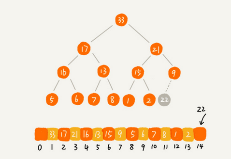

### 堆（Heap）和堆排序

#### 1 堆的定义

堆是一种特殊的树，需要满足以下两点：

- 堆是一个**完全二叉树**；
- 堆中每一个节点的值都必须**大于等于**（或**小于等于**）其子树中的**每个**节点的值。 按照递归的思想，也可以表述为**每个**子节点**大于等于**（或**小于等于**）其**左右**子节点的值。

每个节点大于等于子树中每个节点值的堆叫做**大顶堆**，小于等于则叫做**小顶堆**。
例如下面左小顶堆，右大顶堆：


#### 2 堆的存储

堆是完全二叉树，因此适合用数组来存储。下标为 i 的左子节点就是 i*2 位置节点；右子节点就是 i*2+1 位置节点；父节点就是 i/2 位置节点。


#### 3 堆的操作

以大顶堆为示例。

##### 3.1 插入元素

- 插入元素后需要继续满足堆的两个特性，例如将新插入元素放到堆的最后，如果不符合特性就需要调整让其满足堆的特性，这个过程叫做 **堆化**。
- 堆化分两种：从下往上、从上往下。
- 堆化操作：顺着节点所在路径，向上或者向下，对比，然后交换，例如大顶堆中子节点值比父节点大，那么就交换父子节点值。

例如如下新插入元素 22 ：



因为作为大顶堆，父节点肯定比左右子节点值大的，而新插入22节点比父节点9要大，不符合堆特性，所以需要进行堆化，那么可以采用 从下往上 的堆化。


```java
/**
     * （大顶堆）堆中插入元素
     * @param data
     */
    public void insert(int data){
        // 首先判断堆是否已满
        if(n >= max){
            return;
        }

        // 将元素放到堆中最后一个节点
        heap[++n] = data;

        // 进行堆化处理，采用从下往上堆化
        int p = n;
        while (p / 2 >= 1 && heap[p] > heap[p / 2]){
            // 节点比父节点值大，则进行值交换
            int temp = heap[p];
            heap[p] = heap[p / 2];
            heap[p / 2] = temp;

            p = p / 2;
        }
    }
```

插入的时间复杂度，堆化从下往上，遍历路径顺着高度依次向上，所以堆化的时间复杂度跟堆的高度成正比，而堆作为完全二叉树高度不超过logn，因此插入元素时间复杂度是O(logn) 。