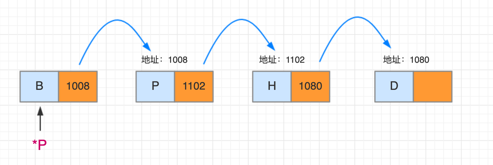

### 链表

#### 1 基本定义

定义：通过指针将零散的（不一定非连续）内存块串联在一起的数据结构。



含义解读：

- 指针：可以理解为储存地址的变量，例如变量P，那么 *P 就是指针声明方式，含义为它代表它所指向地址的变对象；可以理解为Java中的引用：变量Person per = new Person() 变量per本身是引用变量，可能是局部变量，而它实际保存的是所指向对象的地址，即 per 是指向 new Person()出来的这个对象实例的。例如上图*p 指向链表头节点，那么就可以用*p来指代当前链表。
- 非连续：不同于数组要求连续的内存空间，零散的空间即可，有利于空间利用；
- 节点：链表节点同数组一样也是一个个内存块；只不过链表的节点不像数组的节点只有数据，还需要单独一个内存块来存储下一个节点的值；
- 把记录下个节点地址的指针叫做后继指针；
- 链表第一个节点叫做头结点；最后一个节点叫做尾节点；尾节点的后继指针指向空地址NULL，其实就是没存任何地址；
- 我们定义的数组也好，链表也罢，它们在实际内存中的形式都是一样的，都是一个个内存块，不过任务抽象把它们封装成不同的数据结构，例如链表这个前后连接的线肯定不存在，但是从逻辑上存在的，好像一根根线连接起来一样；
- 链表相比数组需要占据更多的内存空间，天然支持动态扩容，但是具体场景选用那种数据结构需要根据实际情况分析；

#### 2 单链表操作

- 插入节点


单纯的插入操作本身：时间复杂度 O(1)

在指定节点之后插入节点： 时间复杂度 O(1)

在指定节点之前插入节点： 时间复杂度 O(n)

在指定值节点之前、后插入节点： 时间复杂度 O(n)

- 删除节点


单纯的删除操作本身：时间复杂度 O(1)

删除给定指针指向的节点：时间复杂度 O(n)，因为删除需要知道指定节点的前驱节点，单链表需要依次遍历直到 p->next = q 找到前驱节点才能删除，查找 O(n) ，删除 O(1)，加起来 O(n)

删除节点中值为某个值的节点：时间复杂度 O(n)，查找节点O(n)，删除操作O(1)，加起来就是 O(n)

- 访问节点

随机访问第K个节点：时间复杂度O(n)，因为链表空间非连续，无法类似数组寻址公式寻找节点，需要从头节点依次遍历

#### 3 循环链表

循环链表即在单链表的基础上，尾节点指向头节点：


#### 4 双向链表

后继指针next指向下一个节点，前驱指针prev指向前面的节点


相比单链表需要更多的存储空间；但是支持前后双向遍历，支持O(1)时间复杂度找到前驱节点

- 插入节点

单纯的插入操作本身：时间复杂度 O(1)

在指定节点之后插入节点： 时间复杂度 O(1)

在指定节点之前插入节点： 时间复杂度 O(1)

在指定值节点之前、后插入节点： 时间复杂度 O(n)

- 删除节点

单纯的删除操作本身：时间复杂度 O(1)

删除给定指针指向的节点：时间复杂度 O(1)

删除节点中值为某个值的节点：时间复杂度 O(n)，查找节点O(n)，删除操作O(1)，加起来就是 O(n)

- 访问节点

随机访问第K个节点：同单链表一样 时间复杂度O(n)

#### 5 双向循环链表


#### 6 如何写好链表代码

- 指针、引用的含义

有些语言有指针，有些语言是引用；本质上是一样的，都是存储所指对象的地址；

例如链表中某个节点，以单链表来说，需要两个内存块，一个保存当前节点数据，一个为next指针，即保存了下一个节点的内存地址；


- 警惕指针丢失和内存泄露

在进行例如插入链表节点时，需要注意指针指向的顺序，例如：


如果这样操作：

```
P -> next = M
M -> next = P -> next
```

因为第一步已经把P指针对应节点后继指针指向了M，这样当用 P -> next 想将 H 节点声明为 M 节点的后继节点时候，P->next其实已经不是H了，而是M，这样就导致M指向了自己，导致链表断裂，其实原因在于一开始 P->next 将指向改变的时候就切断了与后面节点的联系，导致新的节点也无法找到后面的节点位置。

正确应该是(相当于先不切断W和H的联系)：

```
M -> next = P -> next
P -> next = M
```

C语言类似的需要手动释放删除的节点内存；而Java这种自动内存管理的不需要；

- 利用哨兵简化难度

引入哨兵节点，head指针一直指向这个哨兵节点；

有哨兵节点的链表叫做带头链表；没有哨兵节点的就叫不带头链表；

带头链表：


- 留意边界条件处理

需要考虑链表为空、只有一个节点、只有两个节点、在处理头尾节点的时候能否正常工作？

- 画图辅助思考

无图无真相

- 多写多练

Talk is cheap, show me your code !

#### 7 链表代码实战

见代码目录：

[https://github.com/SkyYongFly/DSA/tree/master/src/main/java/com/skylaker/linkedlist](