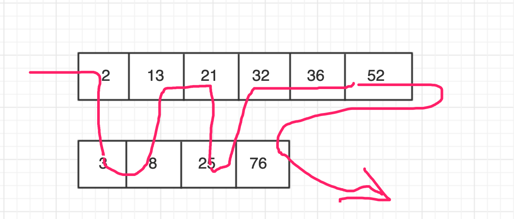

### 排序

#### 1 排序分类

按照时间复杂度分类：

|     排序算法     | 时间复杂度 | 是否基于比较 |
| :--------------: | :--------: | :----------: |
| 冒泡、插入、选择 |   O(n^2)   |      是      |
|    快排、归并    |  O(nlogn)  |      是      |
|  桶、计数、基数  |    O(n)    |      否      |

#### 2 分析衡量排序算法

**1. 算法的执行效率**

A. 最好、最坏、平均情况时间复杂度

分析排序算法，需要给出最好、最坏、平均时间复杂度三种情况，因为一不同算法之间会对比区分，二要排序的数据有序无序程度不一样，排序算法在不同数据情况下的性能表现需要全面衡量；

B. 时间复杂度的系数、常数、低阶

时间复杂度反应的是数据规模n很大时候一个增长趋势，会忽略系数、常数、低阶这些内容，但是对于排序算法，数据量可能很少，那么就不能简单的忽略这些内容；对于同阶排序算法比较也不能忽略系数这些内容；

C. 比较次数和交换（或移动）次数

基于比较的排序算法，涉及两种操作：比较大小、移动元素，分析时候需要考虑这两种情况；

**2. 排序算法的内存消耗**

算法内存消耗可以通过空间复杂度来分析衡量；

**原地排序**：特指空间复杂度为O(1)的排序算法。（冒泡、插入、选择都是原地排序算法）

**3. 排序算法的稳定性**

**稳定性**：待排序的序列中存在值相等的元素，排序后，值相等的元素相对顺序不变。

例如：


排序后两个3相对位置没有改变，所以就叫稳定排序；

但是如果这样：


就不是稳定排序算法了。

可能疑惑，这个3谁在前在后有啥关系？我们这里只是数值排序，没啥影响，但是涉及相关状态的处理就有意义了。比如一群人给你转账，张三转100块，李四转200块，，，张三和王五都是转100块，但是他们转的先后时间不同，这个时候你想看谁转账钱多少顺序以及先后顺序，那么对于相同100块钱来说他们的先后顺序就不能颠倒。针对这种场景，可以先按照金额排序后再针对金额相同的按照时间再一个个分段排序，不过相对麻烦；可以直接先按照时间排序一次，从前到后，然后再利用稳定排序算法排序金额，最终排序结果就是金额按照顺序，且相同金额符合时序。

#### 3 冒泡排序（Bubble Sort）

##### **3.1 基本思想**

从前到后，依次在剩余未排序项前后两两比较，如果前一个比后一个大则交换位置，一次冒泡后未排序项中最大值就被放到末尾，这样经过多次冒泡后从前到后依次从小到大有序（当然也可以从后向前、或者从大到小排序都可以，但是基本思想是一致的）。

例如，有序列  15、2、23、12、9、56、31

首先所有的项都是未排序项，则先 15 和 2 两两比较，15 比 2 大，则交换位置：2、15、23、12、9、56、31

再继续往后，15 和 23 比较，前一个小则不动，这样依次比较交换，第一次冒泡后最大值56被排到末尾：


这样经过一轮后剩下的6个元素还未排序好，需要再次冒泡，那么第二次冒泡最大值23就排到最后了，，，依次冒泡后即可排序好；


##### **3.2 算法代码**

```java
/**
 * 冒泡排序算法1：直接有多少元素冒泡几次
 * @param a
 */
public static void sort1(int[] a) {
    if(null == a || a.length < 1) {
        return;
    }

    // i 表示第几次（i + 1）冒泡（有多少个元素就冒泡几次）
    for(int i = 0; i < a.length; i++) {
        // j 表示需要几次（j + 1）比较，第 i 次 冒泡 ，则还剩余 length - i 个元素，则两两比较次数为 length - i -1 次
        for(int j = 0; j < a.length - i - 1; j++) {
            if(a[j] > a[j + 1]) {
                int temp = a[j];
                a[j] = a[j+1];
                a[j+1] = temp;
            }
        }
    }
}
```

但是根据上面冒泡图我们可以看到其实在第3次冒泡后序列已经有序，后面的冒泡其实没有必要，所以我们可以优化下代码，在冒泡过程中发现**没有发生交换**说明**已经有序**则后续无需再冒泡，直接结束：

```java
/**
	 * 冒泡排序算法2：记录是否发生交换，没交换直接结束
	 * @param a
	 */
	public static void sort2(int[] a) {
		if(null == a || a.length < 1) {
			return;
		}
		
		// i 表示第几次（i + 1）冒泡（有多少个元素就冒泡几次）
		for(int i = 0; i < a.length; i++) {
			//记录是否发生数据交换
			boolean swap = false;
			// j 表示需要几次（j + 1）比较，第 i 次 冒泡 ，则还剩余 length - i 个元素，则两两比较次数为 length - i -1 次
			for(int j = 0; j < a.length - i - 1; j++) {
				if(a[j] > a[j + 1]) {
					int temp = a[j];
					a[j] = a[j+1];
					a[j+1] = temp;
					// 设置发生了数据交换
					swap = true;
				}
			}
			
			if(!swap) {
				// 没有数据交换说明有序直接退出
				break;
			}
		}
	}
```

##### **3.3 冒泡排序分析**

- 是否原地排序？

  算法中只有在相邻元素交换的时候才会申请一个临时变量空间，对于整体来说是常量级，即空间复杂度为O(1)，所以冒泡排序为原地排序。

- 是稳定排序算法么？

  这个取决于比较交换操作，当前后两个元素相等时候，我们不交换元素，则可以保证冒泡排序稳定性。

- 时间复杂度

  最好情况：即已经完全有序，但仍然需要一次冒泡比较来确定，而比较次数为 n-1 ，则时间复杂度为**O(n)**；

  最坏情况：即完全逆序，需要n次冒泡，每次冒泡 length-i-1比较交换，整体而言时间复杂度**O(n^2)**；

- 平均时间复杂度

  按照概率论等分析会比较复杂，可以根据**有序度**、**逆序度**来分析；

  **有序度**：是数组中具有有序关系的元素对的个数，即 a[i] <= a[j]，如果 i < j;

  例如 15、2、23、12、9、56、31，有序对一共14对：

  ```
  （15，23）、（15，56）、（15，31）、
  
  （2，23）、（2，12）、（2，9）、（2，56）、（2，31）、
  
  （23，56）、（23，31）、
  
  （12，56）、（12，31）、
  
  （9，56）、（9，31）
  ```

  **满有序度**：完全有序的序列，例如 1、2、 8、 15、 17、 21，满有序度即两两组合对 **n*(n-1)/2**；

  **逆序度**：大小相反的元素对，即 a[i] > a[j]，如果 i < j；
  $$
  逆序度 = n*(n-1)/2 - 有序度     （n为元素个数）
  $$
  例如 15、2、23、12、9、56、31，有序对一共7对：

  ```
  （15、2）、（15、12）、（15、9）、
  （23、12）、（23、9）、
  （12、9）、
  （56、31）
  ```

  按照公式计算 **逆序度 7 = 满有序度 21 - 有虚度 14**；

  平均情况：取最好情况 即完全有序时候 有序度 n(n-1)/2，交换次数为0；最坏时候有序度即完全逆序，有序度 0 ，交换次数  n(n-1)/2；取中间次数 n(n-1)/4，则最终平均时间复杂度为 **O(n^2)**

#### 4 插入排序（Insertion Sort）

##### 4.1 基本思路

将目标数组（这里以数组作为目标数据结构）分为已排序区间和未排序区间，将未排序区间中的元素依次放到已排序区间中的合适位置，那么最终得到的数组就是有序的。例如对于数组来说，我们一开始可以将第一个元素作为已排序区间，后面元素依次在已排序区间找到合适位置插入。

例如对于数组序列：15、2、23、12、9、56、31


每次拿未排序的第一个元素插入到已排序序列，比较的次数是从已排序序列的最后一个元素往前，因为如果已排序序列最后元素小于未排序第一个元素，说明已经符合有序性，那么就不需要再往前比较交换了，直接继续下一个未排序元素，例如第二行，以排序元素2、15，未排序元素23来比较时候发现大于15，则直接继续下一个元素12的比较插入操作。

插入操作涉及两种操作：1、元素比较   2、元素移动（移动次数等于逆序度）

##### 4.2 代码实现

```java
public static void sort(int[] a){
  if(null == a || a.length < 1){
    return;
  }

  // 从第二个元素开始，第一个元素一开始被当成以排序有序序列
  for(int i = 1; i < a.length; i++){
    // 需要缓存当前未排序第一个元素值，因为后期再用a[i]取值可能该位置值已被更新
    int temp = a[i];
    int j ;
    for(j = i - 1; j >= 0; j--){
      if(a[j] > temp){
        // 如果被比较元素比当前待比较元素大，则位置后移一位
        a[j+1] = a[j];
      }else{
        // 如果小于等于则说明已排序序列和当前未排序第一个序列已经是有序了
        break;
      }
    }
    // 将未排序第一个元素值放到已排序序列元素后移留出的空位置
    a[j + 1] = temp;
  }
}
```

在未排序第一个元素向前比较过程中，如果发现前面的元素比当前元素大，我们并不采用像冒泡排序类似的交换位置做法，而只是把前面的元素位置后移，这样就空出一个位置，一直向前比较，直到找到合适位置，再把目标元素放到合适的空位置，这样减少了操作次数，降低时间复杂度。

例如上述列表在 2、15、23、12、9、56、31 中 12 往前面已排序列表插入操作：


##### 4.3 插入排序分析

- 是否原地排序？是，因为几乎不占用额外内存空间；

- 是否稳定排序？是，我们在涉及相等值比较后，不做位置交换，保证稳定；

- 时间复杂度

  **最好时间复杂度**：本身就是有序列表，但是需要从前到后遍历一下比较下元素和之前已排序列表末尾元素，所以最好时间复杂度为 **O(n)**；

  **最坏时间复杂度**：即完全逆序的列表，则需要从前到后遍历，然后每个元素在已排序区间比较再涉及现有元素后移，相当于内外层循环嵌套，则最坏时间复杂为  **O(n^2)** ；

  **平均时间复杂度**：因为每次元素插入操作相当于往数组插入一个元素，而这个操作平均时间复杂度为O(n)，而我们这里需要排序n个元素，所以平均时间复杂度就是**O(n^2)**

#### 5 选择排序（Selection Sort）

##### 5.1 基本思路

每次从未排序列表中查找出最小的数放到已排序列表末尾（当然也可以取最大放到末尾等）。


其实对于数组来说，选取第k大数后需要交换位置放到第K个下标索引位置中。

##### 5.2 代码实现

```java
public static void sort(int[] a){
        if(null == a || a.length < 1){
            return;
        }

        for(int i = 0; i < a.length; i++){
            // 从剩下区间中选择最小的数
            int min = a[i];
            int index = i;
            for(int j = i; j < a.length; j++){
                if(min > a[j]){
                    min = a[j];
                    index = j;
                }
            }
            // 如果index不是当前i说明最小数不是当前i下标数，需要交换
            if(i != index){
                int temp = a[i];
                a[i] = a[index];
                a[index] = temp;
            }
        }
    }
```

##### 5.3 选择排序分析

- 空间复杂度为 **O(1)** ，是原地排序；
- 最好、最坏、平均时间复杂度都是 **O(n^2)**，因为无论如何它都要内外循环查找一遍；
- **不是稳定排序算法** ，因为比如 5、5、2，第一遍寻找到最小数为2，则直接和第一个5交换，最终2、5、5，但是两个5前后顺序已经改变了，所以不是稳定排序算法；

#### 6 归并排序（Merge Sort）

##### 6.1 基本思路

如何将两个各自有序的数组合并成一个整的有序数组？我们可以依次从头比较两个数组的元素，依次将较小的值放入新的大数组，最后将剩下的数组元素放入大数组末尾即可。



归并排序最核心的算法就是利用数组合并的方法，即我们要对一个大的数组排序，那么我们可以直接将大数组一分为二，拆分成两个数组，那么将这两个数组分别排好序之后利用上述的合并方法整合起来不就是有序的数组了嘛。而对于拆分成的两个数组怎么排序呢？可以同样用拆分合并的方式递归下去，即最终细分到最底层的合并就是两个数组元素的合并。


##### 6.2 代码实现

```java
package com.skylaker.sort;

/**
 * 归并排序：核心思想，先将目标数组分解，再依次将分解的子数组从小串联合并起来
 * @author skylaker2019@163.com
 * @version V1.0 2019/11/1 11:59 PM
 */
public class MergeSort {
    public static void main(String[] args) {
        int[] a = {99, 80, 198, 66, 32, 1, 23, 45, 2, 18, 56, 72, 11};
        sort(a);
        print(a);
    }

    private static void sort(int[] a){
        if(null == a || a.length < 1){
            return;
        }

        sort_merge(a, 0, a.length - 1);
    }

    /**
     * 排序数组a 索引p到r之间的元素
     * @param a 目标数组
     * @param p 开始索引位置
     * @param r 结束索引位置
     */
    private static void sort_merge(int[] a, int p, int r){
        if(p >= r){
            return;
        }

        // 取待排序数组中间索引位置
        int q = (p + r) / 2;

        // 排序前半段
        sort_merge(a, p, q);
        // 排序后半段
        sort_merge(a, q+1, r);

        // 合并前后两段
        merge(a, p, q, r);
    }

    /**
     * 合并数组前后半段（前后半段已经分别排好序）
     * @param a 目标数组
     * @param p 开始索引位置
     * @param q 中间索引位置
     * @param r 结束索引位置
     */
    private static void merge(int[] a, int p, int q, int r){
        // 申请临时数组空间（注意这里申请临时数组大小）
//        int[] b = new int[a.length];
        int[] b = new int[r - p + 1];

        // i 前半段数组游标 j 后半段数组游标
        int i = p, j = q + 1;
        // k 临时数组索引
        int k = 0;

        // 依次从前后半段数组取最小的值，串起来
        while(i <= q && j <= r){
            if(a[i] <= a[j]){
                b[k++] = a[i++];
            } else {
                b[k++] = a[j++];
            }
        }

        // 将前后半段中剩下的元素放到临时数组的后面（它们就是最大的元素）
        int start = i, end = q;
        if(j <= r){
            start = j;
            end = r;
        }
        while(start <= end){
            b[k++] = a[start++];
        }

        // 将临时数组复制回原数组(注意回写的索引位置)
//        for(int t = 0; t < b.length; t++){
        int m = p;
        for(int t = 0; t < b.length; t++){
            a[m++] = b[t];
        }
    }

    private static void print(int[] a) {
        if(null == a || a.length < 1) {
            System.out.println("数组无内容！");
            return;
        }

        for(int i = 0; i < a.length; i++) {
            System.out.print(a[i] + " ");
        }
    }
}

```

##### 6.3 算法分析

- 是否稳定排序？

  只要保证在将前后两个子数组合并的时候，对于相同值的元素先取前半部分的那个元素，再取后半部分的，那么串起来的数组就是稳定的。

- 时间复杂度

  最好、最坏、平均时间复杂度都是 **O(nlogn)**，和原始数组有序度无关，因为不管怎样，都是需要依次拆分再合并起来，所需要的操作是一样的。

- 空间复杂度

  任意时刻只有一个函数执行，即进行申请空间进行合并操作的只有一个执行，申请的空间可以重用，所以最多只需要申请n大小的空间，即空间复杂度为**O(n)**

#### 7 快速排序

##### 7.1 算法思想

一组数据中任意一个元素在排序后必然是有其所在位置的，那么要想将n个元素排序，我们一次找出每个元素应该在集合中的位置不就可以了么？

例如对于数组[a,d,c,f,e,b],我们可以先确定b元素对应的有序位置，b元素最终的排序位置就是第二个位置，即[a,b,c,f,e,d],那么接下来我们可以对其前后部分再如此递归操作，不就能排序了么。


算法的基本思路在递归排序；核心难点在于如何确定指定元素（分区点）所在位置——从前到后遍历，小于分区点的元素依次往前放，大于的元素往后放，最终分区点元素必然在它们之间。例如对于数组 [a,d,b,f,e,c] 针对分区点c确定分区位置：


##### 7.2 代码实现

```java
package com.skylaker.sort;

/**
 * 快速排序
 * @author skylaker2019@163.com
 * @version V1.0 2019/11/3 12:26 PM
 */
public class QuickSort {
    public static void main(String[] args) {
        int[] a = {99, 80, 198, 66, 32, 1, 23, 45,99, 2, 18, 56, 72, 11};
        sort(a);
        print(a);
    }

    private static void sort(int[] a){
        if(null == a || a.length < 1){
            return;
        }

        quick_sort(a, 0, a.length - 1);
    }

    /**
     * 对数组p到r区间内容元素执行快速排序
     * @param a 目标数组
     * @param p 开始索引位置
     * @param r 结束索引位置
     */
    private static void quick_sort(int[] a, int p, int r){
        // 设置递归终止条件
        if(p >= r){
            return;
        }

        int q = partition(a, p , r);
        // 注意这里递归的索引范围，因为返回的q位置即上一个目标分区点已排序合适位置
        // 下一次排序的应该分别是前后半段
        quick_sort(a, p, q - 1);
        quick_sort(a, q + 1, r);
    }

    /**
     * 对目标数组进行分区排序：
     *  找到分区点，将小于分区点的元素放到分区点前面；大于分区点的元素在后面，
     *  即将目标分区点元素找到其最终对应的位置，前后再依次找分区点元素位置，最终有序
     *
     * @param a      目标数组
     * @param start  开始索引位置
     * @param end    结束索引位置
     * @return {int} 分区点元素最终应该排好序后的索引位置
     */
    private static int partition(int[] a, int start, int end){
        // 默认以最后一个元素作为分区点元素
        int point = end;
        // 小于分区点的元素分区段最后一个索引位置
        // 例如 3 2 8 4 5 中 i 在元素2位置
        int i = start;

        for(int j = start; j <= end - 1; j++){
            if(a[j] < a[point]){
                // 如果在相同位置就没必要交换了
                if(i != j) {
                    int temp = a[i];
                    a[i] = a[j];
                    a[j] = temp;
                }

                i++;
            }
        }

        // 最终交换分区点元素至i索引位置
        int temp = a[i];
        a[i] = a[point];
        a[point] = temp;

        return i;
    }

    private static void print(int[] a) {
        if(null == a || a.length < 1) {
            System.out.println("数组无内容！");
            return;
        }

        for(int i = 0; i < a.length; i++) {
            System.out.print(a[i] + " ");
        }
    }
}

```

##### 7.3 算法分析

- 是否稳定排序？

  不稳定。

- 时间复杂度

  最好 **O(nlogn)**，最坏、平均情况下**O(n^2)**。

- 空间复杂度
  原地排序，**O(1)** , 因为核心的确定分区点位置直接数组内遍历交换并未申请临时数组空间。

#### 8 线性排序

##### 8.1 桶排序

- 排序思想
  将要排序的数据分到几个有序桶之中，每个桶内部再单独排序，这样最后所有桶依次取出元素就是有序的。例如元素 5 12 9 3 17 15 13 ，我们可以放到两个桶中，[1,10]区间、[11,20]区间，就是[5,9,3]、[12,17,15,13],那么第二个区间数肯定是大于第一个区间的，两个区间单独排序后再串起来就是有序的了。
- 时间复杂度
  O(n)
- 优缺点
  优点：桶排序时间复杂度效率高；适合用在外部排序（数据存在外部磁盘，即数据量大的场景）；
  缺点：对数据要求高，正常要求数据分到不同的桶数据需要相对平均，但是如果划分后有些桶很多、有些很少，极端情况下都放到一个桶了，那么就退化成桶里单排序了，如果采用快排，时间复杂度一般来说就是O(nlogn)了。

##### 8.2 计数排序

##### 8.2 基数排序

#### 9 排序算法总结

|          | 是原地排序？ | 是否稳定？ |   最好   |   最坏   |   平均   |
| :------: | :----------: | :--------: | :------: | :------: | :------: |
| 冒泡排序 |      是      |     是     |   O(n)   |  O(n^2)  |  O(n^2)  |
| 插入排序 |      是      |     是     |   O(n)   |  O(n^2)  |  O(n^2)  |
| 选择排序 |      是      |     否     |  O(n^2)  |  O(n^2)  |  O(n^2)  |
| 归并排序 |      否      |     是     | O(nlogn) | O(nlogn) | O(nlogn) |
| 快速排序 |      是      |     否     | O(nlogn) |  O(n^2)  | O(nlogn) |

