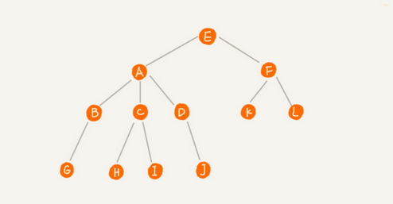
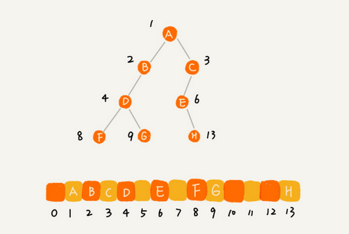
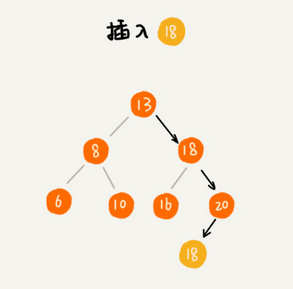

### 树

#### 1 树的基本定义

如下图所示：

**父节点**：A为B、C、D的父节点

**子节点**: K、L为F的子节点

**兄弟节点**：父节点是同一个的节点之间称为兄弟节点，例如 H 节点和 I  节点

**根节点**：没有父节点的节点叫做根节点，图中E节点

**叶子节点**或**叶节点**：没有子节点的节点，例如 G节点、H节点、I节点、J节点



**高度**：节点到叶子节点的最长路径（所以叶子节点的高度肯定为0）

**深度**：根节点到这个节点所经历的边的个数（所以根节点的深度肯定为0）

**层数**：节点的深度 + 1

**树的高度**：根节点的高度

例如：


#### 2 二叉树

##### 2.1 二叉树相关定义

**二叉树**：即树的每个节点最多两个分叉，分别为**左子节点**、**右子节点**，允许没有子节点或者只有一个子节点


**满二叉树**：例如 2 图示，所有叶子节点都在最底层，且除了叶子节点外，每个节点都有左右两个子节点；

**完全二叉树**：如图 3，叶子节点都在**最底下两层**，最后一层叶子节点都**靠左排**，并且除了最后一层，其他层节点个数都达到了最大；

##### 2.2 如何表示或者存储一棵二叉树

- 基于指针或者引用的**二叉链式存储法**

  每个节点有三个字段，一个存储数据，另外两个是指向左右子节点的指针。

  

- 基于**数组**的顺序存储法

  将节点按层依次遍历，依次存储在数组中对应下标位置，例如

  

  根节点在1位置（便于计算），左子节点 1 *2 ，右子节点 1 * 2 + 1 ，类推，X位置的节点，左子节点在 2 * X位置，右子节点在 2 * X + 1 位置，反之，数组中 X / 2 节点位置就是父节点位置。

  完全二叉树存储节省空间，如果是非完全二叉树会浪费不少空间，例如：

  

  **完全二叉树适合用数组存储，因为不需要像链式法需要额外的左右指针**。

  堆是一种完全二叉树。

##### 2.3 二叉树遍历

- **前序遍历**：树中任意节点，先打印**这个**节点，再打印**左**子树，最后打印**右**子树
- **中序遍历**：树中任意节点，先打印**左**子树，再打印**这个**节点，最后打印**右**子树
- **后续遍历**：树中任意节点，先打印**左**子树，再打印**右**子树，最后打印**这个**节点


其实父节点遍历位置决定前中后，

- 父-左子-右子  前序
- 左子-父-右子  中序
- 左子-右子-父  后序

任何时刻都左右子节点都是先遍历左子节点，再右子节点  。

可以使用**递归**来实现遍历代码。

```java
	/**
     * 前序遍历
     * @param root
     */
    public void preOrder(Node root){
        if(null == root) {
            return;
        }

        System.out.print(root.data + " ");
        preOrder(root.left);
        preOrder(root.right);
    }

    /**
     * 中序遍历
     * @param root
     */
    public void inOrder(Node root){
        if(null == root) {
            return;
        }

        inOrder(root.left);
        System.out.print(root.data + " ");
        inOrder(root.right);
    }

    /**
     * 后序遍历
     * @param root
     */
    public void postOrder(Node root){
        if(null == root) {
            return;
        }

        postOrder(root.left);
        postOrder(root.right);
        System.out.print(root.data + " ");
    }

    /**
     * 树节点
     */
    public class Node {
        private int data;

        private Node left;

        private Node right;

        public Node(int data){
            this.data = data;
            this.left = null;
            this.right = null;
        }

        public int getData() {
            return data;
        }

        public void setData(int data) {
            this.data = data;
        }

        public Node getLeft() {
            return left;
        }

        public void setLeft(Node left) {
            this.left = left;
        }

        public Node getRight() {
            return right;
        }

        public void setRight(Node right) {
            this.right = right;
        }
    }
```


##### 2.4 时间复杂度

- 二叉树遍历时间复杂度

  每个节点最多访问两次，所以时间复杂度跟节点个数 n 成正比，所以二叉树遍历时间复杂度为 **O(n)**

#### 3 二叉查找树（Binary Search Tree）

##### 3.1 基本定义

**二叉查找树**中任意一个节点，**左**子树的每个节点值都要**小**于这个节点的值；**右**子树的每个节点值都要**大**于这个节点的值。简单点：**左小右大**。


##### 3.2 特性

- 支持**动态**数据集合的**快速**插入、删除、查找操作；
- **中序遍历**二叉查找树，可以输出**有序的数据序列**，时间复杂为**O(n)**；因此二叉查找树又称**二叉排序树**；

##### 3.3 查找操作

从根节点开始，小于的从左子树查、大于的从右子树查。


```java
	/**
     * 查找指定值的节点（默认无重复元素）
     * @param data 目标节点值
     * @return {Node} 目标节点
     */
    public Node findNode(int data){
        // 查找游标节点
        Node p = root;
        while (null != p){
            if(data < p.data) {
                p = p.left;
            } else if(data > p.data){
                p = p.right;
            } else {
                return p;
            }
        }
        return null;
    }
```


##### 3.4 插入操作

这里默认插入叶子节点。

类似查找操作，主要找到合适位置。从根节点开始，小于在左子树找，一直找到左节点为空的节点，作为左子节点插入；同理大于则在右子树查找右子节点为空的节点，作为右子节点插入。


```java
	/**
     * 插入指定值的节点
     * @param data 目标节点值
     */
    public void insertNode(int data){
        if(null == root){
            root = new Node(data);
            return;
        }

        // 查找游标节点
        Node p = root;
        while (null != p){
            if(data < p.data) {
                if(null == p.left){
                    Node node = new Node(data);
                    p.left = node;
                    return;
                }
                p = p.left;
            } else {
                if(null == p.right){
                    Node node = new Node(data);
                    p.right = node;
                    return;
                }
                p = p.right;
            }
        }
    }
```


##### 3.5 删除操作

- 第一种情况要删除节点**没有叶子节点**，那么父节点指向该节点指针置为空；如图18节点删除后，父节点17节点右子节点指针直接设置为空即可；
- 第二种情况删除节点**只有一个子节点**，只需要父节点指向该节点的指针直接指向子节点；如图13、46节点，它们分别只有一个左子节点、右子节点，那么删除后，父节点15左节点指针直接指向3，50节点左节点指针指向48；
- 第三种情况删除节点**有两个子节点**，为了保持查找树限制（左小右大），需要从右子树中找到最小节点，把值替换到当前节点，然后删除最小的那个右子节点，因为右子树中最小节点肯定是最左下角的那个节点，不过需要注意那个最小的节点还可能有右子节点（其实也可以用左子树的最大值节点）。
  例如图中21节点，需要从右子树中找到最小节点23，然后23的值替换到21位置，原先23位置节点需要删除，那么25节点左指针直接指向24节点。


具体代码实现的时候我们可以按照这三种情况分别考虑实现，但是我们可以优化下逻辑，**其实对于第三种情况，从右子树查找最小值节点替换到被删除位置后，对于原来位置的删除肯定是第一种或者第二种情况，因为如果该位置，例如图中23存在左子节点，那么整个右子树的最小值肯定不是23，因此23要么没有子节点要么只有右子节点。所以我们可以把情况三先实现替换值步骤，然后最后三种情况就合并变成了只有两种情况了：要么只有一个子节点（左或者右），要么没有子节点**。

```java
/**
     * 删除指定值的节点
     * @param data 目标节点值
     */
    public void deleteNode(int data){
        // 首先查找节点
        /// p代表当前查找节点位置，最终为要删除的节点
        /// pp代表p节点的父节点
        Node p = root;
        Node pp = null;
        while (null != p){
            if(data == p.data){
                break;
            } else if(data < p.data){
                pp = p;
                p = p.left;
            } else {
                pp = p;
                p = p.right;
            }
        }

        if(null == p){
            System.out.println("未找到指定值的树节点");
            return;
        }

        // 对有两个子节点的节点先进行处理
        if(null != p.left && null != p.right){
            // m节点缓存待删除节点
            Node m = p;

            // 从右子树中查找最小值的节点
            pp = p;
            p = p.right;
            while(null != p.left){
                pp = p;
                p = p.left;
            }
            m.data = p.data;
        }

        // 最终的p节点只有一个节点或者没有子节点
        // 找出子节点的子节点
        Node child ;
        if(null != p.left){
            child = p.left;
        } else if(null != p.right){
            child = p.right;
        } else {
            child = null;
        }

        // 删除最终节点
        if(null == pp){
            // 树只有一个根节点且删除的就是根节点
            p = null;
        } else if(pp.left == p){
            pp.left = child;
        } else if(pp.right == p){
            pp.right = child;
        }
    }
```

##### 3.6 查找最大节点

最大节点必然是最右侧节点

```java
   /**
     * 查找最大值节点
     * @return
     */
    public Node findMaxNode(){
        // 最大值节点肯定是最右侧那个节点
        if(null == root){
            return null;
        }

        Node p = root;
        while (null != p.right){
            p = p.right;
        }
        return p;
    }
```

##### 3.7 查找最小节点

```java
/**
     * 查找最小值节点
     * @return
     */
    public Node findMinNode(){
        // 最大值节点肯定是最左侧那个节点
        if(null == root){
            return null;
        }

        Node p = root;
        while (null != p.left){
            p = p.left;
        }
        return p;
    }
```

##### 3.8 支持重复元素

- 方案一：相同元素值放到同一个节点，节点内部用链表保存这些值；

- 方案二：相同元素值放到右子树：

  查找：按照原先查找方式，遇到目标值节点继续查找，直到叶子节点；


​	插入：插入相同值的右子树，即当作类似大于值节点处理；



​	删除：1）找到一个相同值便删除该节点，删除后重复在新二叉树中查找该节点删除，直到找不到这个值节点；2）也可以先查找出所有指定值节点，然后倒序删除，原因有可能底层的那个节点正好是上一个相同值节点删除时候右子树的最小值，导致如果顺序删除的话删除了前面的，再删除第二个时候这个节点不是原先找的那个节点了。


##### 3.9 时间复杂度

时间复杂度跟树的高度成正比，即 O(height)：

- 极端情况退化成链表，查找时间复杂度O(n)；
- 最好情况是完全二叉树，根据每层节点1、2、4 ......数量 求出n个节点的完全二叉树层数最高 logN + 1，即完全二叉树高度 logN，**完全二叉查找树**插入、查找、删除时间复杂度 **O(logn)**。


##### 3.10 相对散列表优势

- 散列表无序，二叉查找树可以O(n)中序遍历有序输出；
- 散列表冲突、扩容等不稳定或者耗时，而 二叉查找树中特殊的平衡二叉查找树可以稳定在 O(logn)；
- 散列表时间复杂度 O(1) ,但是由于散列冲突、哈希耗时等因素，实际效率不一定高于O(logn)的二叉查找树；
- 散列表构造比二叉查找树复杂，例如散列函数设计、冲突解决、扩容、缩容等；平衡二叉查找树只需要考虑平衡性这个问题；

#### 4 红黑树

#### 5 递归树

##### 5.1 思想

利用树结构来求解递归算法的时间复杂度。例如归并排序、快速排序采用递归公式来分析时间复杂度会比较复杂，而递归的思想就是以大化小，一层层分解，这样分解的过程就可以用形成一个树形结构，叫做递归树。


##### 5.2 实例

例如归并排序：归并排序的核心思想就是化整为零，将整个要排序数据一分为二，依次二分下去，然后再回归按照顺序串起来，就是有序的数据了，例如


整个的操作耗时一个在于数据的拆分，一个在于后期的归并，对于拆分来说，因为二分操作整体效率很高，操作次数很少，可以当作常量级时间复杂度，主要耗时在归并操作，归并操作需要依次将拆分的数列整合，如果左侧m个数，右侧p个数，那么遍历依次需要 O(m+p)时间复杂度，对于归并操作来说因为每次都是二分，那么对于递归树的每一层来说数据总和是固定的，即 n ,例如


那么每一层的时间复杂度就是O(n)，那么对于整体的时间复杂度就是树的高度 h*O(n) , 而归并对应的递归树为满二叉树，则高度大约为logn，因此对于归并排序来说整体时间复杂度就是O(n*logn) 。