## 最短路径算法 （ Shortest Path Algorithm ）

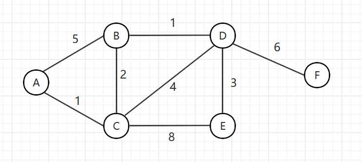

利用一个前置节点数组和优先级队列处理

第1步：

A 节点入队列（其中加入优先级队列的数据结构包含两个元素，一个是当前节点，另一个是当前节点到起始节点的路径——不一定是最短的），对于 A 节点来说，本身就是起始节点，所以距离起始节点最短路径就是 0 ；

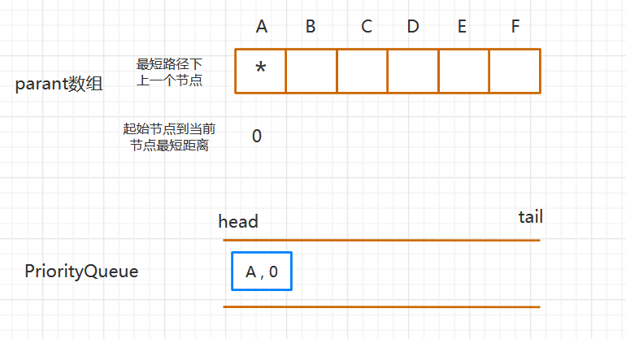

第2步：

A 节点弹出队列，将 A 节点关联的节点入队列，B 到 A 的距离 5，C 到 A 的距离 1，所以 [B, 5] 、[C, 1] 入队列：

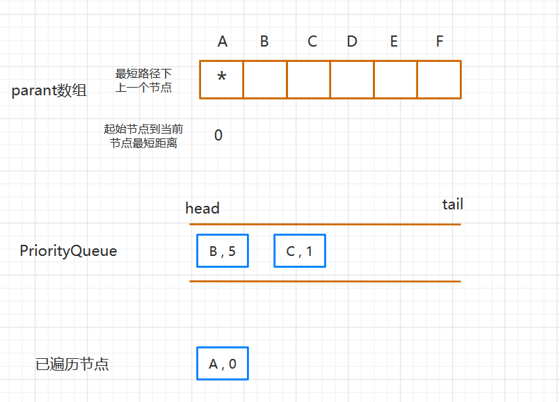

因为加入的是优先级队列，所以需要将 [C, 1] 排到前面：

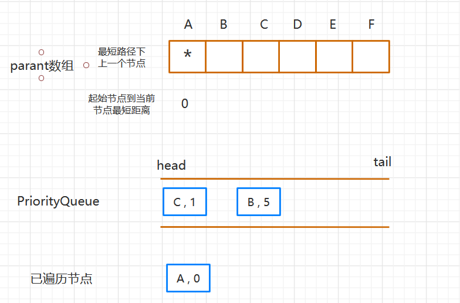

弹出队头节点  [C, 1] ，则 C 节点已经遍历完，同时更新 前置节点数组：

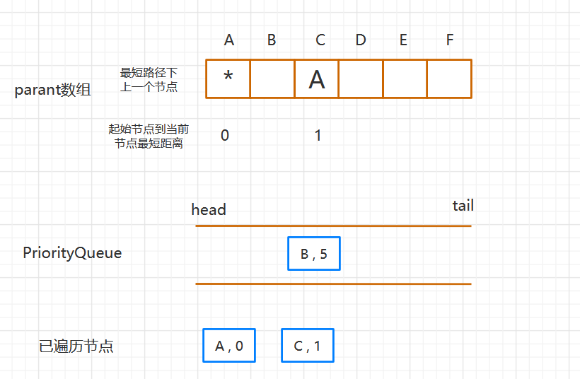

第3步：

C 节点弹出后，则需要将 C 关联的节点放入优先级队列，C 关联的节点有 A、B、D、E ，因为 A 节点已经遍历过了，所以不需要再处理，则只需要将 B、D、E 节点加入队列：

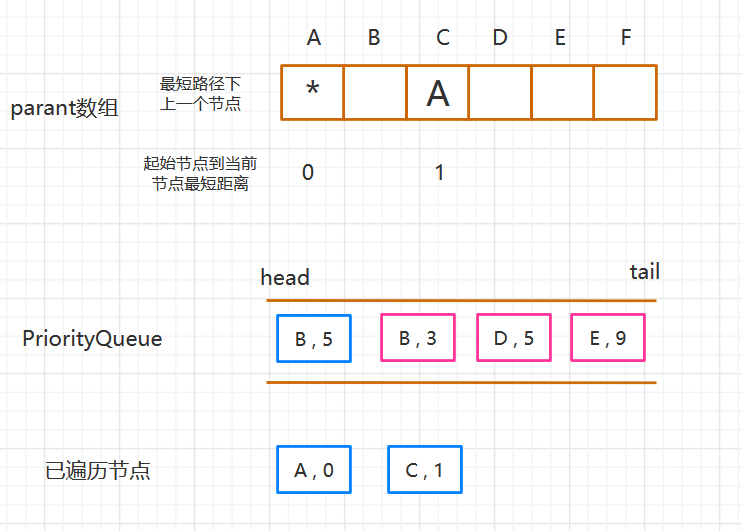

因为是从 C 节点过去的，所以新加入的节点的距离是在 C 距离开始节点的距离上加上C 到当前节点的距离和，例如 D基节点到 A 的距离就是 [A、C] + [C、D] 。

新入队列的节点需要重新按照优先级排序：

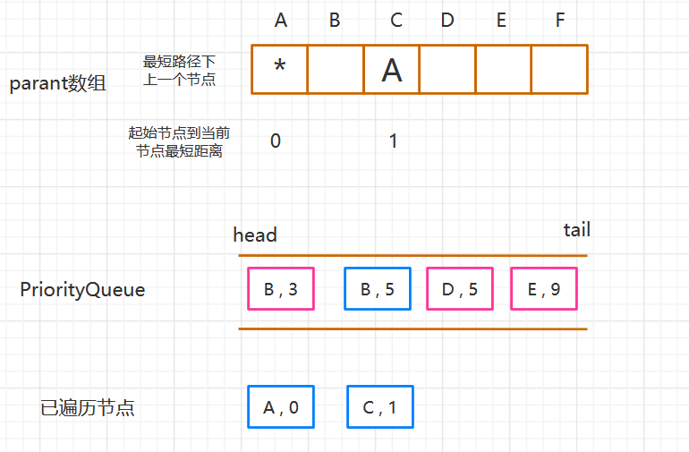

弹出队头节点 [B , 3] , 说明 B 节点距离 起始节点 A 的最短路径就是 3 , 且路径为 A — C — B：

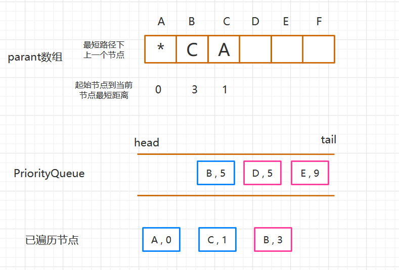

第4步：

弹出了 B 节点，则将 B 关联的节点入队列，除去已经遍历的 A、C 节点，则需要入队列 D 节点，且 D 到起始 A 节点的距离即 3 + 1 = 4 :

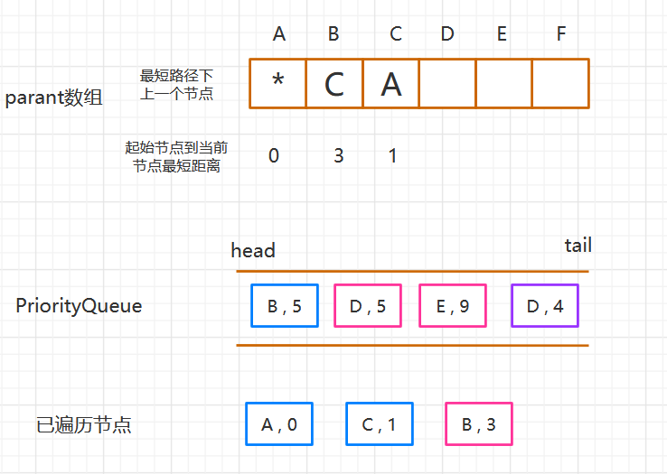

优先级排序：

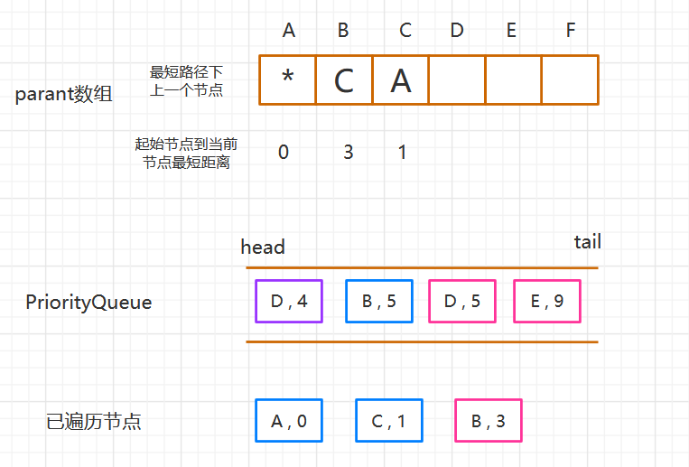

弹出队列头节点 [D, 4] , 加入已遍历节点，且说明 D 到起始节点的最短距离就是 4 ，路径为 A — C — B — D：

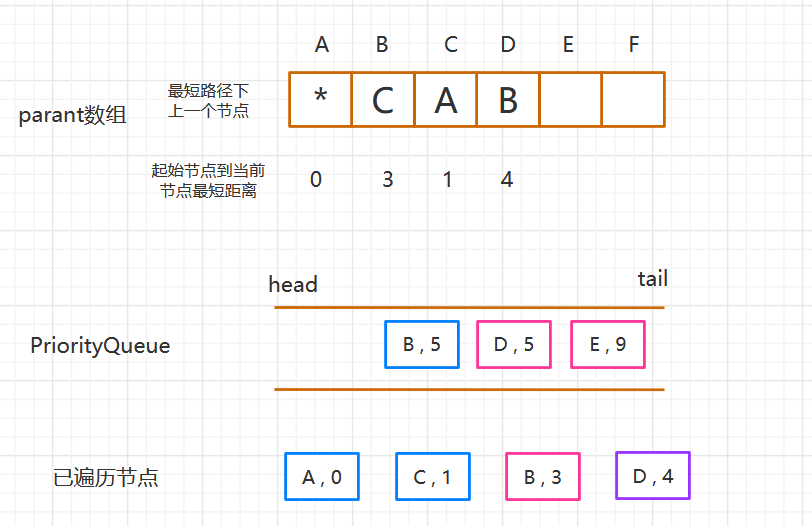

第5步：

弹出了 D 节点，需要将 D 节点关联的节点 B、C、E、F 入队列，B 和 C 已遍历，所以入队列 E 、F，其中 E、F 距离起始 A 节点的距离是在 [D，4] 的基础上遍历的，例如 E 节点距离 A 节点距离就是 4 + 3 = 7：

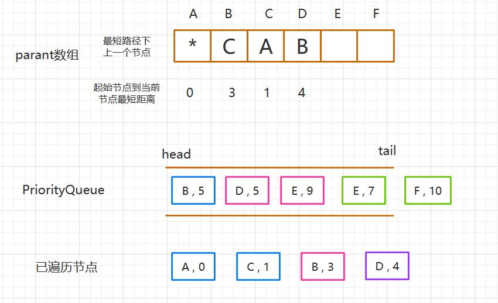

优先级队列排序：

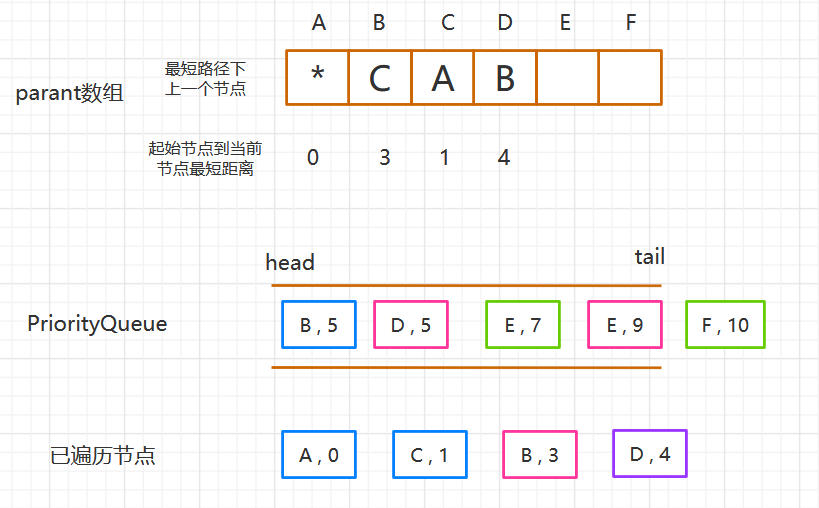

弹出 [B, 5] ，因为 B 节点已经遍历，丢弃；

弹出 [D, 5] ，因为 D 节点已经遍历，丢弃；

弹出 [E, 7] ，E 关联的节点需要入队列，而关联的 C、D 都已遍历，因此不需要再入队；

弹出 [F, 10] ，F 关联的节点需要入队列，而关联的 D 已遍历，因此不需要再入队；

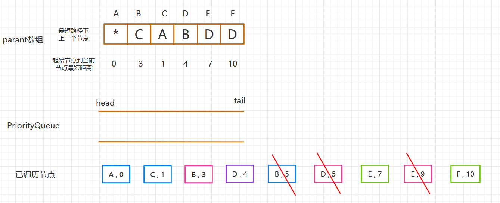

队列为空，遍历结束，所有节点距离起始节点 A 的最短路径已经计算完成，其中例如 F 节点距离 A 的最短路径可以通过 parent 数组反向获取：F — D — B — C — A ，正向即 A — C — B — D — F：

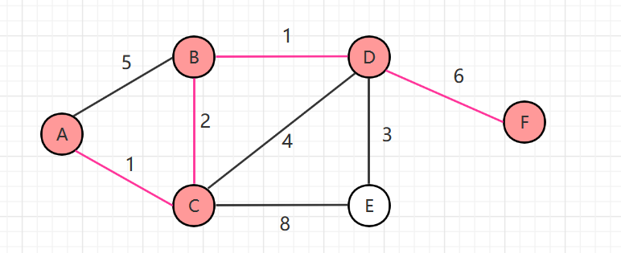

其中可以发现，起始顶点 A 到指定顶点 F 的最短路径上某个顶点（例如 B、D）的路径就是起始顶点到这个顶点的最短路径，例如 A 到 F 的最短路径为 A — C — B — D — F ，那么 A 到 D 的最短路径必然为 A — C — B — D ，可以反证明：

假设 A 到 D 的最短距离不是 A — C — B — D ，而是另一条路径，例如  A — C — E — D ，而 不管 D 之前的路径怎么走，D 到 F 的路径是一定的，那么 A 到 F 的最短路径必然是 A — C — E — D — F ，这个和实际最短路径矛盾，因此不成立。