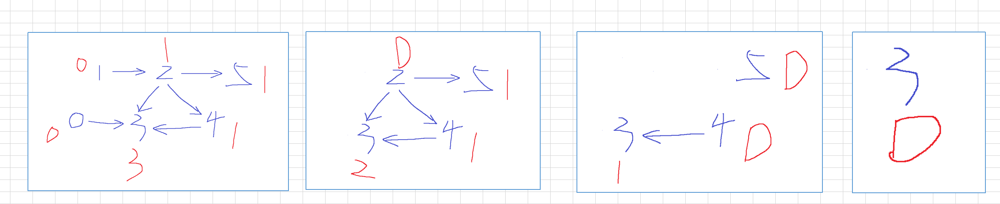
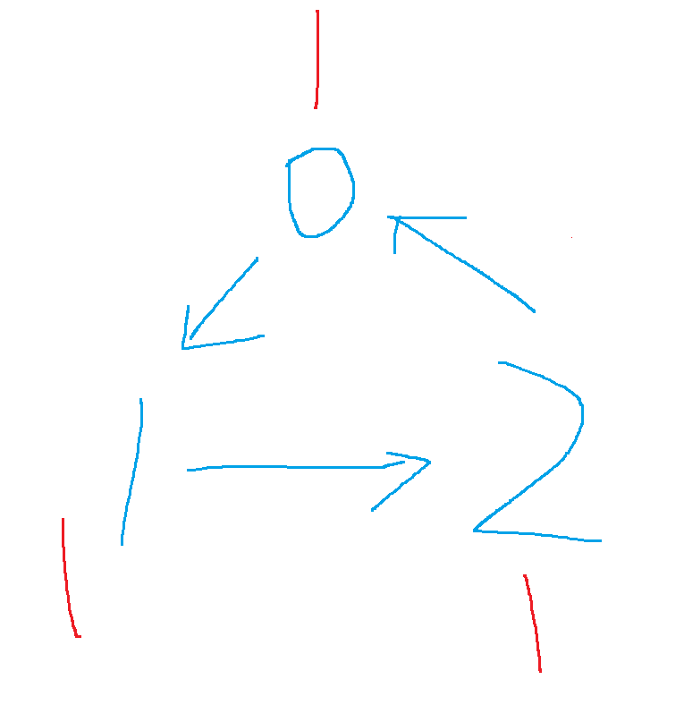
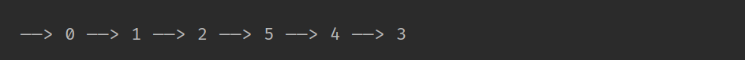
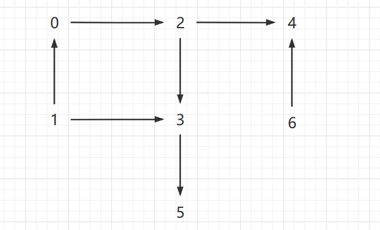

## 拓扑排序（Topological Sorting）

### 1 基础说明

#### 1.1 概念定义

有向图的拓扑排序是其顶点的线性排序，使得对于从顶点 u 到顶点  v 的每条有向边 uv , u 在排序中都在 v 之前。 

例如，图形的顶点可以表示要执行的任务，并且边可以表示一个任务必须在另一个任务之前执行的约束；在这个应用中，拓扑排序只是一个有效的任务顺序 。

#### 1.2 应用场景

* 需要通过局部顺序来推导全局顺序的，一般都能用拓扑排序来解决 ；
* 整体顺序不一定唯一，但是局部存在先后依赖关系的场景；

* 拓扑排序还能检测图中环的存在 ；

#### 1.3 底层数据结构

基于 “ 图” —— 有向无环图 ；

#### 1.4 注意点

拓扑排序的序列并不是唯一的，因为限制条件主要在局部顺序要求，但是对于不同局部内容之间并不一定限制条件

### 2 算法实现

#### 2.1 Kahn 算法

* 采用贪心算法思想；

* 有向图中如果 s 先于 t 执行，s 指向 t 。顶点入度为 0 表示无任何依赖指向，该顶点可先执行；

* 从图中寻找入度为 0 顶点，输出，把这些顶点可达的顶点的入度都减 1。循环执行，最后输出的序列，就是满足局部依赖关系的拓扑排序。

  

  比如这个图：

  * 一开始 1 和  0 顶点入度为 0 ，先遍历，指向的 2、3 入度减1 ，变为 0、2；

  * 再遍历入度为 0  的顶点，只有 2，指向的 5 、3、4 顶点 入度减 1，分别变为 0 、1、0；

  * 再遍历入度为 0  的顶点，有 5 、4，指向的顶点 3 入度减 1，变为 0；

  * 再遍历入度为 0  的顶点，只有 3；

  * 再遍历，没有元素了，结束。

  * 核心思想就是每次寻找入度为 0 的顶点，从外到内，如果发现遍历完还有元素，说明是有环的，比如：

    

    三个顶点入度都为 1，要想寻找 0 入度的顶点没有，但是元素并未被遍历完。不管这个环的三个顶点被多少顶点指向，外部顶点都遍历完，剩下的这三个顶点，要想顶点被遍历“从图中移除” ，那么就需要当前顶点入度为 0 ，而环恰好死循环，导致没一个顶点的入度能达到 0 。

* 代码实现

  ```java
  package com.skylaker.advanced;
  
  import java.util.LinkedList;
  import java.util.Queue;
  import java.util.concurrent.LinkedBlockingQueue;
  
  /**
   * 有向图：拓扑排序
   * @author skylaker
   * @version V1.0 2020/5/25 23:41
   */
  public class GraphTopologicalSorting {
      // 有向图的定义
      // 顶点个数
      private int v;
      // 图的邻接表表示
      private LinkedList<Integer>[] list;
  
  
      /**
       * 图定义
       * @param v 顶点个数
       */
      public GraphTopologicalSorting (int v) {
          this.v = v;
          list = new LinkedList[v];
          for(int i = 0; i < v; i++) {
              list[i] = new LinkedList<>();
          }
      }
  
      /**
       * 图添加边，h 顶点到 t 顶点 ： h ——> t， h 先于 t
       * @param h 起始顶点
       * @param t 结束顶点
       */
      public void addEdge(int h, int t) {
          list[h].add(t);
      }
  
      /**
       * kahn算法实现拓扑排序：利用贪心算法
       *
       *  先找出入度为 0 的顶点，再找出入度为1的顶点…… 依次寻找遍历顶点
       */
      public void sortByKahn() {
          // 记录每个顶点入度数的数组
          int[] d = new int[v];
  
          // 先遍历邻接表统计出所有顶点的入度
          for(int i = 0; i < v; i++) {
              for(int j = 0; j < list[i].size(); j++) {
                  // i 顶点的邻接表中的顶点就是 i 指向的顶点  i ——> list[i].get(j)
                  int p = list[i].get(j);
                  d[p]++;
              }
          }
  
          // 先从入度为 0 的顶点开始遍历
          // 构造一个队列，依次放入入度为 0 、1、2 …… 的顶点，作为临时中转
          Queue<Integer> queue = new LinkedBlockingQueue<>();
          for(int i = 0; i < d.length; i++) {
              if(0 == d[i]) {
                  queue.add(i);
              }
          }
  
          while (!queue.isEmpty()) {
              // 移除队列头节点， 一开始即入度为 0 的顶点中的第一个
              int p = queue.remove();
              System.out.print(" ——> " + p);
  
              // 遍历当前顶点的邻接表，并将指向的顶点的入度减 1
              for(int j = 0; j < list[p].size(); j++) {
                  int pp = list[p].get(j);
                  d[pp] --;
  
                  // 如果指向的顶点入度减到为0，则说明就没顶点指向当前顶点了
                  if(0 == d[pp]) {
                      queue.add(pp);
                  }
              }
          }
      }
  }
  
  ```
  
  测试：
  
  ```java
      @Test
      public void testKahn() {
          GraphTopologicalSorting graph = new GraphTopologicalSorting(6);
          graph.addEdge(0, 3);
          graph.addEdge(1, 2);
          graph.addEdge(2, 5);
          graph.addEdge(2, 3);
          graph.addEdge(2, 4);
          graph.addEdge(4, 3);
  
          graph.sortByKahn();
      }
  ```
  
  输出：
  
  
  
  

#### 2.2 DFS算法 

* 算法思想

  利用深度优先搜索，依次从前到后遍历顶点，针对每个顶点，递归查找它依赖的每个顶点，相当于把这个顶点依赖的所有顶点倒序搜索输出；例如：

  

  要输出顶点3，那么肯定先要输出它依赖的顶点 1、2，针对顶点 1 和 2 需要再递归寻找它们依赖的顶点，1 没有，而 2 的依赖的顶点是 0 ，需要先输出 0，顶点 0 没有依赖，则递归结束。

* 代码实现

  可以构建每个顶点的逆邻接表，即每个顶点依赖的