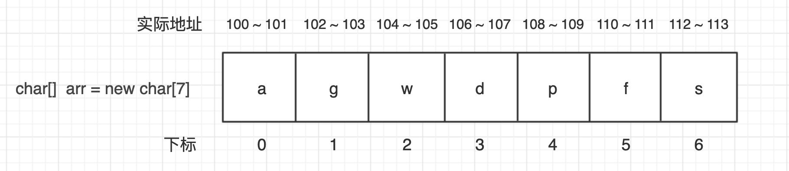
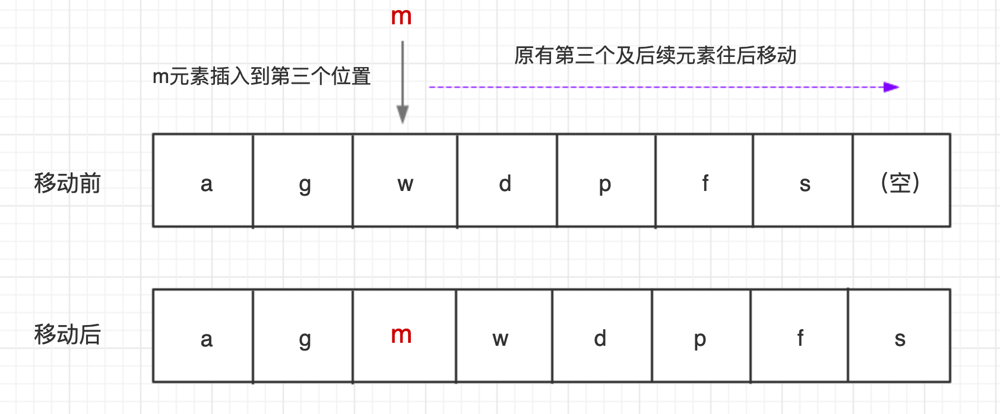

### 数组

#### 1 定义

数组（Array）是一种线性表结构，用一组连续的内存空间，来存储一组具有相同类型的数据。

#### 2 寻址

例如我们申请了一个大小空间为7的字符数组（Java中），假设内存分配给数组的初始地址为100，每个字符占两字节



寻址公式：`第i+1位地址 = 首地址 + i * 每个元素大小`
例如上例第4个元素地址就是 100 + 3*2 = 106

从0开始编号：方便寻址，减少寻址运算；历史原因。

#### 3 查找

查找时间复杂度：
a. 按照下标随机访问：O(1)
b. 查找指定元素元素：最好O(1)、最差O(n)、平均O(n)、二分查找O(logn)

#### 4 插入

a. 将某个元素插入到数组中的第K个位置：
最好 -- 直接插入末尾 O(1)
最差 -- 数组开头位置，因为涉及后续元素往后移动 O(n)
平均 -- O(n)



优化插入操作：将原位置元素放入末尾，原位置插入目标元素，时间复杂度O(1)


#### 5 删除操作

删除第K位的元素，为保证内存连续性也要搬移数据
最好 -- 直接删除末尾 O(1)
最差 -- 数组开头位置，因为涉及后续元素往后移动 O(n)
平均 -- O(n)
优化 -- 每次删除时候并不真正删除元素，而是标记为已删除，当存储空间不够时候再执行真正的删除并搬移数据，减少每次都搬移数据的时间消耗

#### 6 数组访问越界

C语言即使越界了但是只要内存空间可以访问就能正常运行，可能导致隐含bug；例如C语言中：元素向下压栈分配内存空间，i、a[2]、a[1]、a[0]，越界后a[3]就是i位置，结果i又变为0，导致死循环（和编译器有关，开启堆栈保护功能设置可避免）

```java
int main(int argc, char* argv[]){
    int i = 0;
    int arr[3] = {0};
    for(; i<=3; i++){
        arr[i] = 0;
        printf("hello world\n");
    }
    return 0;
}
```

Java语言具有显式越界检查，避免越界问题。

#### 7 注意点

容器，例如ArrayList底层就是数组，对数组的操作进行了封装;
为避免集合频繁扩容影响性能最好提前预估设置好容量大小；
集合无法存储基本类型，基本类型还需要使用数组；
表示多维数组使用数组更简单；