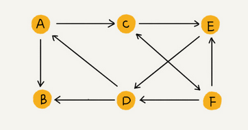
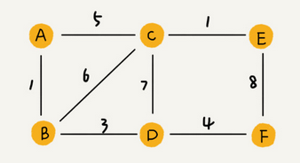
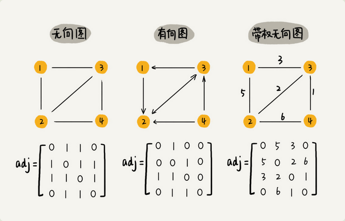
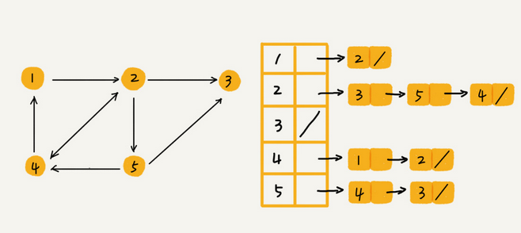
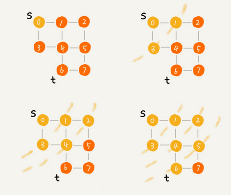

### 图（Graph）

#### 1 概述

* 非线性表结构

* 图中的元素我们叫做**顶点**（vertex）; 一个顶点可以与任意其它顶点建立联系，这种关系称为**边**（edge）

  例如下图，顶点 A、B、C、D、E、F，顶点 A 和顶点 B 、顶点 D 、顶点 C 之间都有边：

  

  **度**（degree）: 跟顶点相连接的边的条数；例如上图顶点 A 的度为 3 ；

  **无向图**：边没有方向的图，例如上图；

  **有向图**：边有方向的图，例如下图；

  

  **入度**（In-degree）: 有向图中，有多少条边指向这个顶点；；例如上图指向 A 顶点 1 条边，即入度 1；

  **出度**（Out-degree）: 有向图中，以这个起点有多少条边指向其它顶点；例如上图 A 顶点指出去 2 条边，即出度 2；
  
  **带权图**（weighted graph）: 每条边都有一个权重 （weight）, 例如下图：
  
  

#### 2 图的存储

##### 2.1 邻接矩阵（Adjacency Matrix）

* 邻接矩阵底层依赖一个二维数组；

* 对于无向图来说，如果顶点 i 与顶点 j 之间有边，我们就将 `A[i][j]`和 `A[j][i]`标记为 1；

* 对于有向图来说，如果顶点 i 到顶点 j 之间，有一条箭头从顶点 i 指向顶点 j 的边，那我们就将 `A[i][j]`标记为 1。同理，如果有一条箭头从顶点 j 指向顶点 i 的边，我们就将 `A[j][i]`标记为 1。

* 对于带权图，数组中就存储相应的权重；

  

* 优缺点

  * 比较浪费存储空间，例如无向图，`A[1][3]` 位置为1 ，那么 `A[3][1]` 肯定也是1 ，对称相等，只需要存储一半对角线一半数据；

  * 存储方式简单、直接，因为基于数组，所以在获取两个顶点的关系时，就非常高效；
  * 方便计算，可以将很多图的运算转换成矩阵之间的运算；

##### 2.2 邻接表（Adjacency List）

* 每个顶点对应一条链表，链表中存储的是与这个顶点相连接的其他顶点，例如有向图存储的邻接表：

  

* 邻接表存储起来比较节省空间，但是使用起来就比较耗时间；比如查找2是否有到4的边，需要遍历2对应的链表，而邻接矩阵的话直接查看 `A[2][4]` 位置对应的值；

* 邻接表链表过长可以优化，将链表改成平衡二叉查找树，实际开发中，我们可以选择用红黑树；

#### 3 图的代码实现

无向图的邻接表实现：

```java
package com.skylaker.graph;

import java.util.LinkedList;

/**
 * 图 （无向图）
 */
public class Graph {
    // 顶点的个数
    private int v;

    // 用邻接表存储（链表数组）
    // 每个顶点对应到对应索引位置，节点中的链表保存与当前节点相连的顶点
    private LinkedList<Integer>[] adj;


    public Graph(int v){
        this.v = v;

        adj = new LinkedList[v];
        for(int i = 0; i < v; i++){
            adj[i] = new LinkedList<>();
        }
    }

    /**
     * 存储两个顶点之间的边关系
     * @param s 顶点s
     * @param t 顶点t
     */
    public void addEdge(int s, int t){
        // 无向图两个顶点之间的关系是同时存在的，所以两个顶点要同时保存对应的边关系
        adj[s].add(t);
        adj[t].add(s);
    }
}
```

#### 4 图的搜索

##### 4.1 图的搜索算法

​	在图中找出从一个顶点出发，到另一个顶点的路径；

##### 4.2 广度优先搜索（Breadth-First-Search）

* 广度优先搜索（Breadth-First-Search），简称为 **BFS**。直观地讲；

* 其实就是一种**一层层推进**的搜索策略，即先查找离起始顶点最近的，然后是次近的，依次往外搜索；

* 如下图，S 到 T 广度优先搜索，我们搜索一条从 s 到 t 的路径，实际上，这样求得的路径就是从 s 到 t 的最短路径。

  