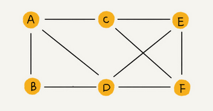
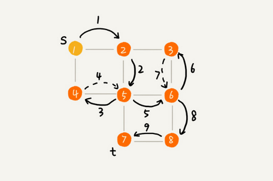
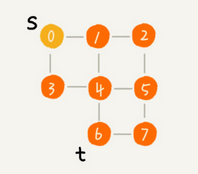

### 图（Graph）

#### 1 概述

* 非线性表结构

* 图中的元素我们叫做**顶点**（vertex）; 一个顶点可以与任意其它顶点建立联系，这种关系称为**边**（edge）

  例如下图，顶点 A、B、C、D、E、F，顶点 A 和顶点 B 、顶点 D 、顶点 C 之间都有边：

  

  **度**（degree）: 跟顶点相连接的边的条数；例如上图顶点 A 的度为 3 ；

  **无向图**：边没有方向的图，例如上图；

  **有向图**：边有方向的图，例如下图；

  

  **入度**（In-degree）: 有向图中，有多少条边指向这个顶点；；例如上图指向 A 顶点 1 条边，即入度 1；

  **出度**（Out-degree）: 有向图中，以这个起点有多少条边指向其它顶点；例如上图 A 顶点指出去 2 条边，即出度 2；
  
  **带权图**（weighted graph）: 每条边都有一个权重 （weight）, 例如下图：
  
  

#### 2 图的存储

##### 2.1 邻接矩阵（Adjacency Matrix）

* 邻接矩阵底层依赖一个二维数组；

* 对于无向图来说，如果顶点 i 与顶点 j 之间有边，我们就将 `A[i][j]`和 `A[j][i]`标记为 1；

* 对于有向图来说，如果顶点 i 到顶点 j 之间，有一条箭头从顶点 i 指向顶点 j 的边，那我们就将 `A[i][j]`标记为 1。同理，如果有一条箭头从顶点 j 指向顶点 i 的边，我们就将 `A[j][i]`标记为 1。

* 对于带权图，数组中就存储相应的权重；

  

* 优缺点

  * 比较浪费存储空间，例如无向图，`A[1][3]` 位置为1 ，那么 `A[3][1]` 肯定也是1 ，对称相等，只需要存储一半对角线一半数据；

  * 存储方式简单、直接，因为基于数组，所以在获取两个顶点的关系时，就非常高效；
  * 方便计算，可以将很多图的运算转换成矩阵之间的运算；

##### 2.2 邻接表（Adjacency List）

* 每个顶点对应一条链表，链表中存储的是与这个顶点相连接的其他顶点，例如有向图存储的邻接表：

  

* 邻接表存储起来比较节省空间，但是使用起来就比较耗时间；比如查找2是否有到4的边，需要遍历2对应的链表，而邻接矩阵的话直接查看 `A[2][4]` 位置对应的值；

* 邻接表链表过长可以优化，将链表改成平衡二叉查找树，实际开发中，我们可以选择用红黑树；

#### 3 图的代码实现

无向图的邻接表实现：

```java
package com.skylaker.graph;

import java.util.LinkedList;

/**
 * 图 （无向图）
 */
public class Graph {
    // 顶点的个数
    private int v;

    // 用邻接表存储（链表数组）
    // 每个顶点对应到对应索引位置，节点中的链表保存与当前节点相连的顶点
    private LinkedList<Integer>[] adj;


    public Graph(int v){
        this.v = v;

        adj = new LinkedList[v];
        for(int i = 0; i < v; i++){
            adj[i] = new LinkedList<>();
        }
    }

    /**
     * 存储两个顶点之间的边关系
     * @param s 顶点s
     * @param t 顶点t
     */
    public void addEdge(int s, int t){
        // 无向图两个顶点之间的关系是同时存在的，所以两个顶点要同时保存对应的边关系
        adj[s].add(t);
        adj[t].add(s);
    }
}
```

#### 4 图的搜索

##### 4.1 图的搜索算法

​	在图中找出从一个顶点出发，到另一个顶点的路径；

##### 4.2 广度优先搜索（BFS）

* 广度优先搜索（Breadth-First-Search），简称为 **BFS**。直观地讲；

* 其实就是一种**一层层推进**的搜索策略，即先查找离起始顶点最近的，然后是次近的，依次往外搜索；

* 如下图，S 到 T 广度优先搜索，我们搜索一条从 s 到 t 的路径，实际上，这样求得的路径就是从 s 到 t 的最短路径。

  

* 代码实现

  ```java
  	/**
       * 图的广度优先搜索 （核心思想：一层层往后搜索）
       * @param s 起点
       * @param t 终点
       */
      public void bfs(int s, int t){
          if(t <= s){
              return;
          }
  
          // 标识对应索引顶点是否已经访问
          boolean[] visited = new boolean[v];
          visited[s] = true;
  
          // 用队列缓存已经被访问，但是相连节点还未被访问的顶点
          // 方便依次向后每一层遍历，比如
          // 2——3——4——5
          // |  |  |
          // 6——7——8
          // 从2开始，2初始入队，然后获取2的关联顶点 3、6 入队，先弹出队列中的顶点 3，
          // 获取到关联的顶点4、7 入队，再弹出6 这样依次操作
          Queue<Integer> queue = new LinkedList<>();
          queue.add(s);
  
          // 数组每个索引位置表示对应顶点的前一个顶点，比如顶点3的前一个顶点是4，那么 prev[3]=4
          // 每个节点的前驱节点可能有多个，这里只存储遍历到的第一个
          int[] prev = new int[v];
          for(int i = 0; i < v; i++){
              prev[i] = -1;
          }
  
          while (queue.size() != 0){
              // 队列出队头结点
              int cur = queue.poll();
              // 遍历当前节点关联的顶点
              for(int i = 0; i < adj[cur].size(); i++){
                  int node = adj[cur].get(i);
                  if(!visited[node]){
                      // 先记录前驱节点
                      prev[node] = cur;
  
                      // 判断是否是目标节点
                      if(node == t){
                          print(prev, s, t);
                          return;
                      }
  
                      // 关联的顶点没有被访问
                      visited[node] = true;
                      queue.add(node);
                  }
              }
          }
  
      }
  
      /**
       * 打印顶点s到t的路径（递归打印，打印s到t的路径，那么就是s到t的上一个顶点加上打印 t 顶点）
       * @param prev 记录顶点前驱顶点的数组
       * @param s 起点
       * @param t 终点
       */
      public void print(int[] prev, int s, int t){
          if(-1 != prev[t] && s != t){
              print(prev, s, prev[t]);
          }
  
          System.out.printf(t + " ");
      }
  ```

* 时间复杂度

  广度优先搜索的时间复杂度是 O(V+E)，其中，V 表示顶点的个数，E 表示边的个数，也可以简写为 **O(E)**，因为一般边的个数要大于顶点的个数；

* 空间复杂度

  辅助变量 visited 数组、queue 队列、prev 数组存储空间的大小都不会超过顶点的个数，所以空间复杂度是 **O(V)**；

##### 4.3 深度优先搜索（DFS）

* 利用递归从起始顶点开始，依次往后找，递归调用关联的顶点，直到找到目标顶点；类似走迷宫，先选择一条路走，有路走则往前，否则回退，比如下面这图，1先到2, 2到5，5到4， 4 到1，发现1已经走过，那就回退到5, 走其他边……

  

* 代码实现

  ```java
  	/**
       * 图的深度优先搜索 （核心思想：一条路往前走，不通则回退重走，递归实现）
       * @param s 起点
       * @param t 终点
       */
      public void dfs(int s, int t){
          if(t <= s){
              return;
          }
  
          // 标识对应索引顶点是否已经访问
          boolean[] visited = new boolean[v];
          visited[s] = true;
  
          // 数组每个索引位置表示对应顶点的前一个顶点，比如顶点3的前一个顶点是4，那么 prev[3]=4
          // 每个节点的前驱节点可能有多个，这里只存储遍历到的第一个
          int[] prev = new int[v];
          for(int i = 0; i < v; i++){
              prev[i] = -1;
          }
  
          recurDfs(s, t, visited, prev);
          print(prev, s, t);
      }
  
      /**
       * 递归深度优先搜索
       * @param s 当前起点
       * @param t 终点
       * @param visited 顶点已访问标识数组
       * @param prev 顶点前驱顶点数组
       */
      public void recurDfs(int s, int t, boolean[] visited, int[] prev){
          // 找到目标顶点结束
          if(s == t){
              return;
          }
  
          // 标识当前节点已访问
          visited[s] = true;
  
          // 遍历当前顶点的关联顶点
          for(int i = 0; i < adj[s].size(); i++){
              int cur = adj[s].get(i);
              if(!visited[cur]){
                  prev[cur] = s;
                  recurDfs(cur, t, visited, prev);
              }
          }
      }
      
      /**
       * 打印顶点s到t的路径（递归打印，打印s到t的路径，那么就是s到t的上一个顶点加上打印t顶点）
       * @param prev 记录顶点前驱顶点的数组
       * @param s 起点
       * @param t 终点
       */
      public void print(int[] prev, int s, int t){
          if(-1 != prev[t] && s != t){
              print(prev, s, prev[t]);
          }
  
          System.out.printf(t + " ");
      }
  ```

* 实际测试

  

 广度优先搜索打印路径：0 1 4 6  ；

 深度优先搜索打印路径：0 1 2 5 7 6 ；

 深度优先的路径并不一定是最短路径

* 时间复杂度

  深度优先搜索算法的时间复杂度是 **O(E)**，E 表示边的个数

* 空间复杂度

  visited、prev 数组的大小跟顶点的个数 V 成正比，递归调用栈的最大深度不会超过顶点的个数，所以总的空间复杂度就是 **O(V)**；