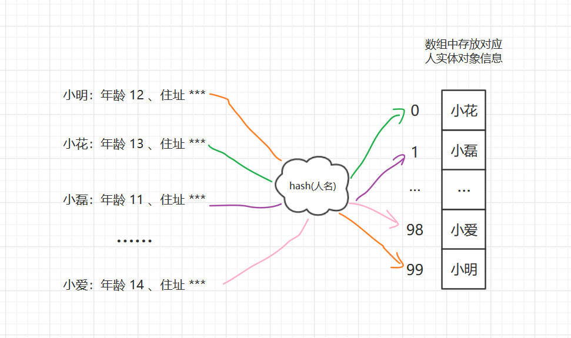

### 散列表

#### 1 **散列表**

Hash Table , 称为哈希表或者Hash表。利用数组支持下标**随机访问**数据的特性。

#### 2 **散列函数**

##### 2.1 基本概念

一个函数，可以将原数据抽象并利用函数计算出在散列表中存储位置的下标，可以定义成**hash(key)**，key为元素键值，hash(key)运算结果为散列函数计算得到的值，叫做**散列值**、或**Hash值**、或**哈希值**。

例子：例如有100个人，想根据人名快速找到对应人员的信息，如何做？

可以将人名依次做hash运算，得到的值作为存放数组位置的下标索引，即

即每个人存放的位置下标都是根据人名散列计算得到，这样要想根据人名快速找到对应信息可以直接对人名做哈希运算，得到对应数组下标索引，借助数组下标快速访问的特性，可以做到 O(1) 时间复杂度的查找。

##### 2.2 设计要求

散列函数设计基本要求

- 散列函数计算得到的散列值要是一个非负整数，因为要对应数组下标；
- 如果 key1 == key2 , 那么 hash(key1) == hash(key2);
- 如果 key1  != key2 , 那么 hash(key1)  != hash(key2)，该点要求有些时候不一定能够满足，即不同的key值经过哈希运算后得到的散列值可能是一样的，即**散列冲突**。对应到散列表来说，就是会计算得到同一个数组下标，那么就会发生冲突。例如上例中小明哈希后得到的值为99，而小花哈希后也是99，两个人的信息都想存放到同一个位置，那么就有问题了，需要相应的措施解决。

#### 3 装载因子（Load factor）

表示散列表空位多少，**散列表装在因子 = 表中元素个数 / 散列表的长度**。

#### 4 散列冲突解决：

##### **4.1 开放寻址法**

**核心思想**：出现散列冲突，那么重新探测得到一个空闲位置，将其插入。

**探测方法**：

###### **4.1.1 线性探测（Linear Probing）**：

**插入**：插入数据时候，经过散列函数计算得到的位置已经被占用，那么从当前位置开始依次向后找空闲位置，如果到数组末尾还没有就从头开始，直到找到空闲位置为止。

例如图示X散列后应该存放在5位置，但是已经被占，所以向后查找直到末尾还是没有空闲位置，所以从数组开头开始查找，找到1位置空闲，插入。

**查找**：通过散列计算出应该存放位置，如果对应下标元素值不等于目标，那么向后查找，查找不到同样从数组开头开始查找，直到找到目标元素。其中如果**遇到空闲位置还没找到**，说明要查找元素**不在**散列表中。

**删除**：需要将对应位置特殊标记，例如标记为deleted，而不能直接置空，因为如果置空，那么会影响上面的查找，例如：

位置0元素删除后，置空，导致查找X元素时候找到0位置发现为空还没找到，便认为不存在X，这就导致查找出问题，所以我们需要设置删除位置特殊标志，当查找时候遇到继续向后找。

###### 4.1.2 二次探测（Quadratic probing）

线性探测每次步长为1，即 hash(key)+0、hash(key)+1、hash(key)+2 ……，而二次探测步长变为原来的二次方，即 hash(key)+0、hash(key)+1^2、hash(key)+2^2 ……

###### 4.1.3 双重散列（Double hashing）

利用一组散列函数 hash1(key)、hash2(key)、hash3(key)……，用第一个散列函数计算得到的位置已经被占用那么就用第二个散列函数，直到找到空闲的位置。

##### 4.2 链表法

散列表每个桶（bucket）或槽（slot）都对应一条链表，散列值相同的元素放到相同槽位置对应的链表中。

插入时候只需要散列计算出对应槽位，并插入链表，时间复杂度O(1)；

查找、删除需要计算得到对应槽，然后遍历链表查找或者删除，时间复杂度跟链表长度成正比，O(k)，k=n/m，n为散列表中元素个数，m表示槽个数，当然要求元素散列比较均匀。

#### 5 如何设计散列函数

- 散列函数设计合理，设计不能太复杂，避免消耗过多计算时间；

- 散列函数生成的值尽可能随机并且均匀分布，降低散列冲突；

- 动态扩容

  散列因子太大，即列表中占用的元素很多，可以进行动态扩容；

  例如申请一个更大的散列表，容量为原来散列表的两倍，将数据搬移到新的散列表，这样搬移后装载因子就下降为之前一半；但是散列表迁移后数据的位置可能会因为散列算法发生改变；

  插入情况下最好情况最好情况不需要扩容，时间复杂度O(1); 最坏情况下，需要重新扩容，重新申请空间，计算哈希位置，并搬移数据，时间复杂度O(n)；均摊情况O(1);

  一次性扩容比较耗时，可以将扩容操作分摊到插入操作中：当有新数据插入时候，新数据插入到新的散列表，并从旧的散列表中取出一个数据放到新散列表；查询时候兼容查询旧的散列表和新的散列表；

- **数据量比较小、装载因子小的时候，适合采用开放寻址法**，例如 ThreadLocalMap;

- 链表法中的链表改造为其他高效的动态数据结构，比较跳表、红黑树；即使出现散列冲突，极端情况下，散列到同一个桶，避免是单链表时间复杂度退化到O(n)，跳表、红黑树时间复杂可以保持在O(logn);

  基于**链表法的解决方法比较适合存储大对象、大数据量的散列表**，且支持更多的优化策略，比如用红黑树替代列表；

- HashMap ，默认初始大小16，最大装载因子默认0.75，当HashMap元素个数超过 **0.75 * 散列表容量**的时候，就会启动扩容，每次扩容为原来的两倍大小；采用链表法解决冲突，JDK1.8中，对HashMap引入红黑树，当链表长度太大（默认超过8），链表就转换为红黑树；当节点个数少于8个，又将红黑树转换为链表；