### 堆（Heap）和堆排序

#### 1 堆的定义

堆是一种特殊的树，需要满足以下两点：

- 堆是一个**完全二叉树**；
- 堆中每一个节点的值都必须**大于等于**（或**小于等于**）其子树中的**每个**节点的值。 按照递归的思想，也可以表述为**每个**子节点**大于等于**（或**小于等于**）其**左右**子节点的值。

每个节点大于等于子树中每个节点值的堆叫做**大顶堆**，小于等于则叫做**小顶堆**。
例如下面第一个小顶堆，第二个大顶堆：

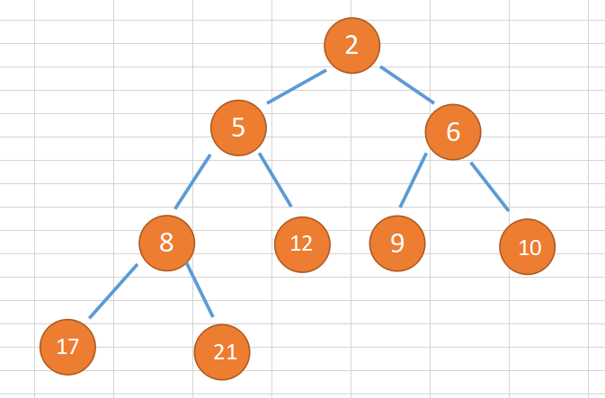

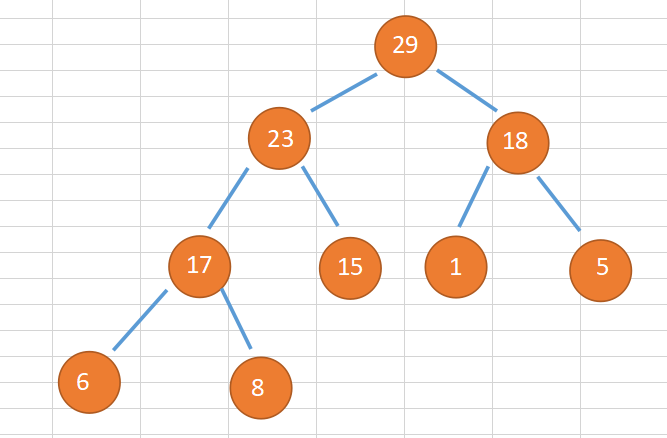

#### 2 堆的存储

堆是完全二叉树，因此适合用数组来存储。下标为 i 的左子节点就是 i * 2 位置节点；右子节点就是 i * 2+1 位置节点；父节点就是 i/2 位置节点。


其实不管树也好、堆也好，这些复杂的数据结果本质上都是逻辑层的抽象，底层来说最基本的数据结构就两个：数组和链表，很多复杂的数据结构也是在这两个基本数据结构上面的封装和抽象，这个本身就取决于硬件层次的内存数据存储方式，内存中都是一个个块数据，那么对应高层次抽象的编程语言中也是，组织起来要么连续的内存空间即数组，要么分散但是逻辑上指针相连接的空间即链表。


这里堆上的这些数据可以用数组存储，也可以用左右指针节点类似链表存储，但是数组存储更节省空间。

可以反过来，其实我们要操作的数据就是这么一个数组中的数据，只不过为了特定场景，我们可以逻辑上映射成一个堆这么一个数据结构。

#### 3 堆的操作

以**大顶堆**为示例。

##### 3.1 插入元素

- 插入元素后需要继续满足堆的两个特性，例如将新插入元素放到堆的最后，如果不符合特性就需要调整让其满足堆的特性，这个过程叫做 **堆化**。

- 堆化分两种：从下往上、从上往下。

- 堆化操作：顺着节点所在路径，向上或者向下，对比，然后交换，例如大顶堆中子节点值比父节点大，那么就交换父子节点值。

- **示例**

  例如如下新插入元素 28：

  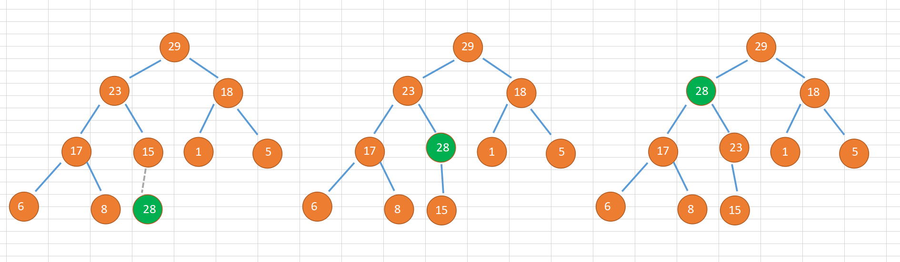

  新插入的元素直接放到数组末尾，新的堆需要判断是否满足还是一个堆，例子中明显新插入的节点28比它的父节点15大，那么不满足大顶堆要求，就需要进行堆化操作，直接交换15、28两个节点的值；

  交换后需要继续判断，发现 28 还是比现在的父节点 23 大，那么继续交换（这里交换可能担心父节点23的其它子节点，是否交换后28比父节点大，但是比左子节点小呢？这个不存在，原来父节点肯定比左右子节点大，那么现在自己比父节点大，那肯定比父左字节点大了）；

  交换后再比较，发现比父节点29小，那么就不需要再堆化了。

- **代码实现**

```java
package com.skylaker.heap;


/**
 * 堆
 */
public class Heap {
    // 堆直接用数组存储
    private int[] heap ;

    // 堆中能存储的最大元素个数
    private int max;

    // 堆中已经存储的元素个数
    private int n;

    /**
     * 初始化构造堆
     * @param initLength 设置的堆最大容量
     */
    public Heap(int initLength){
        // 申请容量需要预留一个首空位置
        heap = new int[initLength + 1];
        max = initLength;
        n = 0;
    }


    /**
     * （大顶堆）堆中插入元素
     * @param data
     */
    public void insert(int data){
        // 首先判断堆是否已满
        if(n >= max){
            return;
        }

        // 将元素放到堆中最后一个节点
        heap[++n] = data;

        // 进行堆化处理，采用从下往上堆化
        int p = n;
        while (p / 2 >= 1 && heap[p] > heap[p / 2]){
            // 节点比父节点值大，则进行值交换
            int temp = heap[p];
            heap[p] = heap[p / 2];
            heap[p / 2] = temp;

            p = p / 2;
        }
    }
    
     /**
     * 打印输出
     */
    public void print(){
        if(0 == n){
            return;
        }

        for(int i = 1; i <= n; i++){
            System.out.print(heap[i] + " ");
        }
        System.out.println();
    }
}
```

* 时间复杂度

  插入的时间复杂度，堆化从下往上，遍历路径顺着高度依次向上，所以**堆化的时间复杂度跟堆的高度成正比**，而堆作为完全二叉树高度不超过logn，因此插入元素时间复杂度是 **O(logn)** 。

##### 3.2 删除堆顶元素

* 简述

  大顶堆中堆顶元素必然是最大值，小顶堆中堆顶元素必然是最小值。

  删除堆顶元素后，剩下的元素必须要维持堆这个数据结构，但是堆顶空缺了一个元素啊，咋办啊？两个思路：

  * 既然堆顶少了元素，那么我就直接补一个呗，而补的这个元素要作为堆顶元素，必然是剩下元素中最大值，而剩下元素最大值必然是之前堆顶的左右子节点中的一个，假设是左节点，左节点替补上后，那么原来左字节点这个位置又空缺了啊，那么仿照之前步骤继续剩下元素最大节点补充……但是这个方式又可能造成最后的叶子节点空缺，导致最后不是堆。

  * 删除堆顶元素，直接将最后一个元素补缺到堆顶，这样满足所有的节点是完全二叉树，然后再根据堆顶元素和左右子节点大小，选取出最大的值作为堆顶元素，依次向下堆化，例如：

    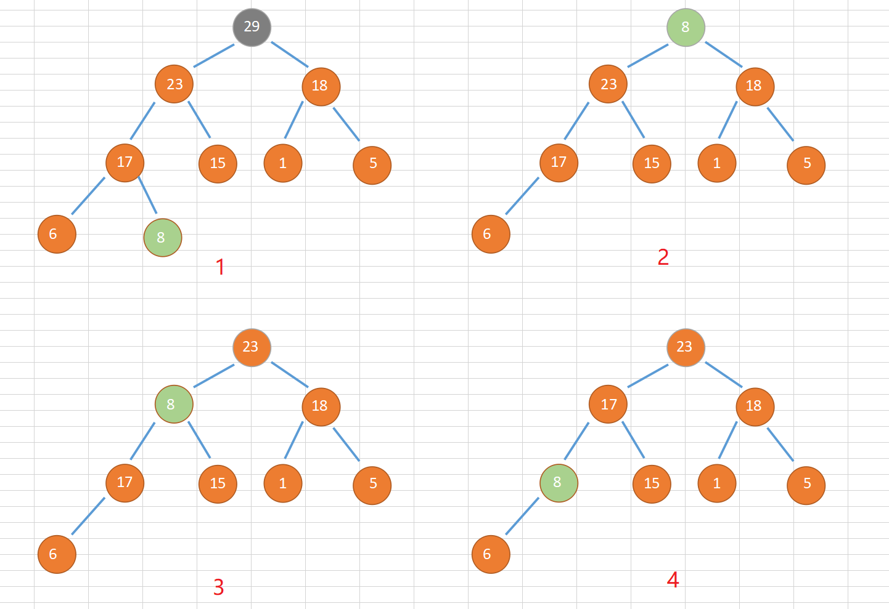

* 代码实现

  ```java
  	/**
       * 删除堆顶元素（大顶堆）
       */
      public void deleteMax(){
          // 边界检查
          if(n <= 0){
              return;
          }
  
          // 交换堆顶元素和最后一个元素值
          // 因为是删除堆顶元素，只需要将末尾元素放到堆顶
          heap[1] = heap[n];
          // 删除了一个元素，整体长度减一
          n--;
  
          // 进行自顶向下堆化处理
          int i = 1;
          while (true) {
              int maxPos = i;
  
              // 和两个子节点比较，找出最大的一个
              if(i*2 <= n && heap[maxPos] < heap[i * 2]) {
                  maxPos = i * 2;
              }
  
              if(i*2+1 <= n && heap[maxPos] < heap[i * 2 + 1]) {
                  maxPos = i * 2 + 1;
              }
  
              if (maxPos == i){
                  // 如果当前节点比左右子树节点都大，说明已经符合大顶堆要求，无需再处理
                  break;
              } else {
                  // 如果当前节点（父节点）比左右子树一个节点小，说明需要堆化，即交换节点
                  int temp = heap[i];
                  heap[i] = heap[maxPos];
                  heap[maxPos] = temp;
  
                  // 当前指向的节点需要跳到选取的较大值左右子节点位置
                  i = maxPos;
              }
          }
      }
  
      @Test
      public void testDeleteMax(){
          int[] arr = {29,23,18,17,15,1,5,6,8};
          Heap heap = new Heap(9);
          for(int a : arr){
              heap.insert(a);
          }
          heap.print();
          
          heap.deleteMax();
          heap.print();
          
          heap.deleteMax();
          heap.print();
      }
  ```
  
  测试构建如上图大顶堆，结果对应数组输出理论上应该是： 23、17、18、8、15、1、5、6，再删除一次堆顶，应该输出：18、17、6、8、15、1、5
  
  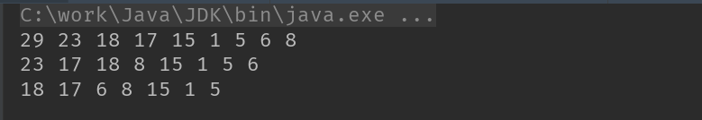

* 时间复杂度

  这里堆化自顶向下沿着路径比较交换，所以时间复杂度跟堆的高度成正比，即 **O(log n)**

#### 4 堆排序

##### 4.1 基本思想

* 借助于堆实现的排序算法就叫做堆排序；
* 其实我们排序的还是一堆数据，假设就数组吧，这些数据是无序的，那么要用堆实现排序，那不得首先有个堆啊，就是需要先将要排序的数据建立一个堆；建成之后呢？排序的最终目的是将数据按照从大到小或者从小到大（只谈数值数据大小）有序排列，就是要分出大小，那么建成的堆有什么特点呢？堆顶元素是最大值或者最小值！那么我们先取堆顶元素，剩下的元素再堆化成新的堆，再取堆顶元素，依次操作，最后不就能得到一个有序的数据集合了嘛 ！

##### 4.2 实现步骤

* 建堆

  先将待排序元素映射成完全二叉树，这个时候每个节点的值可能还不满足堆的大小关系，所以需要堆化成堆。

  需要从非叶子节点依次堆化，因为叶子节点不存在子节点，所以无需所谓的和子节点比较。

  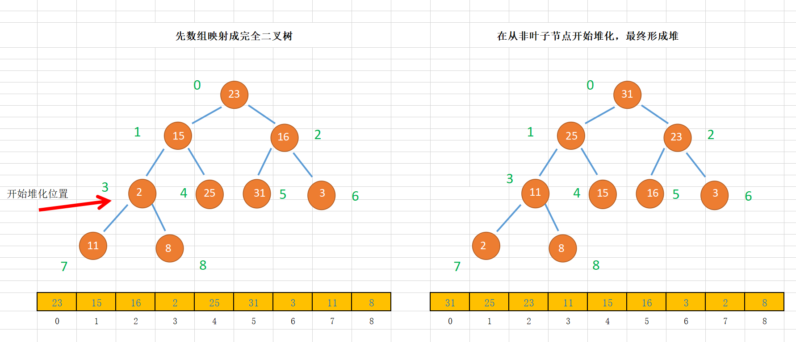

* 排序

  建成堆之后，再依次取堆顶元素，这里大顶堆就是最大元素，每次取完剩下的元素需要重新堆化成新的大顶堆，再取堆顶，依次操作……

  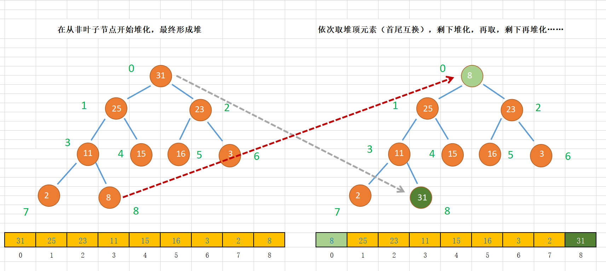

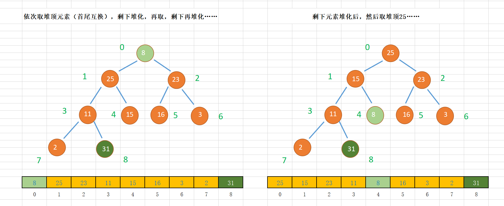

##### 	4.3 代码实现

```java
	/**
     * 堆排序
     * @param a 需要排序的数组，索引从 0 开始
     */
    public void heapSort(int[] a){
        if(null == a || 0 == a.length){
            return;
        }

        int length = a.length;

        // 1、建堆
        // 将数组映射成一个完全二叉树，但是还不满足堆的节点大小顺序要求，所以先堆化
        // 从非叶子节点开始
        heapMax(a);

        // 2、排序
        while (length >= 1){
            // 依次取堆顶元素，即大顶堆堆顶元素为最大值
            // 交换堆顶元素和末尾元素
            int temp = a[length - 1];
            a[length - 1] = a[0];
            a[0] = temp;

            // 索引位置往前移动一个，即剩下的元素堆化
            length--;

            // 每次剩下的元素要堆顶开始堆化（因为堆顶是之前末尾元素替换上去的）
            heapify(a, length , 0);
        }
    }

    /**
     * 任意一个数组建成大顶堆
     * @param a
     */
    public void heapMax(int[] a) {
        if (null == a || 0 == a.length) {
            return;
        }

        int length = a.length;

        // 将数组映射成一个完全二叉树，但是还不满足堆的节点大小顺序要求，所以先堆化
        // 从非叶子节点开始
        for (int i = (length-2)/2; i >= 0; i--) {
            heapify(a, length, i);
        }
    }

    /**
     * 堆化（从上往下）
     * @param a 目标数组 （元素从索引0开始）
     * @param length  数组长度
     * @param i 当前开始堆化的元素位置
     */
    private void heapify(int[] a, int length, int i) {
        while (true) {
            // 和左右两个子节点比较获取最大值节点
            // 并且需要判断左右子节点是否在范围内
            int maxPos = i;
            if(i*2+1 < length && a[maxPos] < a[i * 2 + 1]){
                maxPos = i * 2 + 1;
            }

            if(i*2+2 < length && a[maxPos] < a[i * 2 + 2]){
                maxPos = i * 2 + 2;
            }

            if(maxPos == i){
                // 最大是自身即父节点，满足大顶堆特性，结束
                break;
            } else {
                // 不满足，交换位置
                int temp = a[i];
                a[i] = a[maxPos];
                a[maxPos] = temp;

                // 继续向下比较
                i = maxPos;
            }
        }
    }
```

* 复杂度
  * 建堆时间复杂度 O(n) , 排序时间复杂度 O(n logn) , 整体堆排序时间复杂度 **O(n logn)**；
  * 原地排序算法；
  * 不是稳定排序算法，因为假设堆中元素都是同一个值，但是堆排序会直接交换首尾节点元素，自然就不符合稳定性要求了。

#### 5 堆的应用

##### 5.1 优先级队列

* 概述

  优先级队列数据出队顺序按照优先级来，优先级最高的，最先出队；

  堆可以看作一个优先级队列；

  往优先级队列插入元素，相当于往堆中插入一个元素；从优先级队列取出最高优先级元素，相当于取出堆顶元素；

* 例子

  * 合并有序小文件

    100个小文件，每个100MB，每个文件中存储有序字符串，需要合并成一个大的有序文件。

    思路：取每个小文件第一个字符串，即100个字符串，构建成小顶堆，取堆顶元素，即所有文件中最小的那个字符串，放到大文件；接下来取这个最小字符串所在的文件下一个字符串，入堆，堆化，再取堆顶元素，放到大文件……

##### 5.2 利用求 Top K

* 静态数据

  ​	例如 在一个包含n个数据的数组中，如何查找前K大数据？

  * **思路**

    可以将数组的前 k 个元素建成小顶堆，然后遍历 k+1 到末尾的元素，依次和堆顶元素比较，如果比堆顶元素大，则替换堆顶元素，并调整堆，保持小顶堆；最终这个小顶堆中的元素就是最大的 K 个数据。

  * **时间复杂度**

    遍历数组 O(n) , 一次堆化 O(logK) , 最坏情况下，时间复杂度 O(nlogK)

  * **例子**

    假设现有数组 [8, 2, 5, 3, 1, 6, 9, 4, 7] ，要求找出前4大数据 。

    先前4个元素建堆成小顶堆

    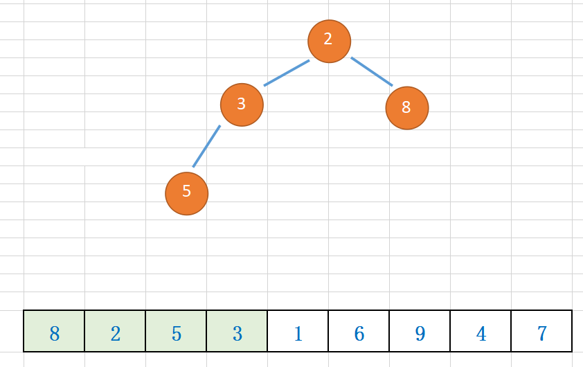

    从第5个元素开始，依次和堆顶元素比较：

    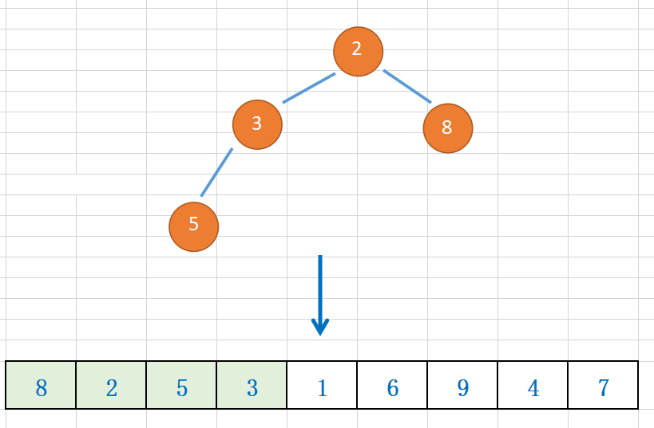

    1 比堆顶2小，不做处理，下一个 6 比堆顶大，则替换堆顶元素，然后堆化处理保持小顶堆：

    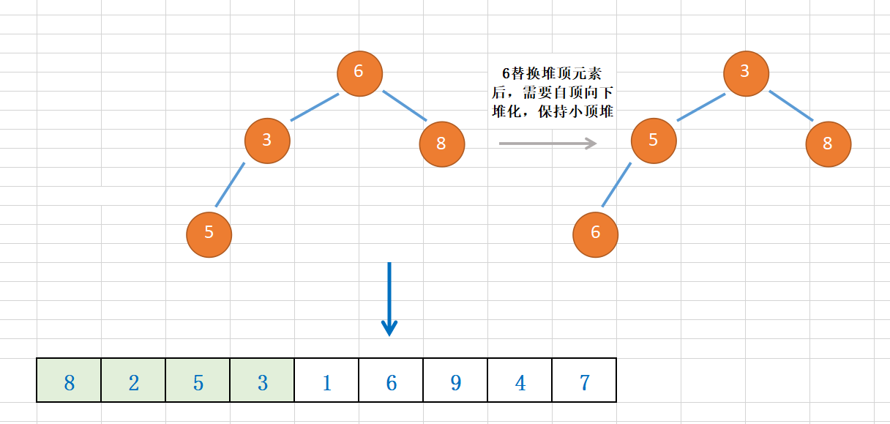

    下一个元素 9 ，9比堆顶3大，替换堆顶元素，然后堆化处理保持小顶堆：

    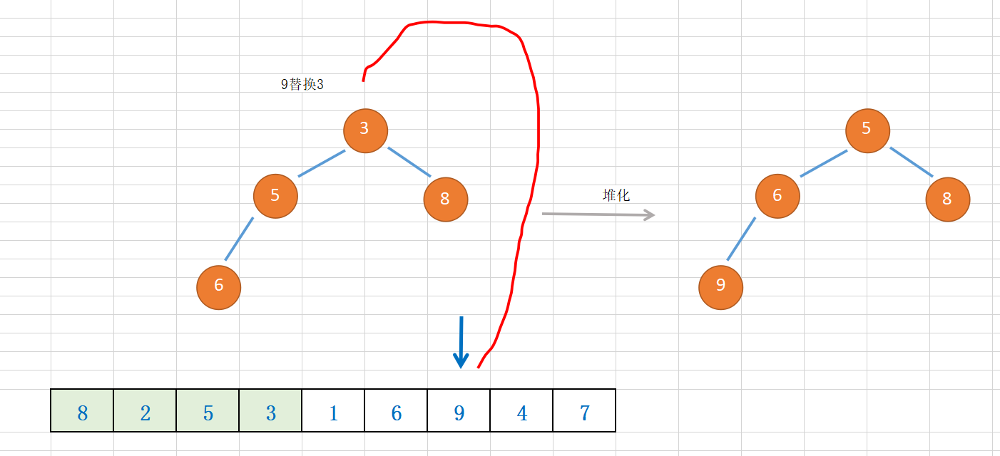

    下一个元素4，因为比堆顶元素5小，所以不处理；

    下一个元素7，比堆顶元素5 大，所以替换堆顶元素：

	  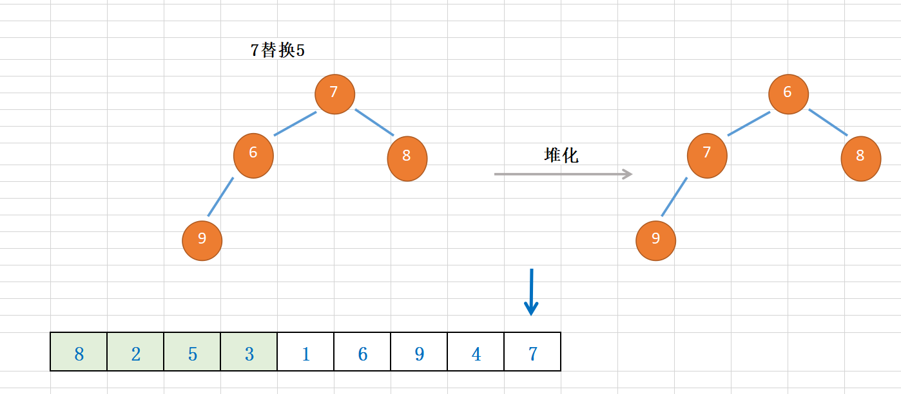
	
	   遍历元素结束，最终的小顶堆中的元素，6、7、8、9 就是最大的4个元素。
	
	* **代码实现**
	
	  ```java
	  /**
	   * 求数组中前K大元素
	   * @param a 目标数组
	   * @param k 前K大范围
	   * @return 前K大元素数组
	   */
	  public int[] getTopK(int[] a, int k){
	      if(null == a || k > a.length || k < 1){
	          return null;
	      }
	  
	      // 数组前K个元素建成小顶堆
	      heapMin(a, k);
	  
	      // 数组第K+1个元素开始遍历和顶堆堆顶元素比较，大则替换堆顶元素
	      for(int i = k; i < a.length; i++){
	          if(a[i] > a[0]){
	              // a[0] 就是小顶堆堆顶元素
	              // 元素比小顶堆堆顶元素大则替换小顶堆堆顶元素
	              int temp = a[0];
	              a[0] = a[i];
	              a[i] = temp;
	  
	              // 堆化堆顶元素，保持还是小顶堆
	              heapifyMin(a, k, 0);
	          }
	      }
	  
	      // 小顶堆中元素即数组前K个元素就是最大的K个元素
	      int[] res = new int[k];
	      for(int i = 0; i < k; i++){
	          res[i] = a[i];
	      }
	      return res;
	  }
	  
	  /**
	   * 将数组前K个元素建成小顶堆
	   * @param a 目标数组
	   * @param k 前K个元素
	   */
	  public void heapMin(int[] a, int k){
	      if (null == a || 0 == a.length) {
	          return;
	      }
	  
	      // 将数组映射成完全二叉树，从非叶子元素开始堆化
	      //（因为叶子节点没有子元素，自然也没有比较的对象）
	      for(int i = (k - 2) / 2; i >= 0; i--){
	          heapifyMin(a, k, i);
	      }
	  }
	  
	  /**
	   * 小顶堆 从上往下堆化
	   * @param a 数组
	   * @param length 数组长度
	   * @param i 开始堆化位置
	   */
	  private void heapifyMin(int[] a, int length, int i) {
	      while (true) {
	          // 找出当前节点和左右子节点中最小的那个元素
	          int min = i;
	  
	          if((i*2+1 < length) && (a[min] > a[i*2 + 1])){
	              min = i*2+1;
	          }
	  
	          if((i*2+2 < length) && (a[min] > a[i*2 + 2])){
	              min = i*2 + 2;
	          }
	  
	          if(min == i){
	              // 如果最小的节点就是当前节点，那么比较结束
	              break;
	          } else {
	              // 需要交换父节点和 左、右中最小的节点
	              int temp = a[i];
	              a[i] = a[min];
	              a[min] = temp;
	  
	              i = min;
	          }
	      }
	  }
	  ```

* 动态数据

  * 问题

    一个数据集合，一个操作添加元素，一个询问当前的前K大元素。

  * 思路

    维护一个K大小的小顶堆，当有元素添加到集合中，和堆顶元素对比，比堆顶元素大，则替换堆顶元素，堆化；比堆顶元素小则不处理。这样任意时刻堆中就是前K大元素。

##### 5.3 利用堆求中位数

* 中位数

  处在中间位置的数；

  如果数据奇数个，数据从小到大排列，那第  n/2 + 1 个数据就是中位数；

  如果数据偶数个，数据从小到大排列，那第 n/2 和 第 n/2 + 1个数据就是中位数，可以任取一个；

* 静态数据

  直接排序，取中间位置

* 动态数据

  * 维护两个堆，一个大顶堆，一个小顶堆；

    大顶堆存储前半部分数据，小顶堆存储后半部分数据；小顶堆数据都大于大顶堆数据；

  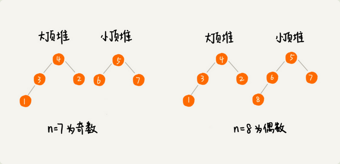

  ​	n是偶数，大顶堆存储 n/2 个元素，小顶堆也是 n/2 个元素；则大顶堆堆顶元素就是中位数；

  ​	n是奇数，大顶堆存储 n/2+1 个元素，小顶堆 n/2 个元素；则大顶堆堆顶元素就是中位数；

  * 新加入元素

    新加入元素小于等于大顶堆堆顶，则插入大顶堆；否则插入小顶堆；

    （因为大顶堆本身是前半部分数据，比大顶堆小说明其也是前半部分小的数据）

    

    但可能出现插入后，两个堆的数据个数**不符合**约定的情况，需要调整（假设一开始8个数据，大小顶堆都是4个元素，来了新的100个数据，都比大顶堆堆顶小，那么都插入大顶堆，并且不调整元素，那么大顶堆就成104个数据，小顶堆还是4个，那大顶堆堆顶还可能是中位数么？）

    调整方式：**将一个堆顶元素不停移动到另一个堆**，保持两个堆维持上述约定；

    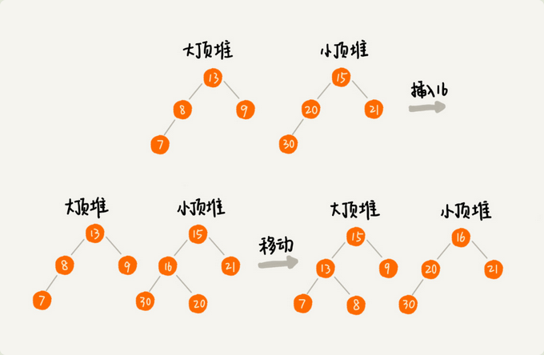

    时间复杂度：插入元素涉及堆化 O(logn) ，求中位数直接返回大顶堆堆顶，O(1)， 所以整体 O(logn) ；

    