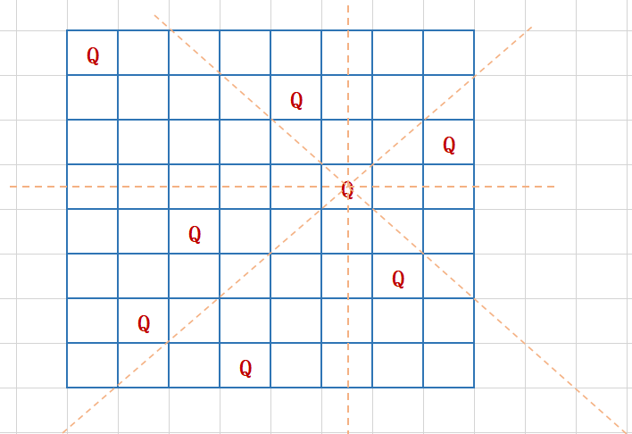
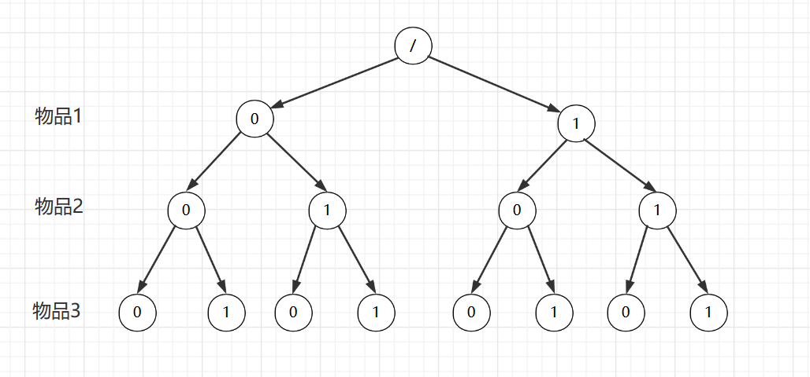
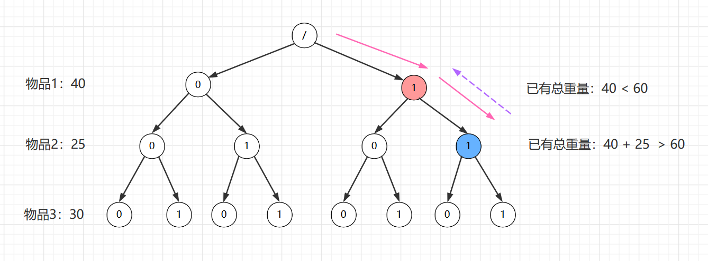

### 回溯算法（Backtracking algorithm）

#### 1 应用具体算法或场景

* 深度优先搜索算法、正则表达式匹配、编译原理中的语法分析

* 数独、八皇后、0-1 背包、图的着色、旅行商问题、全排列

#### 2 基本思想

* 类似枚举搜索，枚举所有的解，找到满足期望的解，简单的说其实就是：

  暴力枚举，遍历所有情况，满足情况就停止遍历；

* 把问题分为多个阶段，每个阶段看是否满足条件，不满足回退到上一步重新选择。

#### 3 实际案例

##### 3.1 八皇后

* 问题

  有一个 8x8 的棋盘，希望往里放 8 个棋子（皇后），每个棋子所在的行、列、对角线都不能有另一个棋子。

  

* 思路

  从第一行选择一个放置元素，接着从第二行选择一个位置放置元素，判断是否满足条件，不满足则换一列位置；依次类推……

  元素是一行一行往后放置，所以不需要关注下面的同列、对角线。只需要看所在行上面的同列、对角线是否有元素。只要已放置元素保证和之前的元素不相交，那么在后面的元素放置时候肯定也不会相交，因为和后面的元素不相交是由后面的元素判断处理保证的。

* 代码

  ```java
  public class Backtracking {
      public static void main(String[] args) {
          b8Queues();
      }
  
  
      // 8皇后算法中保存元素占用位置数组
      // 下标索引代表行，对应值代表列
      private static int[] data = new int[8];
  
      /**
       * 计算8皇后问题
       */
      public static void b8Queues() {
          data = new int[8];
          // 从第一行开始放置元素
          cal8Queues(0);
      }
  
      /**
       * 计算指定行元素应该放在哪一列
       * @param row 行数
       */
      private static void cal8Queues(int row){
          if(row >= 8) {
              // 每一行都放过元素，即已处理完毕
              printData();
              return;
          }
  
          // 元素在每一行都有8列位置可放
          for(int column = 0; column < 8; column++) {
              if(isOk(row, column)) {
                  // 当前行、当前列所在位置能放置元素
                  data[row] = column;
  
                  // 继续放下一行元素
                  cal8Queues(row + 1);
              }
          }
      }
  
      /**
       * 判断元素在指定行、指定列是否能放置，其实就是判断上面的列、左上角、右上角对应位置是否有元素
       * @param row 行
       * @param column 列
       * @return 能 ：true ; 不能 ：false
       */
      private static boolean isOk(int row, int column) {
          // 左边的列
          int leftColumn = column - 1;
          // 右边的列
          int rightColum = column + 1;
  
          // 依次判断前面的行
          for(int r = row - 1; r >= 0; r--) {
              // 判断上面相同列是否有元素
              if(data[r] == column) {
                  return false;
              }
  
              // 判断左上角是否有元素
              if(data[r] == leftColumn) {
                  return false;
              }
  
              // 判断右上角是否有元素
              if(data[r] == rightColum){
                  return false;
              }
  
              // 需要继续往上一行位置判断
              leftColumn--;
              rightColum++;
          }
  
          return true;
      }
  
      /**
       * 打印8皇后元素位置
       */
      private static void printData() {
          for(int row = 0; row < 8; row++) {
              for(int column = 0; column < 8; column++) {
                  if(data[row] == column) {
                      System.out.print("Q ");
                  } else {
                      System.out.print("* ");
                  }
              }
              System.out.println();
          }
          System.out.println();
      }
  }
  ```

* 结果

  共92种，例如其中2个解：

  ```
  Q * * * * * * * 
  * * * * Q * * * 
  * * * * * * * Q 
  * * * * * Q * * 
  * * Q * * * * * 
  * * * * * * Q * 
  * Q * * * * * * 
  * * * Q * * * * 
  
  * Q * * * * * * 
  * * * Q * * * * 
  * * * * * Q * * 
  * * * * * * * Q 
  * * Q * * * * * 
  Q * * * * * * * 
  * * * * * * Q * 
  * * * * Q * * * 
  
  ```

##### 3.2 0-1 背包

* **问题**

  有一个背包，背包总的承载重量是 Wkg。现在我们有 n 个物品，每个物品的重量不等，并且不可分割。我们现在期望选择几件物品，装载到背包中。在不超过背包所能装载重量的前提下，如何让背包中物品的总重量最大？

* **思路**

  对于每个物品来说，就是放与不放两种情况；
  
  按照暴力法列出所有可能解的话则有 2^n 个，遍历这所有的解，得到不大于背包限制的最大重量即可。
  
  其实我们可以构建一个二叉树，假设共有三个物品：
  
  
  
  这里 0 代表这个物品不被选择，1 代表被选择，那么总共排列下来共 2^3 = 8 种可能选择情况，即二叉树根节点到叶子节点的遍历路径有 8 种。
  
  暴力法就是遍历得到这 8 种路径然后计算对应选择重量，再选择最优解。其实我们利用回溯法进行优化，例如 物品1 到 3 的重量分别为 40、25、30 ，背包限制总重量为 60：
  
  
  
  当我们第一个物品选择了，已有总重量 40，当我们再去选择第二个物品时候发现 40 + 25 已经超出背包限制的 60 了，那么这个时候其实已经说明不能选择物品 2 了，需要中断选择，即对应  1 - 1 - 0 、1 - 1 -1  这两个分支是不能满足要求的。那么在尝试性选择节点 2 失败后就回退，回退到节点 1 ，去选择物品 2 的另一个可能选择：不选，即 左边 0 这个分支，再去判断处理。
  
  这里**回溯**就是体现在这个选择过程中如果当前选择不满足限制条件，那么就退回到上一个节点重新对当前节点进行选择。
  
  而选择中断这个操作就是回溯中的**搜索剪枝**技巧，避免我们搜索所有的分支，相对于暴力法要提升一点性能。

* **代码实现**

  利用递归实现，类似二叉树的前序遍历：

  ```java
  	public static void main(String[] args) {
          // 测试物品
          int[] arr = {20, 90, 9, 7, 2};
  
          bestWeight = 0;
          maxWeight = 100;
          // 从第一个物品开始选择，类似树从根节点开始遍历
          b(0, 0, arr);
  
          System.out.println(bestWeight);
      }
  
      // 能放到背包的最大重量
      public static int bestWeight = 0;
      // 背包限制的最大重量
      public static int maxWeight = 0;
  
      /**
       * 0-1 背包解法
       * @param i 当前物品索引
       * @param hasWeight  已装进背包物品重量
       * @param arr 物品对应重量数组，下标物品索引，值为对应重量
       */
      public static void b(int i, int hasWeight, int[] arr){
          // 1、 判断已经放入的物品总质量是否达到背包限制，如果达到那么就不需要再往后添加物品，
          //    这里不用 currentWeight == maxWeight 因为在上一个物品加入的时候已经判断了
          //    添加进背包的总质量不能大于限制，最大就是等于背包限制，那么这里 currentWeight 
          //    肯定不会比 maxWeight 大
          // 2、如果物品都添加完了自然添加操作结束
          //    如果最后一个物品操作完会将索引加1选择下一个物品，则下一个物品索引为
          //    arr.length - 1 + 1 = arr.length，而这个物品其实是不存在的
          if(hasWeight == maxWeight || i == arr.length) {
              return;
          }
  
          // 当前物品先不放, 直接放下一个物品
          // TODO 对一个物品操作逻辑，只不过这里因为物品不选择，没有需要处理的逻辑
          b(i + 1, hasWeight,  arr);
  
          // 当前物品放，但是需要先判断如果放入当前物品总质量是否会超出限制
          // 这里其实相当于剪枝操作，如果放入当前节点已经不满足条件的话，那么对于这个节点分支都放弃，
          // 那么就回退到上一个节点，对于代码来说就是方法调用返回，就是 i-1 那个物品方法调用
          if(arr[i] + hasWeight <= maxWeight) {
              // 当前物品放进去，那么现有总重量就增加
              hasWeight += arr[i];
              // 判断是不是最优解
              if(hasWeight > bestWeight) {
                  bestWeight = hasWeight;
              }
  
              // 继续对下一个物品操作
              b(i + 1, hasWeight, arr);
          }
      }
  ```

  