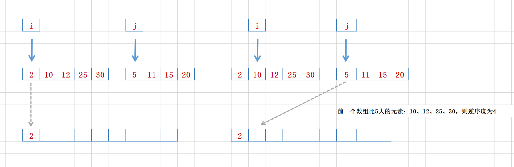

### 分治算法（divide and conquer）

#### 1 基础概念

* 核心思想其实就是四个字，**分而治之** ，也就是将原问题划分成 n 个规模较小，并且结构与原问题**相似**的子问题，**递归**地解决这些子问题，然后再**合并**其结果，就得到原问题的解 。

* **分治算法**是一种处理问题的**思想**，**递归**是一种**编程技巧 **；

* 分治算法一般都比较适合用**递归**来实现：

  * **分解**：将原问题分解成一系列子问题；

  * **解决**：递归地求解各个子问题，若子问题足够小，则直接求解；

  * **合并**：将子问题的结果合并成原问题 

* 分治算法能解决的问题一般需满足这几个条件：
  * 原问题与分解成的小问题具有**相同的模式**；
  * 原问题分解成的**子问题可以独立求解**，子问题之间没有相关性；
  * 具有**分解终止条件**，也就是说，当问题足够小时，可以直接求解；
  * 可以将子问题**合并成原问题**，而这个合并操作的复杂度不能太高，否则起不到减小总体复杂度的效果；

#### 2 问题实例

* 问题

  如何编程求出一组数据的有序对个数或者逆序对个数 ？

* 思路

  利用分治思想，将数组分成前后两半部分，各自求逆序对个数，然后两部分之间再求逆序度，整体的逆序度就是三者之和；而前后两部分的逆序度又可以通过递归重复上述操作获取；关键在于两部分之间求逆序度，可以借助归并排序；

  

  例如图示，前后两个子数组合并的时候（因为借助于归并排序，所以两个数组各自是有序的），我们依次从中获取小的元素放入临时数组，因为我们关注的是逆序度，所以当取到后面数组中元素个数的时候，就看下前面数组中比该元素大的有几个，有几个就代表当前这个数字逆序度是几。

  例如第一次取值取得是前面数组中 2 ，第二次取后面数组中 5 ，这个时候需要计算下逆序度，其实就是前面数组中比当前元素大的数字有几个，因为前一个数组指针 i 指向的值 10 是比后一个数组 j 指针位置值 5 大，所以前面数组中比当前元素大的数字就是 i 指针位置开始到结尾的 10、12、25、30 共 4 个。

* 代码

  ```java
  public class Divide {
      // 逆序度计数
      private int num = 0;
  
      /**
       * 利用分治思想求数组的逆序度
       * @param arr 目标数组
       * @return {int} 数组的逆序度z
       */
      public int count(int[] arr){
          if(null == arr || 0 == arr.length){
              return 0;
          }
  
          num = 0;
          divideAndMergeArray(arr, 0, arr.length -1);
          return num;
      }
  
      /**
       * 归并处理数组
       * @param arr 目标数组
       * @param p 起始索引位置
       * @param r 结束索引位置
       */
      private void divideAndMergeArray(int[] arr, int p, int r){
          if(p >= r){
              return;
          }
  
          // 数组中间元素位置
          int m = (p + r) / 2;
  
          // 处理前半部分
          divideAndMergeArray(arr, p, m);
          // 处理后半部分
          divideAndMergeArray(arr, m + 1, r);
  
          // 合并两部分子数组
          merge(arr, p, m, r);
      }
  
      /**
       * 合并前后两个子数组
       * @param arr 目标数组
       * @param p 起始索引位置
       * @param m 中间索引位置
       * @param r 结束索引位置
       */
      private void merge(int[] arr, int p, int m, int r) {
          // 构建一个临时数组，用于存放当前两个子数组合并后的有序列
          int[] temp = new int[r - p + 1];
  
          // 构建前后两个子数组游标指针
          int x = p , y = m + 1;
          // 构建临时数组游标指针
          int k = 0;
  
          // 依次从两个子数组中取较小的一个元素值
          while (x <= m && y <= r) {
              if(arr[x] <= arr[y]) {
                  // 前面子数组值较小或相等
                  temp[k++] = arr[x++];
              }
  
              else {
                  // 后一个子数组值较小
                  // 计算逆序度，就是前面数组指针位置往后的元素个数
                  num += ( m - x + 1 );
  
                  temp[k++] = arr[y++];
              }
          }
  
          // 前一个子数组还有剩余值
          if(x <= m) {
              temp[k++] = arr[x++];
          }
  
          // 后一个子数组还有剩余值
          if(y <= r) {
              temp[k++] = arr[y++];
          }
  
          // 将临时有序数组元素替换到原数组位置
          for(int i = 0; i < temp.length; i++){
              arr[p + i] = temp[i];
          }
      }
  }
  ```

  