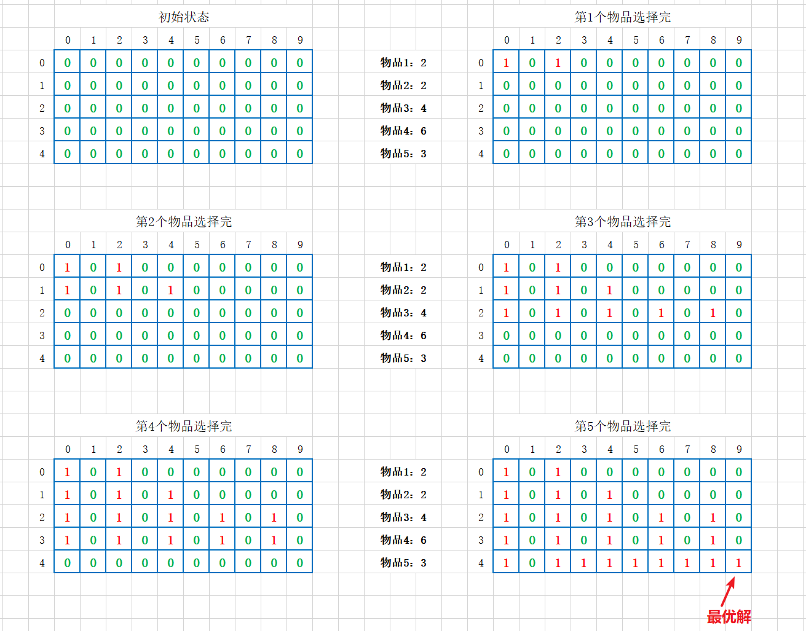
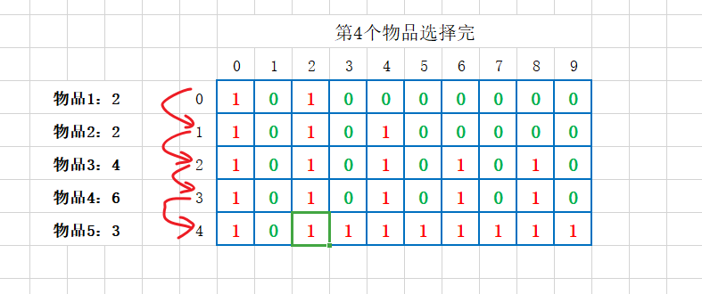
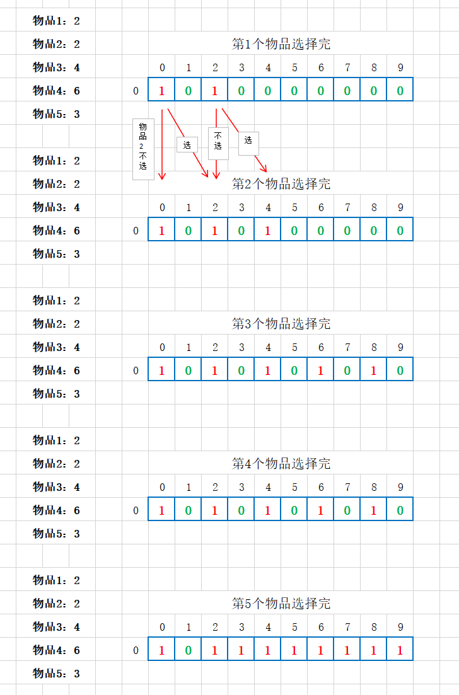
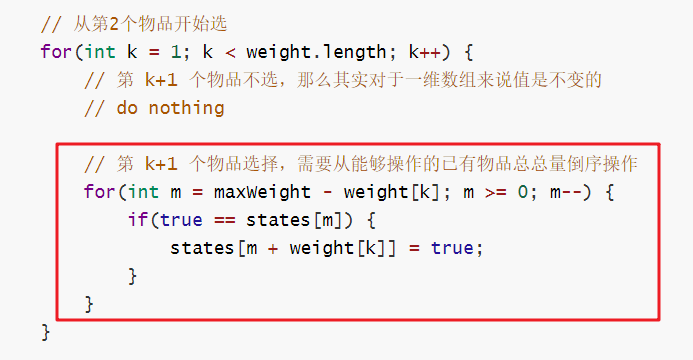
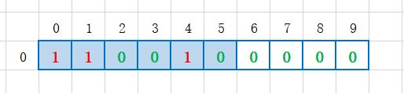
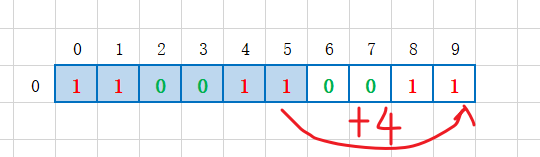

### 动态规划（Dynamic Programming）

#### 1 0-1背包问题

##### 1.1 **问题**

有一个背包，背包总的承载重量是 Wkg。现在我们有 n 个物品，每个物品的重量不等，并且不可分割。我们现在期望选择几件物品，装载到背包中。在不超过背包所能装载重量的前提下，如何让背包中物品的总重量最大？

##### 1.2 **思路**

* 通过回溯方法求解，但是时间复杂度过大；

  回溯的话是每个物品选择或者不选，依次递归，在递归后续物品选择的时候判断限制条件以及求最优解。

* 动态规划

  我们可以换个思路，选择物品的过程，已有物品的总重量是已经选择的几个物品重量和，当选择下一个物品的时候，再得到的已有物品总重量就是 前面已有总重量 +  当前物品重量。那么可以当前选择的结果是依赖于之前选择的，那么其实每一个物品选择后的可装入最大重量就是在 之前已有总重量和当前重量 这两个变量之间决策，而已有总重量最优解就是 前一个物品重量 和 前一个物品选择时候已有重量 之间决策，简单点就是：**后面阶段的状态可以通过前面阶段的状态推导出来**。

  即动态规划解决问题思路：我们把问题分解为多个阶段，每个阶段对应一个决策。我们记录每一个阶段可达的状态集合（去掉重复的），然后通过当前阶段的状态集合，来推导下一个阶段的状态集合，动态地往前推进。

  这里我们建立一个二维数组状态表来记录 0-1 物品选择这个状态依次推导过程：

  

  假设5个物品重量分别为 2、2、4、6、3，背包限制重量为 9 ，那么我们就可以建立一个二维状态表 states[5] [10] ,  其中行代表选择第几个物品，列代表当前物品选择的可达状态范—即已装入物品重量。背包限制重量为 9，即每次物品选择后的已装入物品重量值只能在 9 以内，所以列大小为10。

  states[i] [j] = true （图中表示为1） 代表当前这个物品 i 决策后的已有物品重量为 j , 这里物品决策可能是 选择了，也可能是没选择。 比如 物品1 没选择，那么已有总重量就是 0 ，则 states[0] [0] = true , 如果物品 1 选择了，那么已有总重量就是 2 ，即 states[0] [2] = true 。

##### 1.3 **代码实现**

​	动态规划：

```java
package com.skylaker.dp;

/**
 * 动态规划：求 0-1 背包问题
 * @author skylaker
 * @version V1.0 2020/5/23 17:49
 */
public class DynamicProgramming {
    public static void main(String[] args) {
        // 测试物品
        int[] arr = {20, 24, 19, 7, 12};
        System.out.println(bestWeight(arr, 100));
    }

    /**
     * 利用动态规划求解 0-1 背包问题 能存放的最大物品重量
     * @param weight  每个物品对应的重量
     * @param maxWeight 背包限制最大重量
     * @return 能放到背包最大重量
     */
    public static int bestWeight(int[] weight, int maxWeight) {
        // 构建二维状态数组
        boolean states[][] = new boolean[weight.length][maxWeight + 1];

        // 后续的物品选择结果是要基于前面的状态来的，
        // 那么对于第一个物品来说，直接将选择不选择情况设置到状态表中
        // 不选择, 即列表示的选择重量为 0
        states[0][0] = true;
        // 选择，那么对应到列就是第一个物品的重量，但是要注意重量范围不能超出限制
        if(weight[0] <= maxWeight) {
            states[0][weight[0]] = true;
        }

        // 开始依次往后选择，填充状态表
        for(int k = 1; k < weight.length; k++) {
            // 第 k+1 个物品不选择，那么已选择物品的重量其实是和 k - 1 是一致的
            for(int j = 0; j <= maxWeight; j++) {
                if(true == states[k-1][j]) {
                    states[k][j] = true;
                }
            }

            // 第 k+1 个物品选择，那么就需要在 k-1 物品选择重量基础上加上当前重量
            // 同时需要注意加上当前物品后已有总重量不能大于背包总重量
            for(int j = 0; j <= maxWeight - weight[k]; j++) {
                if(true == states[k-1][j]) {
                    states[k][j + weight[k]] = true;
                }
            }
        }

        // 遍历最后一行，第一个为 true 的即为最优解
        for(int m = maxWeight; m >= 0 ; m--) {
            if(true == states[weight.length-1][m]) {
                return m;
            }
        }
        // 没有合适解
        return 0;
    }
}

```

##### 1.4 **时间、空间复杂度**

* 耗时最多的部分就是代码中的两层 for 循环，所以时间复杂度是 **O(n*w)**。
  （n 表示物品个数，w 表示背包可以承载的总重量）

* 需要额外申请一个 n 乘以 w+1 的二维数组，对空间的消耗比较多；

  动态规划是一种空间换时间的解决思路

##### 1.5 **代码优化**

前面动态规划实现利用二维数组，比较占用空间，其实我们分析下可以对空间进行优化：



这是我们在放完最后一个物品后的状态表，几个物品从前到后依次处理，后一行的状态是在前一行的基础上处理的，而最终我们取最优解的直接根据最后一行，而前面的几行根本没有用上，即前面的行纯粹是临时的状态记录，我们最终目标就是最后的所有选择结果，那是否可以直接将前面的行用过后去除呢？

我们可以利用动态一维数组，比如第一个物品选择完了，第二个物品操作，直接把这一次选择后的结果再保存到一维数组中，依次类推，最终的一维数组不就是我们二维状态数组最后一行么？



对应代码：

```java
/**
     * 利用动态规划（一维状态数组)求解 0-1 背包问题 能存放的最大物品重量
     * @param weight  每个物品对应的重量
     * @param maxWeight 背包限制最大重量
     * @return 能放到背包最大重量
     */
    public static int bestWeight2(int[] weight, int maxWeight) {
        // 构建一维状态数组
        // 下标为 背包可能存放物品重量; 值为 该重量是否是可能解
        boolean[] states = new boolean[maxWeight + 1];

        // 对于第一个物品对应状态直接初始化
        // 第一个物品不选
        states[0] = true;
        // 第一个物品选
        if(weight[0] <= maxWeight) {
            states[weight[0]] = true;
        }

        // 从第2个物品开始选
        for(int k = 1; k < weight.length; k++) {
            // 第 k+1 个物品不选，那么其实对于一维数组来说值是不变的
            // do nothing

            // 第 k+1 个物品选择，需要从能够操作的已有物品总总量倒序操作
            for(int m = maxWeight - weight[k]; m >= 0; m--) {
                if(true == states[m]) {
                    states[m + weight[k]] = true;
                }
            }
        }

        // 从后往前第一个为 true 的总量即为最优解
        for(int m = maxWeight; m >= 0; m--) {
            if(true == states[m]) {
                return m;
            }
        }
        // 未找到最优解
        return 0;
    }
```

其中第二个物品开始选择的时候，需要从后往前选择：



这个是因为如果从前往后的话有可能导致重复计算，例如前一个已经选择的结果为：



如果当前物品重量为 4 ，那么可操作重量范围为 0 -5 ，按照从前到后遍历的话，得到的结果为：


如果从前到后遍历，那么到5的时候，发现有值，就要继续操作，导致计算得到值为 9 ，即 



但是这个5根本不是之前物品选择后可能的结果，这样操作必然是错误的，因此不能从前往后遍历，所以从后往前遍历，因为加上当前物品重量后的重量肯定在当前重量之后，这样往前遍历也就不会出现上面的问题。

#### 2  动态规划理论

##### 2.1 适合解决的问题

* **一个模型三个特征**

  * 一个模型：**多阶段决策最优解模型**

    一般用动态规划来解决最优问题，解决问题的过程，需要经历**多个决策阶段**。每个决策阶段都对应着一组状态。然后我们寻找一组决策序列，经过这组决策序列，能够产生最终期望求解的**最优值**。

    直白点说就是求解问题是分为多个阶段来处理的。

  * 特征一：**最优子结构**

    多阶段求解，后面阶段的状态可以通过前面阶段的状态推导出来。而问题的最优解包含子问题的最优解。反过来说就是，我们可以通过子问题的最优解，推导出问题的最优解。

  * 特征二：**无后效性**

    * 第一层含义

      在推导后面阶段的状态的时候，我们只关心前面阶段的状态值，不关心这个状态是怎么推导出来的。

    * 第二层含义

      某阶段状态一旦确定，就不受之后阶段的决策影响 ，只和前面的决策有关联。

  * 特征三：**重复子问题**

    不同的决策序列，到达某个相同的阶段时，可能会产生**重复的状态** 。

##### 2.2 解决问题的思路

**不是**每个问题都**同时适合**这两种解题思路。要结合具体的题目选择用哪种解题思路。

###### 2.2.1 状态转移表法

* 1）先用回溯暴力法搜索解决，定义节点状态，画出递归树，看是否存在重复状态，可用“备忘录”提升效率；

* 2）如果可以用动态规划：

  * **绘制状态表**：一般都是二维的，代码表示即二维数组。其中每个状态包含三个变量，行、列、数组值。

  * **填充状态数据**：根据决策的先后过程，从前往后，根据递推关系，分阶段填充状态表中的每个状态；

  * **翻译为代码**：将这个递推填表的过程，翻译成代码，就是动态规划代码。

    ```java
    // 1、定义状态表
    int[][] states = new int[*][*];
    
    // 2、填充状态表
    // 第一行直接填充初始化
    // 第二行后面的行根据前面的选择数据加上当前数据来做决策处理，填充状态表
    
    // 3、选择最优解
    ```

###### 2.2.2 状态转移方程法

* 类似递归的解题思路
  * 分析某个问题如何通过子问题来递归求解，也就是所谓的**最优子结构**。
  * 根据最优子结构，写出**递归公式**，也就是所谓的状态转移方程。
  * 根据状态转移方程**代码实现**：一种是**递归加“备忘录”**，另一种是**迭代递推**。

#### 3 贪心、回溯、动态规划、分治

* 分治单独单独一类

  分治算法解决的问题大部分也是最优解问题，但是大部分都不能抽象成多阶段决策模型；

* 贪心、回溯、动态规划可归为一类

  解决问题的模型，都可以抽象成多阶段决策最优解模型；

  * 回溯

    适用性广，基本上能用的动态规划、贪心解决的问题，我们都可以用回溯算法解决。

    回溯算法相当于穷举搜索。穷举所有的情况，然后对比得到最优解。

    时间复杂度非常高，是指数级别的，只能用来解决小规模数据的问题。

  * 动态规划

    比回溯算法高效；

    只有满足三个特征，最优子结构、无后效性和重复子问题，才能用动态规划来解决。

  * 贪心算法

    实际上是动态规划算法的一种特殊情况。

    解决问题更高效，代码实现简洁。

    可解决的问题有限，需满足三个条件，最优子结构、无后效性和贪心选择性。（贪心选择性”的意思是，通过局部最优的选择，能产生全局的最优选择。每一个阶段，我们都选择当前看起来最优的决策，所有阶段的决策完成之后，最终由这些局部最优解构成全局最优解）