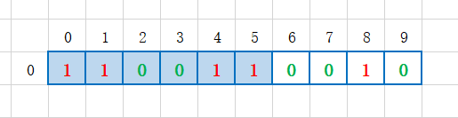
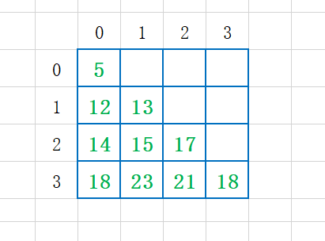

### 动态规划（Dynamic Programming）

#### 1 0-1背包问题

##### 1.1 **问题**

有一个背包，背包总的承载重量是 Wkg。现在我们有 n 个物品，每个物品的重量不等，并且不可分割。我们现在期望选择几件物品，装载到背包中。在不超过背包所能装载重量的前提下，如何让背包中物品的总重量最大？

##### 1.2 **思路**

* 通过回溯方法求解，但是时间复杂度过大；

  回溯的话是每个物品选择或者不选，依次递归，在递归后续物品选择的时候判断限制条件以及求最优解。

* 动态规划

  我们可以换个思路，选择物品的过程，已有物品的总重量是已经选择的几个物品重量和，当选择下一个物品的时候，再得到的已有物品总重量就是 前面已有总重量 +  当前物品重量。那么可以当前选择的结果是依赖于之前选择的，那么其实每一个物品选择后的可装入最大重量就是在 之前已有总重量和当前重量 这两个变量之间决策，而已有总重量最优解就是 前一个物品重量 和 前一个物品选择时候已有重量 之间决策，简单点就是：**后面阶段的状态可以通过前面阶段的状态推导出来**。

  即动态规划解决问题思路：我们把问题分解为多个阶段，每个阶段对应一个决策。我们记录每一个阶段可达的状态集合（去掉重复的），然后通过当前阶段的状态集合，来推导下一个阶段的状态集合，动态地往前推进。

  这里我们建立一个二维数组状态表来记录 0-1 物品选择这个状态依次推导过程：

  

  假设5个物品重量分别为 2、2、4、6、3，背包限制重量为 9 ，那么我们就可以建立一个二维状态表 states[5] [10] ,  其中行代表选择第几个物品，列代表当前物品选择的可达状态范—即已装入物品重量。背包限制重量为 9，即每次物品选择后的已装入物品重量值只能在 9 以内，所以列大小为10。

  states[i] [j] = true （图中表示为1） 代表当前这个物品 i 决策后的已有物品重量为 j , 这里物品决策可能是 选择了，也可能是没选择。 比如 物品1 没选择，那么已有总重量就是 0 ，则 states[0] [0] = true , 如果物品 1 选择了，那么已有总重量就是 2 ，即 states[0] [2] = true 。

##### 1.3 **代码实现**

​	动态规划：

```java
package com.skylaker.dp;

/**
 * 动态规划：求 0-1 背包问题
 * @author skylaker
 * @version V1.0 2020/5/23 17:49
 */
public class DynamicProgramming {
    public static void main(String[] args) {
        // 测试物品
        int[] arr = {20, 24, 19, 7, 12};
        System.out.println(bestWeight(arr, 100));
    }

    /**
     * 利用动态规划求解 0-1 背包问题 能存放的最大物品重量
     * @param weight  每个物品对应的重量
     * @param maxWeight 背包限制最大重量
     * @return 能放到背包最大重量
     */
    public static int bestWeight(int[] weight, int maxWeight) {
        // 构建二维状态数组
        boolean states[][] = new boolean[weight.length][maxWeight + 1];

        // 后续的物品选择结果是要基于前面的状态来的，
        // 那么对于第一个物品来说，直接将选择不选择情况设置到状态表中
        // 不选择, 即列表示的选择重量为 0
        states[0][0] = true;
        // 选择，那么对应到列就是第一个物品的重量，但是要注意重量范围不能超出限制
        if(weight[0] <= maxWeight) {
            states[0][weight[0]] = true;
        }

        // 开始依次往后选择，填充状态表
        for(int k = 1; k < weight.length; k++) {
            // 第 k+1 个物品不选择，那么已选择物品的重量其实是和 k - 1 是一致的
            for(int j = 0; j <= maxWeight; j++) {
                if(true == states[k-1][j]) {
                    states[k][j] = true;
                }
            }

            // 第 k+1 个物品选择，那么就需要在 k-1 物品选择重量基础上加上当前重量
            // 同时需要注意加上当前物品后已有总重量不能大于背包总重量
            for(int j = 0; j <= maxWeight - weight[k]; j++) {
                if(true == states[k-1][j]) {
                    states[k][j + weight[k]] = true;
                }
            }
        }

        // 遍历最后一行，第一个为 true 的即为最优解
        for(int m = maxWeight; m >= 0 ; m--) {
            if(true == states[weight.length-1][m]) {
                return m;
            }
        }
        // 没有合适解
        return 0;
    }
}

```

##### 1.4 **时间、空间复杂度**

* 耗时最多的部分就是代码中的两层 for 循环，所以时间复杂度是 **O(n*w)**。
  （n 表示物品个数，w 表示背包可以承载的总重量）

* 需要额外申请一个 n 乘以 w+1 的二维数组，对空间的消耗比较多；

  动态规划是一种空间换时间的解决思路

##### 1.5 **代码优化**

前面动态规划实现利用二维数组，比较占用空间，其实我们分析下可以对空间进行优化：


这是我们在放完最后一个物品后的状态表，几个物品从前到后依次处理，后一行的状态是在前一行的基础上处理的，而最终我们取最优解的直接根据最后一行，而前面的几行根本没有用上，即前面的行纯粹是临时的状态记录，我们最终目标就是最后的所有选择结果，那是否可以直接将前面的行用过后去除呢？

我们可以利用动态一维数组，比如第一个物品选择完了，第二个物品操作，直接把这一次选择后的结果再保存到一维数组中，依次类推，最终的一维数组不就是我们二维状态数组最后一行么？


对应代码：

```java
/**
     * 利用动态规划（一维状态数组)求解 0-1 背包问题 能存放的最大物品重量
     * @param weight  每个物品对应的重量
     * @param maxWeight 背包限制最大重量
     * @return 能放到背包最大重量
     */
    public static int bestWeight2(int[] weight, int maxWeight) {
        // 构建一维状态数组
        // 下标为 背包可能存放物品重量; 值为 该重量是否是可能解
        boolean[] states = new boolean[maxWeight + 1];

        // 对于第一个物品对应状态直接初始化
        // 第一个物品不选
        states[0] = true;
        // 第一个物品选
        if(weight[0] <= maxWeight) {
            states[weight[0]] = true;
        }

        // 从第2个物品开始选
        for(int k = 1; k < weight.length; k++) {
            // 第 k+1 个物品不选，那么其实对于一维数组来说值是不变的
            // do nothing

            // 第 k+1 个物品选择，需要从能够操作的已有物品总总量倒序操作
            for(int m = maxWeight - weight[k]; m >= 0; m--) {
                if(true == states[m]) {
                    states[m + weight[k]] = true;
                }
            }
        }

        // 从后往前第一个为 true 的总量即为最优解
        for(int m = maxWeight; m >= 0; m--) {
            if(true == states[m]) {
                return m;
            }
        }
        // 未找到最优解
        return 0;
    }
```

其中第二个物品开始选择的时候，需要从后往前选择：


这个是因为如果从前往后的话有可能导致重复计算，例如前一个已经选择的结果为：


如果当前物品重量为 4 ，那么可操作重量范围为 0 -5 ，按照从前到后遍历的话，得到的结果为：



如果从前到后遍历，那么到5的时候，发现有值，就要继续操作，导致计算得到值为 9 ，即 


但是这个5根本不是之前物品选择后可能的结果，这样操作必然是错误的，因此不能从前往后遍历，所以从后往前遍历，因为加上当前物品重量后的重量肯定在当前重量之后，这样往前遍历也就不会出现上面的问题。

#### 2  动态规划理论

##### 2.1 适合解决的问题

* **一个模型三个特征**

  * 一个模型：**多阶段决策最优解模型**

    一般用动态规划来解决最优问题，解决问题的过程，需要经历**多个决策阶段**。每个决策阶段都对应着一组状态。然后我们寻找一组决策序列，经过这组决策序列，能够产生最终期望求解的**最优值**。

    直白点说就是求解问题是分为多个阶段来处理的。

  * 特征一：**最优子结构**

    多阶段求解，后面阶段的状态可以通过前面阶段的状态推导出来。而问题的最优解包含子问题的最优解。反过来说就是，我们可以通过子问题的最优解，推导出问题的最优解。

  * 特征二：**无后效性**

    * 第一层含义

      在推导后面阶段的状态的时候，我们只关心前面阶段的状态值，不关心这个状态是怎么推导出来的。

    * 第二层含义

      某阶段状态一旦确定，就不受之后阶段的决策影响 ，只和前面的决策有关联。

  * 特征三：**重复子问题**

    不同的决策序列，到达某个相同的阶段时，可能会产生**重复的状态** 。

##### 2.2 解决问题的思路

**不是**每个问题都**同时适合**这两种解题思路。要结合具体的题目选择用哪种解题思路。

###### 2.2.1 状态转移表法

* 1）先用回溯暴力法搜索解决，定义节点状态，画出递归树，看是否存在重复状态，可用“备忘录”提升效率；

* 2）如果可以用动态规划：

  * **绘制状态表**：一般都是二维的，代码表示即二维数组。其中每个状态包含三个变量，行、列、数组值。

  * **填充状态数据**：根据决策的先后过程，从前往后，根据递推关系，分阶段填充状态表中的每个状态；

  * **翻译为代码**：将这个递推填表的过程，翻译成代码，就是动态规划代码。

    ```java
    // 1、定义状态表
    int[][] states = new int[*][*];
    
    // 2、填充状态表
    // 第一行直接填充初始化
    // 第二行后面的行根据前面的选择数据加上当前数据来做决策处理，填充状态表
    
    // 3、选择最优解
    ```

###### 2.2.2 状态转移方程法

* 类似递归的解题思路
  * 分析某个问题如何通过子问题来递归求解，也就是所谓的**最优子结构**。
  * 根据最优子结构，写出**递归公式**，也就是所谓的状态转移方程。
  * 根据状态转移方程**代码实现**：一种是**递归加“备忘录”**，另一种是**迭代递推**。

###### 2.2.3  实战

* 问题

  类似杨辉三角，每个位置的数字可以随意填写，经过某个数字只能到达下面一层相邻的两个数字。
  从第一层，往下移动，我们把移动到最底层所经过的所有数字之和，定义为路径的长度。
  请你编程求出从最高层移动到最底层的最短路径长度 。
             5
            / \
          7     8
         /  \  /  \
        2     3    4
       /  \  /  \ /  \
      4    9     6    1

* 状态转移表法

  * 1）绘制状态表

    按照阶段解析角度来看，这个三角是从最高层到最底层的，因此可以按照层分，同时每一层的数字个数是一定的，我们可以构建一个二维状态表：

    * 行代表每一层；
    * 列代表层的数字最大个数，用最底层数字个数作为列
    * 值代表当前数字选择后最短路径

  * 2）填充状态表

    一层层填充：

    最左边的数字最短路径就是上一个最左数字已有路径和加上当前数字

    最右边数字最短路径就是上一个最右边数字已有路径和加上当前数字

    如果是中间数字，那么 最短路径 = 上一层相连的两个数字中的最短一个路径 + 当前数字

    

  * 3）转换为代码

    ```java
    	/**
         * 利用状态表求解
         * @param triangle “杨辉三角”对应的二维数组，一维代表每一层，二维代表每一行数字
         * @return 最高层到最底层的最短路径
         */
        public static int dpStatesTable(int[][] triangle) {
            // 1、定义状态表
            // 行代表每一层
            // 列代表层的数字最大个数，用最底层数字个数作为列
            // 值代表当前数字选择后最短路径
            int[][] states = new int[triangle.length][triangle.length];
    
            // 2、开始填表
            // 初始化第一层
            states[0][0] = triangle[0][0];
    
            // 第二层开始依赖前一层处理
            for(int c = 1; c < triangle.length; c++) {
                for(int k = 0; k < triangle[c].length; k++) {
                    // 当前层最右边数字索引
                    int rightIndex = triangle[c].length - 1;
    
                    if(0 == k) {
                        // 最左边的数字最短路径就是上一个最左数字已有路径和加上当前数字
                        states[c][0] = states[c - 1][0] + triangle[c][0];
                    }
                    else if(k == rightIndex) {
                        // 上一层最右边数字索引
                        int upRightIndex = triangle[c-1].length - 1;
                        // 最右边数字最短路径就是上一个最右边数字已有路径和加上当前数字
                        states[c][rightIndex] = 
                            states[c-1][upRightIndex] + triangle[c][rightIndex];
                    }
                    else {
                    // 如果是中间数字，那么最短路径=上一层相连的两个数字中的最短一个路径 + 当前数字
                        int upLeft = states[c-1][k-1];
                        int upRight = states[c-1][k];
                        states[c][k] = Math.min(upLeft, upRight) + triangle[c][k];
                    }
                }
            }
    
            // 3、得到最优解
            // 这里状态表最后一层的数据就是最底层每个数字的最短路径，
            // 那么对于整个三角来说，最短路径就是这些最短路径中的最小值
            int bottomRow = states.length - 1;
            int min = states[bottomRow][0];
            for(int i = 0; i < states[bottomRow].length; i++) {
                if(states[bottomRow][i] < min) {
                    min = states[bottomRow][i];
                }
            }
            return min;
        }
    ```

* 状态转移方程法

  * 1）先定义状态转移方程

    其实在上面的状态转移表时候我们已经得到对应的关系方程：

    ```java
    最左边数字最短路径 = 上一个最左数字已有路径和 + 当前数字
    最右边数字最短路径 = 上一个最右边数字已有路径和 + 当前数字
    如果是中间数字，那么 最短路径 = 上一层相连的两个数字中的最短一个路径 + 当前数字
    ```

  * 2）转换为代码

    ```java
    /**
     * 利用状态转移方程求解
     * @param triangle “杨辉三角”对应的二维数组，一维代表每一层，二维代表每一行数字
     * @return 最高层到最底层的最短路径
     */
    public static int stateTransferEquation(int[][] triangle){
    	int min = Integer.MAX_VALUE;
    
    	// 求最后一层的数字每个的最短路径，从中选最小值
    	// 最后一层往前迭代
    	for(int i = 0; i < triangle[triangle.length - 1].length; i++) {
    		int dst = stf(triangle, triangle.length - 1, i);
    		if(dst < min) {
    			min = dst;
    		}
    	}
    
    	return min;
    }
    
    /**
     * 求指定数字对应的最短路径
     * @param triangle “杨辉三角”对应的二维数组，一维代表每一层，二维代表每一行数字
     * @param c 层数
     * @param k 指定层第几个（k+1）数字
     * @return 当前数字最短路径
     */
    private static int stf(int[][] triangle, int c, int k) {
    	// 设置终止条件
    	if(0 == c && 0 == k) {
    		return triangle[0][0];
    	}
    
    	// 当前层最右边数字索引
    	int rightIndex = triangle[c].length - 1;
    
    	// 当前数字的最短路径通过状态转移方程递归前面的数字得到
    	if(0 == k) {
    		// 最左边的数字最短路径就是上一个最左数字已有路径和加上当前数字
    		return stf(triangle, c-1, 0) + triangle[c][0];
    	}
    	else if(k == rightIndex) {
    		// 上一层最右边数字索引
    		int upRightIndex = triangle[c-1].length - 1;
    		// 最右边数字最短路径就是上一个最右边数字已有路径和加上当前数字
    		return  stf(triangle, c-1, upRightIndex) + triangle[c][k];
    	}
    	else {
    		// 如果是中间数字，那么 最短路径=上一层相连的两个数字中的最短一个路径 + 当前数字
    		return Math.min(stf(triangle, c-1, k - 1), stf(triangle, c-1, k))
                + triangle[c][k];
    	}
    }
    ```

    

###### 2.2.4  适合场景

​	个人理解

* 状态转移方程法适合能归纳出**迭代方程**的，即可通过**子问题最优解**来推断**当前最优解**：
  $$
  当前最优解 = 子问题最优解 + 当前状态处理
  $$
  例如

  * “杨辉三角” 能总结出迭代方程：

  $$
  每个数字的最短路径 = 上一层关联的两个数字最短路径 + 当前数字
  $$

  * 但是 0-1 背包问题不太好用迭代方程表示，因为可能前 n-1 个物品选择出的最大重量 + 当前物品选择处理 不是最合适的解，比如背包限制 9， 物品重量 3、5、4， 前两个物品选择出最优解是8 ， 对于第三个物品选择来说，如果在之前最优解基础上做选择，那第三个物品处理后最优解就是8；但其实应该是 9 ，即当前物品的选择不是建立在之前物品最优选择基础上，而是之前物品可以选择的所有可能解上。

* 状态转移表法一般适合可**二维状态表**表示的求解过程；

  比如 0-1 背包问题分为多个物品分阶段，每个阶段可以选择的值在一定范围内；

  “杨辉三角” 按层求解，每一层的数字个数一定，可以用二维数字行表示层，列表示层的数字个数；

#### 3 贪心、回溯、动态规划、分治

* 分治单独单独一类

  分治算法解决的问题大部分也是最优解问题，但是大部分都不能抽象成多阶段决策模型；

* 贪心、回溯、动态规划可归为一类

  解决问题的模型，都可以抽象成多阶段决策最优解模型；

  * 回溯

    适用性广，基本上能用的动态规划、贪心解决的问题，我们都可以用回溯算法解决。

    回溯算法相当于穷举搜索。穷举所有的情况，然后对比得到最优解。

    时间复杂度非常高，是指数级别的，只能用来解决小规模数据的问题。

  * 动态规划

    比回溯算法高效；

    只有满足三个特征，最优子结构、无后效性和重复子问题，才能用动态规划来解决。

  * 贪心算法

    实际上是动态规划算法的一种特殊情况。

    解决问题更高效，代码实现简洁。

    可解决的问题有限，需满足三个条件，最优子结构、无后效性和贪心选择性。（贪心选择性”的意思是，通过局部最优的选择，能产生全局的最优选择。每一个阶段，我们都选择当前看起来最优的决策，所有阶段的决策完成之后，最终由这些局部最优解构成全局最优解）