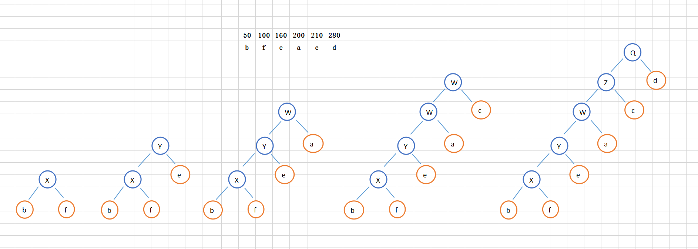
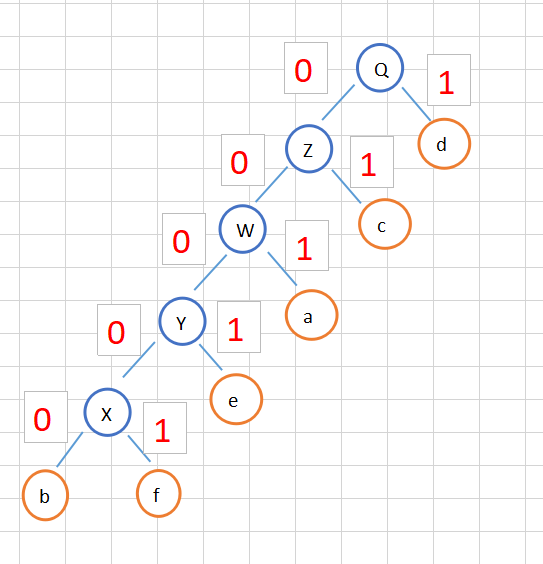

## 贪心算法（greedy algorithm）

## 1 概念

在对问题求解时，总是做出在**当前**看来是**最好**的选择。

即不从整体最优上加以考虑，他所做出的是在某种意义上的**局部最优解**。

## 2 应用

* 霍夫曼编码（Huffman Coding）

* Prim 和 Kruskal 最小生成树算法

* Dijkstra 单源最短路径算法

## 3 一般思路

* **1)**  看到这类问题，首先要联想到贪心算法：针对一组数据，我们定义了限制值和期望值，希望从中选出几个数据，在满足限制值的情况下，期望值最大。

* **2)**  尝试问题是否可以用贪心算法解决：每次选择当前情况下，在对限制值同等贡献量的情况下，对期望值贡献最大的数据。

* **3)**  举几个例子看下贪心算法产生的结果是否是最优的。（严格证明较为困难，另外，用贪心算法解决问题的思路，并不总能给出最优解）

## 4 霍夫曼编码

* **问题**

  有一个包含 1000 个字符的文件，每个字符占 1 个 byte（1byte=8bits），这 1000 个字符中只包含 6 种不同字符，假设它们分别是 a、b、c、d、e、f。存储这 1000 个字符就一共需要 8000bits，是否有节省空间存储方式？

* **解决**

  * 1）用 3 个二进制位（bit）就可以表示 8 个不同的字符，所以，每个字符用 3 个二进制位来表示。那存储这 1000 个字符只需要 3000bits 就可以了 ；

  * 2）**霍夫曼编码**

    * 思路

      * 霍夫曼编码既考察文本中有多少个不同字符，也考察每个字符出现的频率，根据频率的不同，选择不同长度的编码。

      * 根据贪心的思想，我们可以把出现频率比较多的字符，用稍微短一些的编码；出现频率比较少的字符，用稍微长一些的编码。
      * 为了避免解压缩过程中的歧义，任何一个字符的编码都不是另一个的前缀，在解压缩的时候，每次会读取尽可能长的可解压的二进制串。

    * 根据字符频率编码

      依次将字符按照频率从小到大排列，取最小的两个字符作为子节点生成一个父节点，父节点的频率为子节点之和，然后取后续的节点和新的父节点再组合生成新的父节点，依次类推：

      

      给每一条边加上画一个权值，指向左子节点的边我们统统标记为 0，指向右子节点的边，我们统统标记为 1，那从根节点到叶节点的路径就是叶节点对应字符的霍夫曼编码：

      

      | 字符 | 编码  |
      | :--: | :---: |
      |  a   |  001  |
      |  b   | 00000 |
      |  c   |  01   |
      |  d   |   1   |
      |  e   | 0001  |
      |  f   | 00001 |

      