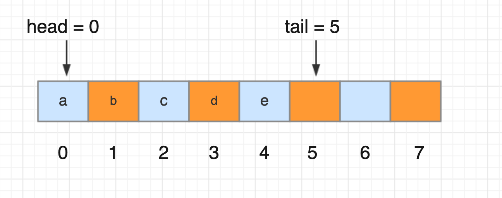
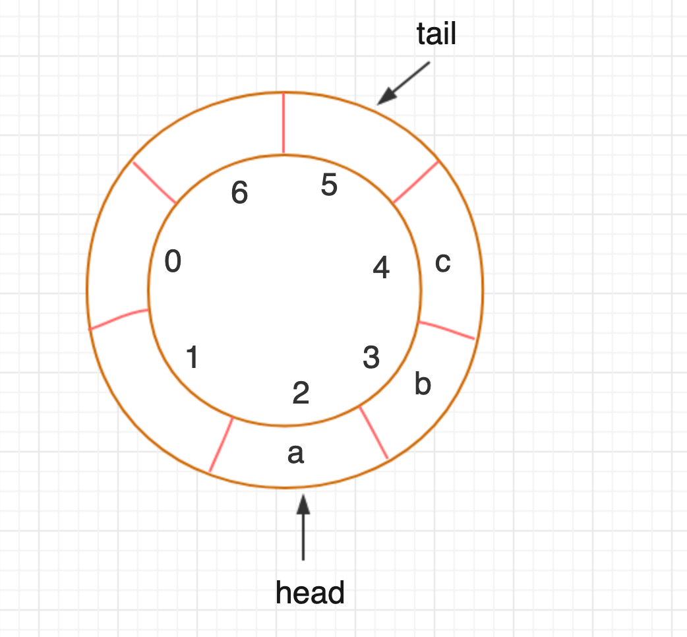

### 队列

#### 1 基本定义

一种操作受限的线性表数据结构；和栈一样，也是一种逻辑上抽象的数据结构，本质上可以用数组和链表两种基本数据结构实现；

最基本的两个操作：入队 enqueue()  队尾放一个数据 、出队 dequeue() 队列头部取一个元素；

基本特性：先进先出；后进后出；


#### 2 顺序队列

顺序队列：用数组实现的队列

```java
package com.skylaker.queue;

/**
 * 顺序队列
 * @author skylaker2019@163.com
 * @version V1.0 2019/9/9 10:04 PM
 */
public class ArrayQueue {
    // 内部数组
    private String[] items;
    // 数组大小：n，即队列大小
    private int n = 0;
    // 队头下标：指向第一个实际元素
    private int head = 0;
    // 队尾下标：指向最后一个元素的后一节点，即入队元素要保存进的位置
    private int tail = 0;

    /**
     * 申请一个大小为 m 的数组
     * @param m
     */
    public ArrayQueue(int m){
        items = new String[m];
        n = m;
    }

    /**
     * 入队操作（不做判空操作，即允许存储空数据）
     * @param item 入队元素
     * @return 成功 true；失败 false
     */
    public boolean enqueue(String item){
        // 判断队列是否已经满
        if(tail == n){
            return false;
        }

        items[tail] = item;
        tail++;
        return true;
    }

    /**
     * 出队操作
     * @return
     */
    public String dequeue(){
        // 判断队列是否为空
        if(head == tail){
            return null;
        }

        String item = items[head];
        head++;
        return item;
    }
}
```

a、b、c、d、e 元素依次入队后，head指向0位置，tail指向5位置：


注意队列元素的内容应该在于队头到队尾之间的元素内容，而不是整个数组，例如出队操作后，只是队头指针向后移动，但是本身出队的元素在数组中是依然存在的；顺序队列是存在于数组上的逻辑数组结构；

两次出队后，队头指向2位置：


产生问题：例如上面的队列，如果继续入队元素，当tail=8时候：

这个时候继续入队，但是队尾已经没有空间了，无法再入队新插入元素，可是队列头明明是有空间的；

解决这个问题，可以在入队的时候进行元素搬移操作，例如上面队列可以后续元素都往前搬移两个位置；但是并不是每次入队都需要，只需要在队尾已经无法插入元素时再迁移元素，降低时间复杂度；

```java
/**
     * （带元素空间调整的）入队操作
     * @param item 入队元素
     */
    public boolean enqueueWithMoveItem(String item){
        // 判断队列是否已满
        if(tail == n){
            if(head == 0){
                // 队头在第一个位置，队尾在末尾位置，说明整个队列已经真正满了，无法再入队
                return false;
            }

            // 说明即使队尾已无法入队，但是队头前还有剩余空间，进行元素搬移操作
            for(int i = head; i < tail; i++){
                items[i - head] = items[i];
            }

            // 调整队头和队尾（注意先要调整队尾）
            tail = tail - head;
            head = 0;
        }

        // 再进行入队操作
        items[tail] = item;
        tail++;
        return true;
    }
```


#### 3 链式队列

链式队列：用链表实现的队列

head指针：指向链表的第一个结点；
tail指针：指向链表最后一个结点；

```java
package com.skylaker.queue;

/**
 * 链式队列
 * @author skylaker2019@163.com
 * @version V1.0 2019/9/9 11:17 PM
 */
public class LinkedQueue {
    // 队头
    private Node head = null;
    // 队尾
    private Node tail = null;

    /**
     * 入队
     * @param item
     * @return
     */
    public void enqueue(String item){
        Node node = new Node(item, null);
        if(tail == null){
            head = node;
            tail = node;
        } else {
            tail.next = node;
            tail = node;
        }
    }

    /**
     * 出队
     * @return
     */
    public String dequeue(){
        if(null == head){
            return null;
        }
        String item = head.data;
        head = head.next;

        // 考虑边界情况，如果当期head指向最后一个元素，即和tail位置一样，那么再出队，则head指向下一个结点即空，tail也就自然指向空了
        if(null == head){
            tail = null;
        }
        return item;
    }

    /**
     * 输出元素
     */
    public void print(){
        Node p = head;
        while(null != p){
            System.out.print(p.data + " ");
            p = p.next;
        }
    }


    /**
     * 链式队列结点定义
     */
    public class Node {
        private String data;

        private Node next;

        Node(String data, Node next){
            this.data = data;
            this.next = next;
        }
    }
}
```


#### 4 循环队列

把原有顺序队列，收尾相连，形成一个循环队列；



当前队列tail=2，tail=5，如果继续入队，那么tail依次为5、6、0，这样比顺序队列一个明显优势就是在tail=n时候不需要再移动数组元素，大大降低了入队时间复杂度；


循环队列tail指向的位置不存储元素，所以会浪费一个存储单元空间；

循环队列代码关键：确定好队空和队满的条件；

循环队列满时规律：`（tail + 1）% n = head`


```java
package com.skylaker.queue;

/**
 * 循环队列
 * @author skylaker2019@163.com
 * @version V1.0 2019/9/10 12:30 AM
 */
public class CircularQueue {
    // 数组
    private String[] items;
    // 数组长度
    private int n;
    // 队头下标
    private int head = 0;
    // 队尾下标
    private int tail = 0;

    public CircularQueue(int m){
        items = new String[m];
        n = m;
    }

    /**
     * 入队
     * @param item
     * @return
     */
    public boolean enqueue(String item){
        // 判断队列是否已经满了
        if((tail + 1 ) % n == head){
            return false;
        }

        items[tail] = item;
        tail = (tail + 1) % n;
        return true;
    }

    /**
     * 出队
     * @return
     */
    public String dequeue(){
        if(head == tail){
            return null;
        }

        String item = items[head];
        head = (head + 1) % n;
        return item;
    }

    /**
     * 打印元素
     */
    public void print(){
        if(head == tail){
            System.out.println("队列为空");;
        }

        int p = head;
        while(p != tail){
            System.out.print(items[p] + " ");

            p += 1;
            if(p >= n){
                p -= n;
            }
        }
    }
}
```

### 