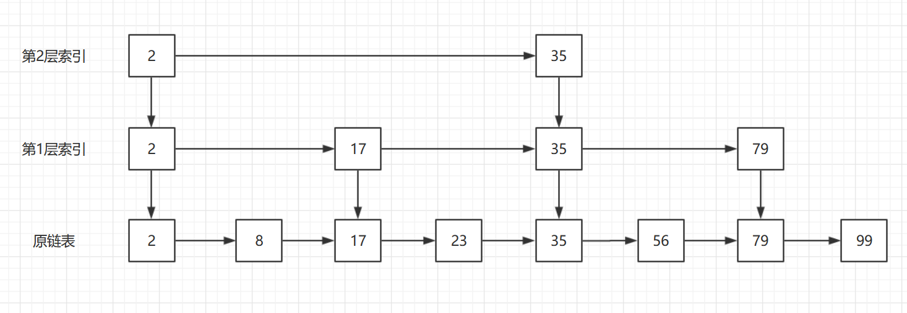
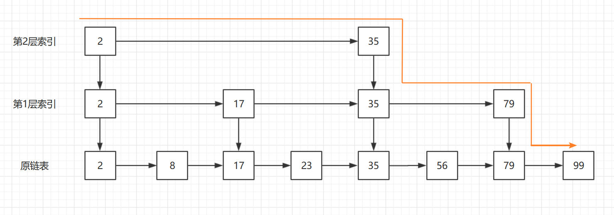
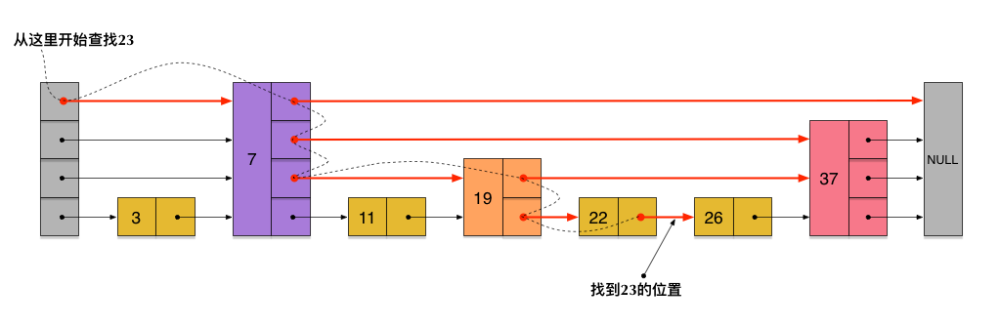

### 跳表（Skip List）

#### 1 基本思想

普通链表查找时间复杂度O(n)，为了提高查找时间复杂度，通过建立多级索引方式来缩减查找次数：



例如原有序链表 2、8、17、23、35、56、79、99，如果要查找元素99，直接顺序遍历的话需要查找8次，但是如按照每两个元素向上提取一个索引的话，一共建立了两层索引，那么从最高层索引遍历只需要查找6次：



很明显减少了查找次数，减低了时间复杂度，如果元素个数更多的话效果更明显。

当然对于整个跳表来说，并不是每次查找的时候再去动态的建立索引，而是在每次增加、删除元素时候去动态的建立索引，便于查找时候直接使用。

#### 2 算法分析

##### 2.1 **时间复杂度**

**A. 查找**

每次查找从最高层索引到链表本身，一定要经历整个调表高度，我们先计算下n个元素链表生成的跳表的最大高度。假设每 m 个元素提取一个索引节点，则第1层索引节点个数共 n / m 个，第2层 n/(m^2)，，，以此类推，到最顶层只有两个元素，得到 n/(m^h) = 2  ，其中h表示索引层高度，则 


（github公式显示有问题，所以截图）, 算上原始链表这一层共


我们在来算下在每一层遍历的元素个数，因为每m个元素提取一个索引节点，则在两个索引节点之间最多遍历的节点个数就是m，那么整个查找的时间复杂度就是：


当m的值比较小的时候，例如2、3，则时间复杂度就可以表示为：


即跳表的时间复杂是 **logn** 级别。

当然如果当m比较大的时候，例如我直接每 n/ 2个元素提取一个索引节点，那么只有一层索引，那么其实就是m趋向于n，最终还是退化成单链表操作，时间复杂度还是 n ，所以一定要选取合适的建立索引区间。

**B. 插入**

插入链表节点本身只需要O(1)，但是需要先查找元素，所以就是O(logn)。

但是跳表在插入元素时候涉及到索引层的更新，而不同的建立索引节点算法是不一样的，所以暂时无法评估，但是建立索引也是跟层次有关系，找到每层应该建立索引位置，再建立索引节点，其实和查找类似，所以最终我们可以简单的描述插入时间复杂度为 **O(logn)** 。


**C. 删除**

类似插入操作。

##### 2.2 **空间复杂度**

需要额外的空间存储索引节点。假设每 m 个元素提取一个索引节点，则第1层索引节点个数共 n / m 个，第2层 n/(m^2)，，，以此类推，到最顶层只有两个元素，得到 总的节点个数：


当 m = 2 的时候，P = n - 2，即空间复杂度 O(n);

当 m = 3 的时候，P = n / 2，即空间复杂度 O(n)，但是其实占用的空间相比 m=2 已经下降一半;

m值越大，所需要的额外索引空间越小。

#### 3  代码实现

对照此跳表图示更好理解（文章：https://juejin.im/post/57fa935b0e3dd90057c50fbc ） ：



```java
package com.skylaker.skipList;

import org.junit.jupiter.api.Test;

import javax.management.MXBean;
import java.util.Random;

/**
 * 跳表实现 (原链表为单链表，且存储元素值为自然数)
 * @author skylaker
 * @version V1.0 2019/12/14 22:17
 */
public class SkipList {
    // 定义最大层高，之所以设置为32，因为按照两个元素一个索引节点的话，可以满足最大 2^32 链表构建跳表
    private static final int MAX_LEVEL = 32;

    // 实际跳表高度，即为最大索引层高度，第一层为0，最高层为 realLevel - 1
    private int realLevel = 0;

    // 头节点，虚拟的哨兵节点，为了方便后续遍历，直接高度设置为最大层高（如果设置尾节点的话，也是同样如此）
    private Node head = new Node(-1, MAX_LEVEL);

    // 随机算法，用于生成层高数
    private Random random = new Random(MAX_LEVEL);


    /**
     * 查找跳表中是否存在指定元素值的节点
     * @param value 需要查找的元素值
     * @return {Node} 目标节点（肯定是原链表即第一层的节点了，如果只是判断是否存在并不需要一定遍历到第一层，因为索引层对应节点值为目标值就代表元素值存在了）
     */
    public Node search(int value){
        // 当前查找节点，从头节点开始
        Node current = head;

        /**
         *  从最顶层头节点开始查找，查找目标元素的前一个节点
         *  例如
         *
         *  3层   HEAD                            78      TAIL
         *  2层   HEAD            21              78      TAIL
         *  1层   HEAD     5      21      57      78      TAIL
         *  0层   HEAD  2  5  16  21  32  57  62  78  99  TAIL
         *
         *  例如查找元素32，首先从最顶层HEAD元素开始，即3层中的HEAD ，它判断下一个节点值即78与目标元素大小关系，发现大于，所以跳出内层while循环，下沉一层；
         *  到下一层即2层查找，发现21比32小，所以在内层while循环中当前查找节点后移一位到21，在继续比较下一位，发现78大于，所以目标元素肯定在21和78之间，下沉一层；
         *  到下一层即1层查找，类似，找到21和57区间，继续在21索引位置下沉一层；
         *  到下一层即0层查找，当前查找节点即是0层的21，比较下一个节点值是否比32小，发现不，所以跳出内层while循环，而外层高度已经到0，即已经找到目标元素在0层应该存放位置的前一个节点；
         */
        for(int level = realLevel - 1; level >= 0 ; level--){
            // 内层循环找到当前层比目标元素小的节点，即目标元素应该所在位置前一个节点
            while (null != current.nextNodes[level] && current.nextNodes[level].data < value){
                current = current.nextNodes[level];
            }
        }

        // 因为目标值肯定在最终的查找节点和后一个节点之间，即 (current, current.next] ，
        // 而查找节点是比目标元素小的，所以肯定不是，那就直接比较下个节点值是否等于目标元素值
        if(null != current.nextNodes[0] && value == current.nextNodes[0].data){
            return current.nextNodes[0];
        } else {
            // 如果下个节点值不等于目标值，那么说明目标节点是在查找节点和下个节点之间的 (current, current.next) ，即不存在
            // 同样还要考虑一种场景，例如查找元素100，最终的查找节点就是0层的99节点，判断到后继节点为空，而目标元素节点又在99后面，那只能说明不不存在
            return null;
        }
    }


    /**
     * 插入元素
     * @param value 新增元素值
     */
    public void insert(int value){
        // 首先获取新增节点占用几层，即原链表本身节点+索引层节点
        // 采用随机算法，确保得到的层数在最大层限制之内
        // 当时需要考虑一种特殊情况，即初始跳表为空，这个时候新增的元素为第一个元素，无需建立索引层
        int level = null == head.nextNodes[0] ? 1 : getRandomLevel();

        if(level > realLevel){
            // 如果超过当前层高，只设置层高为实际层高+1 ，避免单个节点过分高，影响查找效率
            level = ++realLevel;
        }

        // 例如当前层高 10， 计算得到的层高为 6 ，那么层高就是 6 ；但是如果计算出来是 20，则层高设置为 21；

        // 新建节点
        Node newNode = new Node(value, level);

        // 新建节点的所有前置节点值数组，因为单链表的插入需要找到前驱节点，需要这里需要找到目标节点各个层的前置节点
        Node[] preNodes = new Node[level];
        for(int i = 0; i < level; i++){
            // 初始前置节点都设置为头节点
            preNodes[i] = head;
        }

        //找到目标节点各个层的前置节点
        Node current = head;
        for(int currentLevel = level - 1; currentLevel >= 0; currentLevel--){
            while (null != current.nextNodes[currentLevel] && current.nextNodes[currentLevel].data < value){
                current = current.nextNodes[currentLevel];
            }

            preNodes[currentLevel] = current;
        }

        // 在每一层插入目标节点（当然也可以在循环内部每一层找到前置节点的时候插入）
        for(int i = 0; i < level; i++){
            newNode.nextNodes[i] = preNodes[i].nextNodes[i];
            preNodes[i].nextNodes[i] = newNode;
        }
    }

    /**
     * 获取随机层数，该算法可根据实际情况合适选取
     * @return
     */
    private int getRandomLevel(){
        int level = 1;

        for(int i = 0; i < realLevel; i++){
            if(random.nextInt() % 2 == 0){
                level++;
            }
        }

        return level;
    }

    /**
     * 删除目标元素值节点
     * @param value 目标节点值
     */
    public void delete(int value){
        // 要删除的话还是找到在每一层的所有前置节点
        Node[] preNodes = new Node[realLevel];

        Node current = head;
        for(int currentLevel = realLevel - 1; currentLevel >= 0; currentLevel--){
            while (null != current.nextNodes[currentLevel] && current.nextNodes[currentLevel].data < value){
                current = current.nextNodes[currentLevel];
            }

            preNodes[currentLevel] = current;
        }

        // 从最顶层开始删除即可，即每一层都是单链表节点的删除
//        for(int i = realLevel - 1; i >= 0; i--){
//            if(null != preNodes[i].nextNodes[i] && value == preNodes[i].nextNodes[i].data){
//                preNodes[i].nextNodes[i] = preNodes[i].nextNodes[i].nextNodes[i];
//            }
//        }

        // 优化一下
        if(null == preNodes[0].nextNodes || value != preNodes[0].nextNodes[0].data){
            // 即如果目标值不存在链表中即不用执行删除操作，而不存在情况一个是最后链表节点后面、二个某两个节点之间
            return;
        }

        for(int i = realLevel - 1; i >= 0; i--){
            // 即使目标值元素存在依然需要在每一层判断是否存在，因为不一定在每一层都建立了索引节点
            if(null != preNodes[i].nextNodes[i] && value == preNodes[i].nextNodes[i].data){
                preNodes[i].nextNodes[i] = preNodes[i].nextNodes[i].nextNodes[i];
            }
        }

    }

    /**
     * 打印所有跳表节点
     */
    public void printAllSkipListNodes(){
        for(int l = realLevel - 1; l >= 0; l--){
            Node current = head;
            while (null != current.nextNodes[l]){
                System.out.print(current.nextNodes[l].data + " --- ");
                current = current.nextNodes[l];
            }
            System.out.println();
        }
    }

    /**
     * 跳表节点定义
     * 这里的节点并不仅仅是普通链表中的节点概念，而是代表节点在整个跳表中的所有位置集合，
     * 即包括当前节点值以及所有后继节点索引
     */
    public class Node {
        // 当前节点的元素值，默认-1
        private int data = -1;

        // 代表当前节点的所有后继节点索引
        // nextNodes[0]代表当前节点在第1层的后继节点指针
        // 数组大小即为当前节点最大高度
        private Node[] nextNodes;

        // 当前节点最大高度
        // 包括原链表本身节点以及索引层节点
        private int maxLevel = 0;

        /**
         * 构造一个level层高的节点元素，其实指定多高即代表当前元素在哪几层存在
         * @param data 节点值
         * @param level 层高
         */
        public Node(int data, int level){
            this.data = data;

            // 当前节点值在每一层其实都是一样的，只是后继节点是不一样的，而后继节点元素数量正是层高
            this.nextNodes = new Node[level];
        }
    }

    @Test
    public void test(){
        SkipList skipList = new SkipList();
        skipList.insert(2);
        skipList.insert(8);
        skipList.insert(16);
        skipList.insert(23);
        skipList.insert(37);
        skipList.insert(59);

        skipList.printAllSkipListNodes();

        skipList.delete(23);
        skipList.printAllSkipListNodes();

        Node node = skipList.search(116);
        System.out.println(node != null);
    }
}

```

