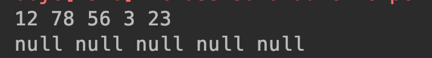
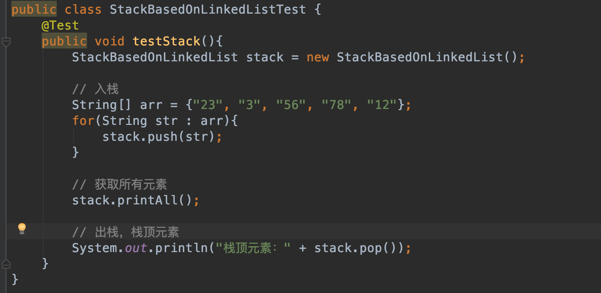

### 栈

#### 1 基本定义

先进后出，后进先出；是一种操作受限的线性表；只允许一端进行操作；

栈这种结构本质上是对数组、链表的逻辑化封装，底层实现还是要基于数组或者链表本身：


#### 2 代码实现

- 基于数组实现的栈

```java
package com.skylaker.stack;

/**
 * 基于数组的栈
 * @author skylaker2019@163.com
 * @version V1.0 2019/8/21 11:14 PM
 */
public class StackBasedOnArray {
    // 内部维护一个数组结构
    private String[] arr;
    // 栈最大大小，即数组的设置大小
    private int max;
    // 栈中已有元素个数
    private int num;

    /**
     * 初始化栈，即初始化内部的数组
     * @param max
     */
    public StackBasedOnArray(int max){
        this.arr = new String[max];
        this.max = max;
        this.num = 0;
    }

    /**
     * 入栈操作
     * @return 成功：true ；失败：false
     */
    public boolean push(String item){
        if(num == max){
            // 已有元素个数达到最大数量限制，则说明栈已经满
            return false;
        }

        arr[num] = item;
        num++;

        return true;
    }

    /**
     * 出栈操作
     */
    public String pop(){
        if(0 == num){
            // 已有元素个数为0则说明栈是空的
            return null;
        }

        // 从最上面取值
        String item = arr[num-1];
        num--;

        return item;
    }
}
```

测试数据：


输出：



如果想遍历的话直接数组倒序遍历即可，避免直接出栈将元素废弃，破坏栈结构。

时间复杂度：O(1)
空间复杂度：O(1)

- 基于链表实现的栈

```java
package com.skylaker.stack;

/**
 * 基于链表实现的栈
 * @author skylaker2019@163.com
 * @version V1.0 2019/8/22 12:03 AM
 */
public class StackBasedOnLinkedList {
    // 栈顶结点，该结点也就可直接代表栈
    Node<String> top = null;

    /**
     * 入栈操作
     * @param val
     */
    public void push(String val){
        Node newNode = new Node(val, null);

        if(null == top){
            top = newNode;
        } else {
            // 新的结点成为栈顶元素
            newNode.next = top;
            top = newNode;
        }
    }

    /**
     * 出栈操作
     */
    public String pop(){
        if(null == top){
            return null;
        }

        String val = top.data;
        // 新的栈顶元素后移一个结点
        top = top.next;
        return val;
    }

    /**
     * 获取所有结点值
     */
    public void printAll(){
        if(null == top){
            System.out.println("[空结构]");
        }

        Node p = top;
        while (p != null){
            System.out.print(p.getData() + " ");
            p = p.next;
        }
        System.out.println();
    }

    public static class Node <E> {
        // 结点保存对象
        E data;
        // 后继节点
        Node<E> next;

        Node(E data, Node<E> next){
            this.data = data;
            this.next = next;
        }

        E getData(){
            return this.data;
        }
    }
}
```

测试代码：



执行结果：


时间复杂度：O(1)
空间复杂度：O(1)

- 支持动态扩容的栈

如果底层是数组，相当于数组空间不够时候自动扩容，可以再申请一个两倍大小的数组，然后将原有数组复制过去；

如果底层是链表，则本身就支持动态扩容；