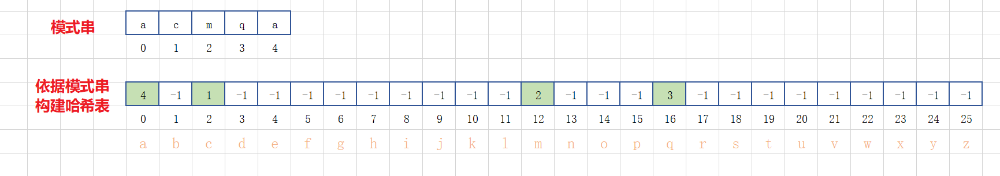

### 字符串匹配

#### 1 单模式串匹配的算法

一个串跟一个串进行匹配

##### 1.1 BF算法

* BF 是 Brute Force 的缩写，中文叫作**暴力匹配算法**，也叫**朴素匹配算法** ；

* 简单、好懂，但性能不高 ；

* **主串**和**模式串**：比如 我们在字符串 A 中查找字符串 B，那字符串 A 就是主串，字符串 B 就是模式串

* 思想：主串中，检查起始位置分别是 0、1、…n-m 且长度为 m 的 n-m+1个子串，看有没有跟模式串匹配的；

  

* 最坏情况时间复杂度是 O(n * m) ；但实际处理时中途遇到不能匹配的字符的时候，就可以就停止了，不需要把 m 个字符都比对一下，所以实际效率一般比 O(n * m)高；

##### 1.2 RK算法

* Rabin-Karp 算法，BF 算法的改进；
* 思想
  * BF 算法在匹配的时候需要针对每个子串挨个字符和模式串匹配，模式串很长的话，耗时；
  * RK算法先**算出主串中每个子串对应的哈希值**，每次比较时候，先直接利用哈希值和模式串比较，很快速；
  * 如果哈希值相等，为避免哈希冲突，可以再详细对比下每个字符；
  * 如果不相等说明肯定不匹配，直接跳过；
  * 当然在主串计算哈希值的时候就直接和模式串比较，避免先算出所有再从头对比；不过如果匹配主串中所有子串就需要一直遍历完主串了。

* 哈希算法设计

  

  哈希算法可根据实际设计，这里简单叙述下思想，计算每个子串哈希值的时候需要遍历每个字符，导致计算哈希值功能部分效率不高，其实我们可以根据前后子串的关联关系快速计算。

  例如上图，假设我们字符串只包含 a 到 z 26个字母，我们简单的将 a 到 z 按照 1 到 25 编号，子串的哈希值就是每个字符对应值和。第一个子串和第二个子串之间其实中间部分是重合的，那我们可以利用第一个子串的哈希值减去自己开头的字符值加上第二个子串的末尾字符值，快速算出第二个子串的值，依次类推……这个在子串比较长的时候很方便，例如

  

  当然不同的哈希算法中间部分的内容不一定是相同的，但是最好设计成有关联关系，例如倍数关系。

  这样可在 O(n) 时间复杂度内计算出所有子串的哈希值。

* 时间复杂度

  整个 RK 算法包含两部分，**计算子串哈希值**和**模式串哈希值与子串哈希值之间的比较**。

  * 第一部分时间复杂度是 O(n)；
* 每个子串与模式串比较 O(1)，总共比较 n-m+1 个子串，所以，这部分的时间复杂度也是 O(n) ;
  
  * 所以，RK 算法整体的时间复杂度就是 **O(n)**。

##### 1.3 BM算法

###### 1.3.1 核心思想

* BK算法、RK算法的思路：主串中字符与模式串依次按位比较，当遇到不合适的字符，模式串往后移动一位，继续重复上述步骤；

  

  例如图示，模式串在比较到第二个字符的时候发现不匹配，那么模式串往后滑动一位。

* BM（Boyer-Moore）

  每次移动一位其实有优化的空间，比如上图，移动后，其实主串的b还是和对应位置模式串a不匹配，那这一次移动其实没有意义，为啥呢？因为模式串中根本不存在字符b, 只要你移动后模式串有跟主串对其，那么就不可能匹配，所以遇到这种情况我们可以多移动几位，来跳过肯不会匹配的情况，那么应该移动几位合适呢？BM算法就是要查找这个合适的移动距离，以此加大移动步伐，提高匹配效率。

  

* BM 算法包含两部分，分别是坏字符规则（bad character rule）和好后缀规则（good suffix shift）

###### 1.3.2 **坏字符规则**

* 基本思路

  * 改变传统的将模式串从前往后依次匹配，而是从后往前匹配；

  * 当发现不匹配的字符的时候，这个主串中不匹配的字符叫做**坏字符**；
  * 拿坏字符在模式串中对齐位置往前查找：
    * 如果查找到说明坏字符在模式串中是存在的，把模式串中这个位置记做 x, 那么就把模式串向后滑动到坏字符和模式串 x 位置字符对齐；
    * 如果没有查找到，说明坏字符不在模式串中存在，那么直接模式串移动到坏字符之后；

* 图示

  * 坏字符在模式串不存在情况

  

   	从后往前匹配，主串 g 不匹配模式串m ，g 就是坏字符；

  ​	查找 g 在模式串中是否存在及位置，发现不存在，那么直接模式串往后滑动3位：

  

  * 坏字符在模式串存在情况

    

    坏字符在模式串存在，那么将模式串滑动到 g 字符对齐的位置。

* 移动距离计算

  * 基本思路

    * 当发生不匹配的时候，我们把**坏字符**对应的**模式串中**的字符下标记作 **si** ；
    * 如果坏字符在模式串中**存在**，我们把这个坏字符在模式串中的下标记作 **xi** ；
    * 如果不存在，我们把 xi 记作 **-1** ；

    * 那模式串往后移动的位数就等于 **si-xi** ；

  * 存在

  

  * 不存在

  ​	

* 时间复杂度

  利用坏字符规则，BM 算法在**最好**情况下的时间复杂度非常低，是 **O(n/m)**；

  比如主串是 aaabaaabaaabaaab，模式串是 aaaa。每次比对，模式串都可以直接后移四位。

* 缺陷

  使用坏字符规则有可能存在问题，**可能会导致计算出的移动位数为负数**；

  比如主串是 aaaaaaaaaaaaaaaa，模式串是 baaa，计算出的移动位数 - 1，显然是不合理的。

* 代码实现

  * 实现的话一个需要定位坏字符在模式串的对齐位置 Si，这个不需要计算；

  * 另外一个查找坏字符在模式串的存在位置，这个如果依次比较的话低效，采用哈希表来解决：

    即构建一个包含模式串所有字符的字符集哈希表，比如模式串只包含 a 到 z 26个英文小写字母，那么构建一个长度为 26 的哈希表，0下标位置就记录 模式串中 a 字符最大的索引位置，依次类推，25 下标记录的就是 z 字符的最大索引位置。

    

  * 那么坏字符就可以在 O (1) 时间复杂度内查找到其在模式串的最靠后的位置，当然这种借助于哈希表的方式，如果模式串包含的字符范围较大，就比较浪费空间；

  * 先不考虑 si-xi 计算得到的移动位数可能会出现负数的问题，实现代码：

    ```java
    /**
        * 根据坏字符规则查找模式串在主串中的匹配位置（忽略计算移动距离负数情况）
        * @param z 主串
        * @param m 模式串
        * @return 匹配情况：模式串开头字母在主串对齐位置；不匹配：-1
        */
    public int bmBcr(char[] z, char[] m){
        if(null == z || null == m || z.length < m.length){
            return -1;
        }
    
        // 根据模式串构建哈希表
        int[] hashTable = generateHashTable(m);
    
        // 匹配模式串和主串
        // 模式串可移动范围在主串 0 到 z.length - m.length 位置
        for(int i = 0; i < z.length - m.length;){
            int j ;
            // 模式串从后往前匹配
            for(j = m.length - 1; j >= 0; j--){
                if(m[j] != z[i + j]){
                    // 遇到坏字符
                    break;
                }
            }
    
            if(j < 0){
                // j小于0，说明模式串整个和主串对应位置匹配，因为最后匹配技术，j还往前移动一位为 -1
                return i;
            } else {
                // 说明没有匹配成功，那么坏字符在主串位置就是 i+j
                /// 移动位置
                int length = j - hashTable[z[i+j] - 'a'];
                i = i + length;
            }
        }
    
        // 如果循环结束还没中间返回说明模式串在主串没有匹配的
        return -1;
    }
    
    /**
        * 根据模式串构建字符集哈希表 （这里假设只有a-z 26个字母，以0到25排序）
        * @param m 模式串
        * @return 字符集哈希表
        */
    private int[] generateHashTable(char[] m) {
        int[] hashTable = new int[26];
    
        // 先初始化, 即默认字符不存在位置值记做 -1
        for(int i = 0; i < 26; i++){
            hashTable[i] = -1;
        }
    
        // 再将模式串中的字符最大索引位置填充到哈希表
        for(int i = 0; i < m.length; i++){
            hashTable[m[i] - 'a'] = i;
        }
    
        return hashTable;
    }
    ```

###### 1.3.3 **好后缀规则**


#### 2 多模式串匹配算法

在一个串中同时查找多个串

##### 2.1 Trie 树

##### 2.2 AC 自动机