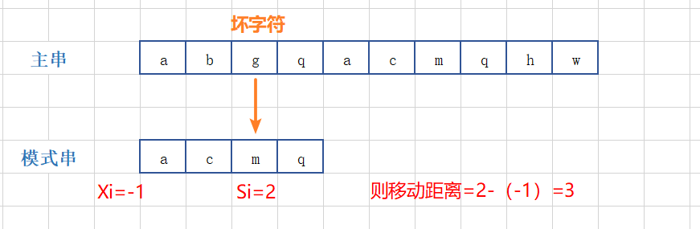
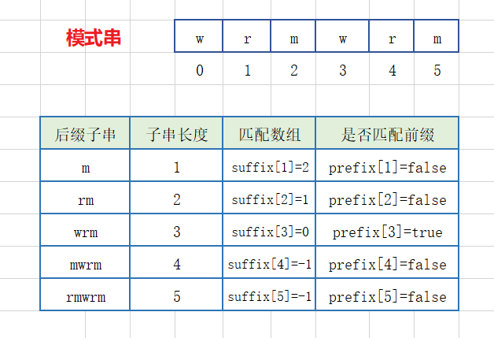
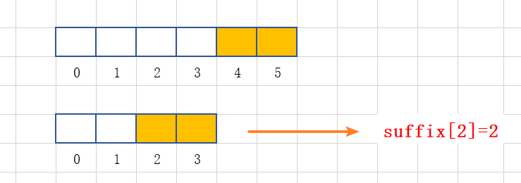
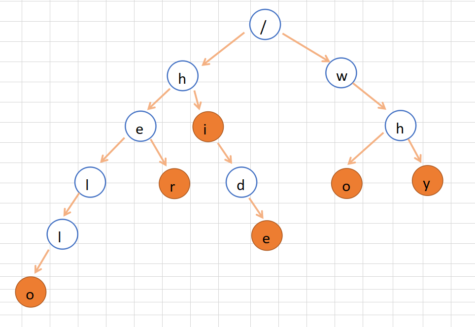

### 字符串匹配

#### 1 单模式串匹配的算法

一个串跟一个串进行匹配

##### 1.1 BF算法

* BF 是 Brute Force 的缩写，中文叫作**暴力匹配算法**，也叫**朴素匹配算法** ；

* 简单、好懂，但性能不高 ；

* **主串**和**模式串**：比如 我们在字符串 A 中查找字符串 B，那字符串 A 就是主串，字符串 B 就是模式串

* 思想：主串中，检查起始位置分别是 0、1、…n-m 且长度为 m 的 n-m+1个子串，看有没有跟模式串匹配的；

  

* 最坏情况时间复杂度是 O(n * m) ；但实际处理时中途遇到不能匹配的字符的时候，就可以就停止了，不需要把 m 个字符都比对一下，所以实际效率一般比 O(n * m)高；

##### 1.2 RK算法

* Rabin-Karp 算法，BF 算法的改进；
* 思想
  * BF 算法在匹配的时候需要针对每个子串挨个字符和模式串匹配，模式串很长的话，耗时；
  * RK算法先**算出主串中每个子串对应的哈希值**，每次比较时候，先直接利用哈希值和模式串比较，很快速；
  * 如果哈希值相等，为避免哈希冲突，可以再详细对比下每个字符；
  * 如果不相等说明肯定不匹配，直接跳过；
  * 当然在主串计算哈希值的时候就直接和模式串比较，避免先算出所有再从头对比；不过如果匹配主串中所有子串就需要一直遍历完主串了。

* 哈希算法设计

  

  哈希算法可根据实际设计，这里简单叙述下思想，计算每个子串哈希值的时候需要遍历每个字符，导致计算哈希值功能部分效率不高，其实我们可以根据前后子串的关联关系快速计算。

  例如上图，假设我们字符串只包含 a 到 z 26个字母，我们简单的将 a 到 z 按照 1 到 25 编号，子串的哈希值就是每个字符对应值和。第一个子串和第二个子串之间其实中间部分是重合的，那我们可以利用第一个子串的哈希值减去自己开头的字符值加上第二个子串的末尾字符值，快速算出第二个子串的值，依次类推……这个在子串比较长的时候很方便，例如

  

  当然不同的哈希算法中间部分的内容不一定是相同的，但是最好设计成有关联关系，例如倍数关系。

  这样可在 O(n) 时间复杂度内计算出所有子串的哈希值。

* 时间复杂度

  整个 RK 算法包含两部分，**计算子串哈希值**和**模式串哈希值与子串哈希值之间的比较**。

  * 第一部分时间复杂度是 O(n)；
* 每个子串与模式串比较 O(1)，总共比较 n-m+1 个子串，所以，这部分的时间复杂度也是 O(n) ;
  
  * 所以，RK 算法整体的时间复杂度就是 **O(n)**。

##### 1.3 BM算法

###### 1.3.1 核心思想

* BK算法、RK算法的思路：主串中字符与模式串依次按位比较，当遇到不合适的字符，模式串往后移动一位，继续重复上述步骤；

  

  例如图示，模式串在比较到第二个字符的时候发现不匹配，那么模式串往后滑动一位。

* BM（Boyer-Moore）

  每次移动一位其实有优化的空间，比如上图，移动后，其实主串的b还是和对应位置模式串a不匹配，那这一次移动其实没有意义，为啥呢？因为模式串中根本不存在字符b, 只要你移动后模式串有跟主串对其，那么就不可能匹配，所以遇到这种情况我们可以多移动几位，来跳过肯不会匹配的情况，那么应该移动几位合适呢？BM算法就是要查找这个合适的移动距离，以此加大移动步伐，提高匹配效率。

  

* BM 算法包含两部分，分别是坏字符规则（bad character rule）和好后缀规则（good suffix shift）

###### 1.3.2 **坏字符规则**

* 基本思路

  * 改变传统的将模式串从前往后依次匹配，而是从后往前匹配；

  * 当发现不匹配的字符的时候，这个主串中不匹配的字符叫做**坏字符**；
  * 拿坏字符在模式串中对齐位置往前查找：
    * 如果查找到说明坏字符在模式串中是存在的，把模式串中这个位置记做 x, 那么就把模式串向后滑动到坏字符和模式串 x 位置字符对齐；
    * 如果没有查找到，说明坏字符不在模式串中存在，那么直接模式串移动到坏字符之后；

* 图示

  * 坏字符在模式串不存在情况

  

   	从后往前匹配，主串 g 不匹配模式串m ，g 就是坏字符；

  ​	查找 g 在模式串中是否存在及位置，发现不存在，那么直接模式串往后滑动3位：

  

  * 坏字符在模式串存在情况

    

    坏字符在模式串存在，那么将模式串滑动到 g 字符对齐的位置。

* 移动距离计算

  * 基本思路

    * 当发生不匹配的时候，我们把**坏字符**对应的**模式串中**的字符下标记作 **si** ；
    * 如果坏字符在模式串中**存在**，我们把这个坏字符在模式串中的下标记作 **xi** ；
    * 如果不存在，我们把 xi 记作 **-1** ；

    * 那模式串往后移动的位数就等于 **si-xi** ；

  * 存在

  

  * 不存在

  ​	

* 时间复杂度

  利用坏字符规则，BM 算法在**最好**情况下的时间复杂度非常低，是 **O(n/m)**；

  比如主串是 aaabaaabaaabaaab，模式串是 aaaa。每次比对，模式串都可以直接后移四位。

* 缺陷

  使用坏字符规则有可能存在问题，**可能会导致计算出的移动位数为负数**；

  比如主串是 aaaaaaaaaaaaaaaa，模式串是 baaa，计算出的移动位数 - 1，显然是不合理的。

* 代码实现

  * 实现的话一个需要定位坏字符在模式串的对齐位置 Si，这个不需要计算；

  * 另外一个查找坏字符在模式串的存在位置，这个如果依次比较的话低效，采用哈希表来解决：

    即构建一个包含主串、模式串所有字符的字符集哈希表，比如现在只包含 a 到 z 26个英文小写字母，那么构建一个长度为 26 的哈希表，0下标位置就记录 模式串中 a 字符最大的索引位置，依次类推，25 下标记录的就是 z 字符的最大索引位置。

    

  * 那么坏字符就可以在 O (1) 时间复杂度内查找到其在模式串的最靠后的位置，当然这种借助于哈希表的方式，如果模式串包含的字符范围较大，就比较浪费空间；

  * 先不考虑 si-xi 计算得到的移动位数可能会出现负数的问题，实现代码：

    ```java
    /**
        * 根据坏字符规则查找模式串在主串中的匹配位置（忽略计算移动距离负数情况）
        * @param z 主串
        * @param m 模式串
        * @return 匹配情况：模式串开头字母在主串对齐位置；不匹配：-1
        */
    public int bmBcr(char[] z, char[] m){
        if(null == z || null == m || z.length < m.length){
            return -1;
        }
    
        // 根据模式串构建哈希表
        int[] hashTable = generateHashTable(m);
    
        // 匹配模式串和主串
        // 模式串可移动范围在主串 0 到 z.length - m.length 位置
        for(int i = 0; i < z.length - m.length;){
            int j ;
            // 模式串从后往前匹配
            for(j = m.length - 1; j >= 0; j--){
                if(m[j] != z[i + j]){
                    // 遇到坏字符
                    break;
                }
            }
    
            if(j < 0){
                // j小于0，说明模式串整个和主串对应位置匹配，因为最后匹配技术，j还往前移动一位为 -1
                return i;
            } else {
                // 说明没有匹配成功，那么坏字符在主串位置就是 i+j
                /// 移动位置
                int length = j - hashTable[z[i+j] - 'a'];
                i = i + length;
            }
        }
    
        // 如果循环结束还没中间返回说明模式串在主串没有匹配的
        return -1;
    }
    
    /**
        * 根据模式串构建字符集哈希表 （这里假设只有a-z 26个字母，以0到25排序）
        * @param m 模式串
        * @return 字符集哈希表
        */
    private int[] generateHashTable(char[] m) {
        int[] hashTable = new int[26];
    
        // 先初始化, 即默认字符不存在位置值记做 -1
        for(int i = 0; i < 26; i++){
            hashTable[i] = -1;
        }
    
        // 再将模式串中的字符最大索引位置填充到哈希表
        for(int i = 0; i < m.length; i++){
            hashTable[m[i] - 'a'] = i;
        }
    
        return hashTable;
    }
    ```

###### 1.3.3 **好后缀规则**

* 好后缀

  坏字符规则在检测到坏字符的时候，其实对于已经检验过的字符是匹配的，这部分内容称为**好后缀**

  

* 处理思路

  * 坏字符规则是根据坏字符在模式串中的位置来移动对齐实现，好后缀也是类似思路，查找好后缀在模式串中出现位置，然后移动模式串使得好后缀内容对齐；

    

  * 如果找不到，那么不能直接说模式串移动到好后缀后面，因为可能好后缀的部分子串和模式串前缀子串内容匹配，所以需要在好后缀中查找和模式串前缀子串匹配的最长子串（这里之所以需要匹配模式串的前缀子串，这是因为如果中间匹配的话，那么模式串中这个匹配部分的前一个字符和好后缀子串的前一个字符肯定不匹配，那么即使移动使两者对其，也肯定不会匹配）；

    

  * 当然如果连好后缀的子串都无法跟模式串的前缀子串对齐，那么就直接将模式串移动到好后缀的后面

    

* 好后缀的处理规则中最核心的内容：

  * 在**模式串**中，查找跟**好后缀匹配**的另一个**子串**；

  * 在**好后缀**的**后缀子串**中，查找**最长**的、能跟**模式串前缀子串**匹配的**后缀子串**；

  * 避免暴力查找匹配好后缀或子串，通过**预处理**模式串，预先计算好模式串的每个后缀子串，对应的另一个可匹配子串的位置

    ​	

    * 因为模式串是固定的，所有的后缀字串也是固定的，即对应的长度可以唯一确定一个后缀字串；
    * 用数组 suffix 保存对应后缀字串在模式串中重复字符字串位置，例如 suffix[2] , 2 就代表字串长度，即字串 rm , 模式串中 rm 的重复位置为 1 、2 两个字符位置，则 suffix[2]=1 ；

    * prefix 数组表示对应后缀字串是否匹配模式串前缀字串；

  * 那么如何求解得到这两个数组？

    我们先看下这个

    

    假设现在我们要找到后缀4、5两个字符组成的字串在前面模式串中的重复位置，这个位置是不确定的，可能在如下几个前缀字串中：

    

    那其实我们只需要依次将这三个前缀子串和模式串后两字符字串比较，有匹配则说明存在；

    而我们的模式串后缀字串情况不止上面长度 2 的，还有其它，它们也有对应的可查找前缀字串，不过整体看来其实都是 0 到 m-1 （假设模式串的最后字符位置为 m） 之间的子串，那么我们直接遍历所有的子串，查找和模式串的公告后缀。

    

    推广到一般形式：

    

  * 代码实现

    ```java
    /**
         * 预处理好后缀规则下 模式串的所有后缀在模式串的匹配情况
         * @param m 模式串
         * @param suffix  记录后缀子串在模式串的重复位置
         				（下标代表后缀子串长度，值代表重复字符内容在模式串位置）
         * @param prefix  记录后缀子串是否匹配模式串前缀子串
         				（下标代表后缀子串长度，值：true 匹配； false 不匹配）
         */
        public void generateGsSuffix(char[] m, int[] suffix, boolean[] prefix){
            int length = m.length;
    
            // 先初始化两个数组
            for(int i = 0; i < suffix.length; i++){
                suffix[i] = -1;
                prefix[i] = false;
            }
    
            // 遍历所有可能前半部分字符子串，即范围在 0 到 length-2, 
            // 即 m[0,i] 的可取值范围 m[0,0] 到 m[0, length-2]
            for(int i = 0; i < length - 1; i++){
                // 记录当前子串的末尾位置
                int j = i;
    
                // 记录公共后缀子串长度
                int k = 0;
    
                // 将当前子串依次和 b[0, length-1] 匹配公共后缀子串, 即当前子串末尾依次往前
                while (j >= 0 && m[j] == m[length-1-k]){
                    // 上一个字符匹配情况下再往前比较
                    j--;
                    k++;
    
                    // 记录公共后缀子串在模式串中匹配的位置
                    // 如果有多个匹配，后面外层子串循环的时候这里会覆盖，即保存最靠后的匹配位置
                    suffix[k]=j+1;
                }
    
                // 如果匹配的位置是第一个字符，说明公共后缀也是模式串的前缀子串
                if(-1 == j){
                    prefix[k] = true;
                }
            }
        }
    ```

* 好后缀规则下模式串移动位数（好后缀长度 k）

  * 好后缀在模式串有匹配的子串，则移动：**坏字符在模式串位置 -  suffix[k] + 1** 

    

  * 好后缀在模式串没有有匹配的子串：

    * 好后缀后缀子串匹配模式串前缀子串，则移动 r 位

      

    * 好后缀后缀子串不匹配模式串前缀子串，则移动 m 位

      

###### 1.3.4 两个规则合并

```java
/**
     * bm 算法实现（总和考虑坏字符及好后缀规则）
     * @param z 主串
     * @param m 模式串
     * @return 匹配情况：模式串开头字母在主串对齐位置；不匹配：-1
     */
    public int bm(char[] z, char[] m){
        if(null == z || null == m || z.length < m.length){
            return -1;
        }

        // 根据模式串构建哈希表
        int[] hashTable = generateHashTable(m);

        // 构建好后缀的后缀子串匹配数组
        int[] suffix = new int[m.length];
        boolean[] prefix = new boolean[m.length];
        generateGsSuffix(m, suffix, prefix);

        // 匹配模式串和主串
        // 模式串可移动范围在主串 0 到 z.length - m.length 位置
        for(int i = 0; i < z.length - m.length;){
            int j ;
            // 模式串从后往前匹配
            for(j = m.length - 1; j >= 0; j--){
                if(m[j] != z[i + j]){
                    // 遇到坏字符
                    break;
                }
            }

            if(j < 0){
                // j 小于0，说明模式串整个和主串对应位置匹配，因为最后匹配技术，j 还往前移动一位为 -1
                return i;
            } else {
                // 说明没有匹配成功，那么坏字符在主串位置就是 i+j
                /// 计算按照坏字符规则移动位置
                int bcrLength = j - hashTable[z[i+j] - 'a'];

                /// 计算按照好后缀规则移动距离
                int gcLength = 0;
                if(j != m.length - 1){
                    // 如果模式串末尾子串就不匹配的话那么也就谈不上好后缀了
                    gcLength = getGsLength(j, m.length, suffix, prefix);
                }

                /// 模式串移动两个规则计算出来的最大距离
                i = i + Math.max(bcrLength, gcLength);
            }
        }

        // 如果循环结束还没中间返回说明模式串在主串没有匹配的
        return -1;
    }

    /**
     * 计算按照好后缀规则模式串需要移动的距离
     * @param j 坏字符位置
     * @param length  模式串长度
     * @param suffix  记录后缀子串在模式串的重复位置
     				（下标代表后缀子串长度，值代表重复字符内容在模式串位置）
     * @param prefix  记录后缀子串是否匹配模式串前缀子串
     				（下标代表后缀子串长度，值：true 匹配； false 不匹配）
     */
    private int getGsLength(int j, int length, int[] suffix, boolean[] prefix) {
        // 好后缀长度
        int k = length - 1 - j;

        if(suffix[k] != -1){
            // 说明好后缀在模式串有匹配
            return j - suffix[k] + 1;
        } else {
            // 好后缀不存在匹配的，那么就查找好后缀的后缀子串是否跟模式串前缀子串匹配
            for(int r = j + 2; r <= length - 1; r++){
                if(prefix[length-r] == true){
                    return r;
                }
            }
        }
        return length;
    }
```

* 如果处理字符集很大的字符串匹配问题，坏字符数组对内存的消耗就会比较多。
* 好后缀和坏字符规则是独立的，如果运行的环境对内存要求苛刻，可以只使用好后缀规则，不使用坏字符规则，这样就可以避免 bc 数组过多的内存消耗；
* BM 算法的时间复杂度分析非常复杂，不同论文证明不一，在最坏情况下，BM 算法的比较次数上限是 5n 或者 3n ；
* 好后缀规则可以独立于坏字符规则使用；

##### 1.4 KMP算法


#### 2 多模式串匹配算法

在一个串中同时查找多个串

##### 2.1 Trie 树

###### 2.1.1 定义

* Trie 树，也叫“字典树”，是一个树形结构。

* 它是一种专门处理**字符串匹配**的数据结构，用来解决**在一组字符串集合中快速查找某个字符串**的问题 ；
* Trie 树的本质，就是**利用字符串之间的公共前缀，将重复的前缀合并在一起**；

###### 2.1.2 基本思路

例如在一组字符串集合中查找某个字符串，例如 在 hello，her，hi，hide，who，why 中查找是否存在 her :

* **构建 Trie 树**

  将这组字符串做下预处理，组织成 Trie 树的结构，之后每次查找，都是在 Trie 树中进行匹配查找

  

  * 根节点不包含任何信息
  * 每个节点表示一个字符串中的字符
  * 从根节点到红色节点的一条路径表示一个字符串
  * 红色节点表示某个字符串的结尾字符，并不都是叶子节点

* **查找匹配**

  当我们在 Trie 树中查找一个字符串的时候，比如查找字符串“her”，那我们将要查找的字符串分割成单个的字符 h，e，r，然后从 Trie 树的根节点开始匹配，只有最后查找结尾字符是红色节点才表示查找到

  

###### 2.1.3 存储一个 Trie 树

每个节点需要保存当前字符，还需要保存指向子节点的指针，Trie 树是一个多叉树，即一个节点的子节点可能多个，所以不能像二叉树一样只设置左右子节点指针，不过同样思路，有多个子节点直接多少个指针。

借助散列表的思想，我们通过一个下标与字符一一映射的数组，来存储子节点的指针：


假设字符串中只有从 a 到 z 这 26 个小写字母，我们在数组中下标为 0 的位置，存储指向子节点 a 的指针，下标为 1 的位置存储指向子节点 b 的指针，以此类推，下标为 25 的位置，存储的是指向的子节点 z 的指针。如果某个字符的子节点不存在，我们就在对应的下标的位置存储 null

```java

class TrieNode {
  char data;
  TrieNode children[26];
}
```

###### 2.1.4 代码实现

```java
package com.skylaker.string;

/**
 * Trie树前缀匹配查找字符串 （默认字符串字符集为26个小写字母）
 * @author skylaker
 * @version V1.0 2020/5/19 20:44
 */
public class Trie {
    // Trie 树的根节点，字符内容默认空
    private TrieNode root = new TrieNode();

    /**
     * 新增字符串
     * @param str
     */
    public void insertString(String str){
        if(null == str || "".equals(str)) {
            return;
        }

        char[] chars = str.toCharArray();

        // 当前字符位置指针
        TrieNode p = root;

        for(int i = 0; i < chars.length; i++) {
            int index = chars[i] - 'a';
            if(null == p.childNodes[index]) {
                // 父节点的子节点数组中没有当前字符指针
                TrieNode childNode = new TrieNode(chars[i]);
                if(i == chars.length - 1) {
                    childNode.setEndChar(true);
                }

                p.childNodes[index] = childNode;
            }
            // 当前节点指针移动到下一个字符位置
            p = p.childNodes[index];
        }
    }

    /**
     * 新增字符串 优化结尾设置
     * @param str
     */
    public void insertString2(String str){
        if(null == str || "".equals(str)) {
            return;
        }

        char[] chars = str.toCharArray();
        // 当前字符位置指针
        TrieNode p = root;

        for(char c : chars) {
            int index = c - 'a';
            if(null == p.childNodes[index]) {
                // 父节点的子节点数组中没有当前字符指针
                p.childNodes[index] = new TrieNode(c);
            }
            // 当前节点指针移动到下一个字符位置
            p = p.childNodes[index];
        }

        // 遍历完字符串，p 指向的就是结尾字符位置
        p.setEndChar(true);
    }

    /**
     * 判断某个字符串是否存在当前集合中
     */
    public boolean isExistStr(String str){
        if(null == str || "".equals(str)) {
            return false;
        }

        char[] chars = str.toCharArray();

        // 从根节点依次遍历
        TrieNode p = root;
        for(char c : chars) {
            if(null == p.childNodes[c - 'a']) {
                return false;
            }
            p = p.childNodes[c - 'a'];
        }

        // p 如果最终指向结束字符，那么当前字符串就存在，否则不存在
        if(p.isEndChar) {
            return true;
        }
        return false;
    }


    /**
     * Trie树节点
     */
    public class TrieNode {
        // 当前节点的字符数据
        private char data;

        // 指向子节点的指针数组
        // 子节点的字符是哪个，就在对应索引位置指向子节点
        private TrieNode[] childNodes = new TrieNode[26];

        // 当前节点是否是某个字符串的结尾字符
        private boolean isEndChar = false;

        public TrieNode() { }

        public TrieNode(char data) {
            this.data = data;
        }

        public void setEndChar(boolean endChar){
            this.isEndChar = endChar;
        }
    }
}
```

测试：

```java
 @Test
    public void testTrieInsert(){
        Trie trie = new Trie();
        trie.insertString2("hello");
        trie.insertString2("her");
        trie.insertString2("hi");
        trie.insertString2("why");

        System.out.println(trie.isExistStr("hello"));
        System.out.println(trie.isExistStr("her"));
        System.out.println(trie.isExistStr("hi"));
        System.out.println(trie.isExistStr("h"));
        System.out.println(trie.isExistStr("herd"));
        System.out.println(trie.isExistStr("who"));
        System.out.println(trie.isExistStr("wh"));
        System.out.println(trie.isExistStr("whoh"));
    }
```

###### 2.1.5 时间复杂度

* 构建 Trie 树的过程，需要**扫描**所有的字符串，时间复杂度是 **O(n)**（n 表示所有字符串的长度和）

* 构建好 Trie 树后，在其中**查找**字符串的时间复杂度是 **O(k)**，k 表示要查找的字符串的长度；

###### 2.1.6 空间优化

* Trie 用的是一种空间换时间策略；

* 用数组来存储一个节点的子节点的指针，字符串包含的字符越多，需要维护的数组越长，在重复的前缀并不多的情况下，Trie 树不但不能节省内存，还有可能会浪费更多的内存；

* 优化策略
  * 牺牲一点查询的效率，将每个节点中的数组换成其他数据结构，来存储一个节点的子节点指针。比如有序数组、跳表、散列表、红黑树等；
    * 假设用有序数组，数组中的指针按照所指向的子节点中的字符的大小顺序排列。查询的时候，我们可以通过二分查找的方法，快速查找到某个字符应该匹配的子节点的指针。但是，在往 Trie 树中插入一个字符串的时候，我们为了维护数组中数据的有序性，就会稍微慢了点 ；

###### 2.1.7 应用场景要求

* 字符串中包含的**字符集不能太大**，如果字符集太大，那存储空间可能就会浪费很多；

* 要求字符串的**前缀重合比较多**，不然空间消耗会变大很多；

* Trie 树中用到了指针，所以对缓存并不友好 ；

* Trie 树比较适合的是查找前缀匹配的字符串针对在一组字符串中查找字符串的问题；

##### 2.2 AC 自动机

